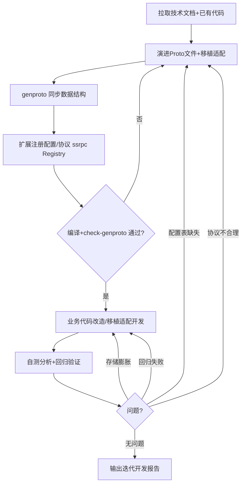
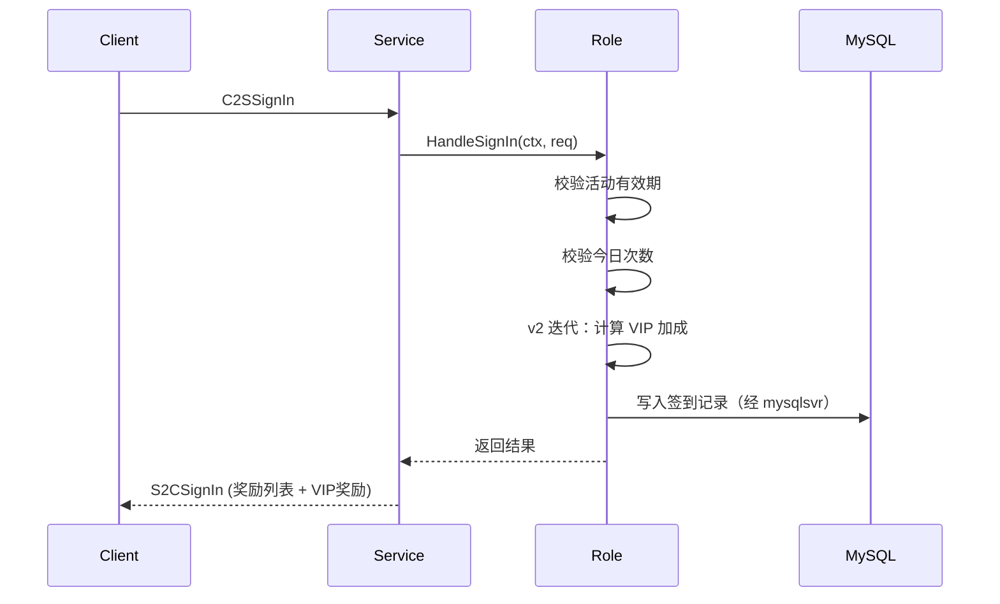

# G1-服务器-业务迭代开发v2

## 概述

本技能在**技术迭代设计v2文档（技术迭代设计v2.md）确认并通过后**，基于已评审的迭代方案，**同时参照用户指定的已有文件代码或从其他项目移植的代码**，进行完整的业务功能迭代升级编码落地。覆盖从 proto 文件演进、数据结构同步、协议扩展注册、业务代码改造/移植适配、回归自测优化到最终输出迭代开发报告的全流程。

与 v1（G1-服务器-业务开发）的区别：
- v1 是基于"从零设计"的技术分析方案做全新编码
- **v2 是基于"现状 → 目标"的迭代设计，编码时必须参照已有代码或移植代码**，做演进式改造而非推倒重来，要保证现有功能不被破坏

> **定位边界**：
> - ✅ 基于已确认的技术迭代设计v2文档进行迭代编码落地
> - ✅ 阅读、理解并基于已有文件代码进行改造/扩展（不破坏既有功能）
> - ✅ 将其他项目移植代码适配进本项目框架并落地（命名、依赖、接口对齐）
> - ✅ 设计和迭代 proto 文件（配置表 proto、通讯协议 proto、数据库定义的演进）
> - ✅ 运行代码生成脚本同步数据结构，扩展注册配置表和协议映射
> - ✅ 按照各服务的开发规范编写/改造业务代码
> - ✅ 完成回归自测：存储分析、协议性能推导、配置表反向校验、**现有功能回归验证**
> - ✅ 迭代优化直到代码闭环
> - ✅ 输出迭代开发报告、配置表说明文档、迭代开发方案文档
> - ❌ 不涉及技术方案设计（那是"G1-服务器-技术迭代设计v2"技能的职责）
> - ❌ 不审查 PRD 逻辑（那是"G1-服务器-需求分析"技能的职责）
> - ❌ 不修改 GoOne 框架层代码（`lib/service/` 等基础设施）
> - ❌ 不上线部署、不做运维操作

## 适用场景

- 技术迭代设计v2评审通过后，启动基于现有代码的迭代编码
- 需要在已有模块基础上扩展新功能、新配置表、新协议
- 需要将其他项目的功能代码移植适配到当前项目
- 需要对已有服务进行功能改造、性能优化、结构重构
- 完成迭代编码后需要进行回归自测和优化迭代
> - 需要输出迭代开发报告供团队归档

---

## 前置条件

本技能依赖技术迭代设计v2已输出并确认。开始前必须确认：

1. 知识库中 `{analysis_output_dir}/{需求名称}/技术迭代设计v2.md` 已存在且状态为"已确认"
2. 知识库中 `{analysis_output_dir}/{需求名称}/需求分析报告.md` 已存在且审查通过
3. 需求的致命和严重问题已全部闭环
4. 如果技术迭代设计v2不存在或未确认，提示用户先使用"G1-服务器-技术迭代设计v2"技能完成技术迭代方案设计

**v2 额外要求**：用户必须指定需要参照/改造的代码来源之一：
- 已有文件代码路径（项目内的某个模块、文件、目录）
- 其他项目移植过来的代码位置（待移植代码的目录或文件）
- 如用户未指定，**必须主动询问用户**要参照/改造哪些已有代码或移植代码，明确后再继续

---

## 规范遵循（强制）

> 在进行配置表 Proto、通讯协议、数据库存储等数据结构的设计或优化时，**先去 `.GoOne/spec/` 目录下自行寻找并读取相关规范文档**，严格遵循其中的规则和约定。技能不固化具体规范文件名，以目录下实际文档为准。文档缺失时应提示用户补充。

## 项目技术要素速查

在进行业务开发前，必须先了解以下项目核心技术要素：

| 要素 | 说明 | 涉及路径/模块 |
|------|------|-------------|
| **配置表 Proto** | Excel → repo gen → Go struct → runtime | `module/gamedata/repository/`（生成代码 `*.gen.go`）|
| **通讯协议 Proto (service)** | 业务 service proto（含 ssrpc option）→ codegen | `common/game_proto/service/*.proto` → `common/protocol/` + `api/gen/` |
| **共享消息 / CMD** | 共享 message、枚举、CMD 常量 | `common/`（git submodule g1_common）|
| **数据库定义** | Go struct + xorm/mysql 标签 | 各服务 `src/<svc>svr/` 业务 model |
| **路由分发** | SvrRouterRule_* / TransactionMgr sharded serial key | `lib/service/svrinstmgr/`、`lib/service/transaction/` |
| **配置表注册** | 配置表加载注册（生成） | `module/gamedata/repository/<表>/*.gen.go` → `gamedata.Register` |
| **协议注册** | ssrpc 服务注册 | 各服务 `src/<svc>svr/app.go` → `RegisterXxxServiceToRegistry` |
| **服务模式** | app.go → service/handler | `src/<svc>svr/`（connsvr / mainsvr / infosvr / mysqlsvr / roomcentersvr / web_svr）|
| **数据持久化** | MySQL（持久化，经 mysqlsvr + xorm）、Redis（缓存/计数） | `lib/db/xorm/`、`lib/db/redis/`、`src/mysqlsvr/` |
| **测试框架** | `tools/tester`（集成压测） + 各服务单测 | `tools/tester/`、各 `src/<svc>svr/*_test.go` |

> 注意：GoOne 业务 service proto 的 source-of-truth 在 `common/game_proto/service/*.proto`，配置表生成代码集中在 `module/gamedata/repository/`，旧式 `protocol_map.go` / `config_map.go` 手写映射已废弃，**CI 门禁禁止使用旧 API**（详见 `docs/ssrpc_idl.md`、`docs/STYLE.md`）。

---

## 工作流程

### 第一步：获取项目配置并拉取技术文档与代码

调用 `G1-项目配置` 技能获取项目配置信息：

> - `vault_path` = Obsidian Vault 名称（用于 obsidian-cli 的 `vault=` 参数）
> - `prd_dir` = 策划需求文档目录（相对 vault 根目录）
> - `analysis_output_dir` = 技术输出目录（相对 vault 根目录）
>
> **输出目录**固定为 `{analysis_output_dir}/{需求名称}/`。

如果 `.GoOne/conf.json` 不存在，`G1-项目配置` 技能会自动引导创建。

#### 1.1 拉取技术文档（通过 obsidian-cli）

1. **技术迭代设计v2**：
   ```bash
   obsidian vault="{vault_path}" read path="{analysis_output_dir}/{需求名称}/技术迭代设计v2.md"
   ```
2. **需求分析报告**：
   ```bash
   obsidian vault="{vault_path}" read path="{analysis_output_dir}/{需求名称}/需求分析报告.md"
   ```
3. **关联技术方案**：扫描技术迭代设计v2中的 `[[wiki-link]]` 引用，通过 obsidian-cli 读取被引用的关联模块技术方案：
   ```bash
   obsidian vault="{vault_path}" read file="{wiki-link名称}"
   ```

#### 1.2 拉取并理解已有代码（v2 核心）

**这是 v2 与 v1 的根本区别。编码前必须读懂要改造/移植的现有代码。**

1. **读取技术迭代设计v2中"代码现状与演进路径"章节**，明确：
   - 哪些现有代码可复用（零改动）
   - 哪些需扩展（新增字段/方法/协议号）
   - 哪些需改造（逻辑变更）
   - 哪些需废弃（标记 deprecated）
   - 移植代码的适配点（命名、依赖、接口）
2. **逐个阅读相关的现有源码文件**，使用文件读取工具确认：
   - 现有 proto 文件结构和已有字段编号（避免编号冲突）
   - 现有 service handler 的实现细节（改造时不破坏既有逻辑）
   - 现有配置表注册、协议注册的现状（增量追加而非覆盖）
3. **从技术迭代设计v2中提取关键信息**：
   - 需求分类与迭代类型（新增/改造/优化/重构/移植）
   - 涉及的服务（connsvr / mainsvr / infosvr / mysqlsvr / roomcentersvr / web_svr）
   - 配置表清单（新增 + 扩展）
   - 通讯协议清单（service method / message + 迭代动作）
   - 数据库结构演进设计
   - 模块接口演进定义
   - 演进步骤分解

---

### 第二步：Proto 文件演进与移植适配

基于技术迭代设计v2中的演进设计，进行三类 proto 文件的**增量演进**（而非全量重建）。

#### 2.1 配置表 Proto 演进

**文件位置**：参照 `module/gamedata/repository/<表名>/` 下既有生成代码反推配置表定义；新增/扩展配置表按仓库既有生成流程（gamedata repository 生成）落地，禁止手改 `*.gen.go`。

**演进要点（区别于全新设计）**：
- **已有表扩展字段**：在现有 message 末尾追加新字段，**字段编号必须从现有最大编号 +1 开始连续分配，绝不复用已有编号**
- **新增表**：追加 message，命名遵循仓库既有约定
- **老字段不删除**：废弃字段使用 `reserved` 关键字标记，保留编号和名称
- 移植代码的配置表 proto 需重命名对齐本项目规范后合并进来

**设计规范**（protobuf 通用约定）：

```protobuf
syntax = "proto3";

//#配置表中文名称#
message {表名}Data {
  int32 id = 1;           // 唯一ID（主键）
  string name = 2;        // 名称
  int32 isEnable = 3;     // 是否启用 0=否 1=是
  // ... 其他业务字段
}
```

**演进示例**（给已有签到表新增 VIP 加成字段）：

```protobuf
//#签到活动配置表#
message SigninActivityData {
  int32 id = 1;              // 活动ID
  string name = 2;           // 活动名称
  int32 startTime = 3;       // 开始时间戳
  int32 endTime = 4;         // 结束时间戳
  int32 dailyLimit = 5;      // 每日签到次数上限
  string rewardList = 6;     // 奖励列表(JSON)
  int32 isEnable = 7;        // 是否启用
  // ====== v2 迭代新增 ======
  int32 vipBonusItem = 8;    // VIP 额外奖励道具ID（v2新增）
  int32 vipBonusCount = 9;   // VIP 额外奖励数量（v2新增）
}
```

**设计要点**：
- 字段编号从 1 开始连续分配，不跳号（演进时从现有最大值 +1）
- 字段类型使用 proto3 标准类型（int32 / int64 / string / float / bool / repeated / map）
- 使用 `repeated int32` 表示数组字段（如奖励列表、条件列表）
- 使用 `string extraConfig` 预留 JSON 扩展字段
- 每条字段必须写中文注释说明含义
- **禁止手改** `module/gamedata/repository/**/*.gen.go`（CI 会校验，详见 `docs/STYLE.md`）

#### 2.2 通讯协议 Proto 演进

**文件位置**：
- 业务 service proto（含 ssrpc option）：`common/game_proto/service/*.proto`（source-of-truth）
- 共享 message / CMD / 枚举：`common/`（git submodule g1_common）
- 生成产物：`common/protocol/**`、`api/gen/**`（**禁止手改**）

**命名规范**（沿用 ssrpc IDL 约定，见 `docs/ssrpc_idl.md`）：
- C2S 请求：`C2S{操作名}` 或 `Req{操作名}`
- S2C 响应：`S2C{操作名}` 或 `Res{操作名}`
- S2C 推送：`S2C{事件名}`（如 `S2CItemUpdate`）
- S2S 消息：`S2S{操作名}`

**演进要点（区别于全新设计）**：
- **已有协议扩展字段**：追加字段编号从现有最大值 +1，绝不复用
- **废弃协议**：不物理删除，保留定义并加注释标记 deprecated，避免客户端旧版本反序列化失败
- **新增协议**：在对应 service proto 中追加 message / rpc，复用已有嵌套类型
- 移植代码的协议需重命名对齐 `C2S/S2C` 规范，并通过 ssrpc option 声明路由

**设计要点**：
- 请求和响应必须成对定义
- 响应消息首字段建议为 `int32 retCode = 1` 或使用 `RetCode` 类型
- 列表字段标注最大长度限制（防止恶意发包）
- 不要删除已有字段编号，废弃字段使用 `reserved` 关键字
- 嵌套消息应该复用已有定义

**示例**（在 service proto 中扩展签到 rpc）：

```protobuf
syntax = "proto3";
package mainsvrv1;
import "goone/options/v1/options.proto";

// 签到请求
message C2SSignIn {
  int32 activityId = 1;  // 活动ID
}

// 签到响应
message S2CSignIn {
  int32 retCode = 1;           // 返回码 0=成功
  int32 activityId = 2;        // 活动ID
  int32 todayCount = 3;        // 今日已签到次数
  repeated int32 rewards = 4;  // 获得的奖励道具ID列表
  // ====== v2 迭代新增 ======
  repeated int32 vipRewards = 5; // VIP 额外奖励道具ID列表（v2新增）
}

// 签到状态推送
message S2CSignInUpdate {
  int32 activityId = 1;   // 活动ID
  int32 todayCount = 2;   // 今日已签到次数
  int32 totalDays = 3;    // 累计签到天数
}
```

#### 2.3 数据库数据定义演进

**文件位置**：在对应服务 `src/<svc>svr/` 业务的 model 层中定义（Go struct + xorm 标签，经 mysqlsvr + xorm 落库到 MySQL）

**演进要点**：
- **已有表结构扩展字段**：追加 struct 字段并设置 `xorm/json` 标签，老数据读出时零值为默认值
- **字段类型变更需兼容**：如 int32 → int64，需保证老数据能正确反序列化
- **数据迁移**：若涉及存量数据结构变更，按技术迭代设计v2的"数据迁移方案"实现迁移逻辑（读时填充/迁移脚本）

**设计规范**：

```go
type XxxModel struct {
    PID       int64  `xorm:"pid pk" json:"pid"`
    Field1    int32  `xorm:"field1" json:"field1"`
    Field2    string `xorm:"field2" json:"field2"`
    CreatedAt int64  `xorm:"created_at" json:"created_at"`
    UpdatedAt int64  `xorm:"updated_at" json:"updated_at"`
}
```

**设计要点**：
- struct 字段同时具备 xorm 列标签与 json 标签
- 使用 `int64` 存储时间戳
- 玩家私有数据以 `PID` 为主键
- 全局共享数据使用复合 ID 作为键
- Key 命名规范：`{模块}:{玩家ID}:{子项}`（Redis 缓存 key，如 `signin:10001:daily`）
- 区分 MySQL 持久化数据（经 mysqlsvr）和 Redis 缓存数据

完整的数据库定义包含在技术迭代设计v2的"数据存储结构设计"章节中，本步骤只是将其落地为 Go 代码。

---

### 第三步：同步数据结构与协议扩展注册

完成 proto 文件演进后，必须运行代码生成脚本同步数据结构和扩展注册。

#### 3.1 运行 proto 代码生成

**命令**（仓库统一入口，见 `docs/ssrpc_idl.md`、`main.sh`）：

```bash
cd <project_root>

# 默认：生成 api/gen（共享消息 / service proto）
go run ./tools/cmd/genproto

# 若改动了 common/game_proto 下共享消息或 service proto，使用 full 模式
./main.sh check-genproto --full
# 等价于：./scripts/proto_goone.sh
```

生成器执行步骤：
1. 扫描 `api/proto` 与 `common/game_proto` 下声明了 `service` 的 proto
2. 调用 `protoc` 生成 `common/protocol/**` 与主仓 `api/gen/**` 的 `.pb.go`
3. 写回仓库工作区

**验证**：

```bash
# CI 门禁：检查生成代码是否与 proto 一致
./main.sh check-genproto
```

若 `git diff` 显示 `api/gen` 或 `common/protocol` 有未提交改动，说明生成代码过期，需重新跑生成并提交。详见 `docs/STYLE.md`：**禁止手改 `api/gen/**`、`common/protocol/*.pb.go`、`module/gamedata/repository/**/*.gen.go`**。

#### 3.2 扩展注册配置表（生成式）

**位置**：`module/gamedata/repository/<表名>/`（由 gamedata 生成器产出）

配置表注册走 **生成代码 + `gamedata.Register`** 模式（**禁止**手写 `config_map.go` 旧式映射，CI 门禁会拦截）。新增/扩展配置表的标准做法：

1. 在配置表定义处追加 message（按 2.1）
2. 跑仓库既有的 gamedata 生成流程，生成 `module/gamedata/repository/<表名>/<表名>.gen.go`
3. 生成产物顶部会自动调用 `gamedata.Register("{表名}", parse)`（参考 `module/gamedata/repository/item_config/ItemData.gen.go`）

**示例**（生成产物示意，**不要手写**）：

```go
// module/gamedata/repository/signin_activity/SigninActivityData.gen.go
// 由生成器自动产出，禁止手改。

func init() {
    gamedata.Register("SigninActivity", parse)
}
```

#### 3.3 扩展注册 Route / CMD 常量

**位置**：`common/game_proto/` + `common/protocol/`（g1_common submodule）

**演进要点**：先确认现有 CMD 占用情况，**绝不复用已分配的编号**，从下一个可用号开始分配。CMD 常量随 service proto 一起由生成器产出，不要手写。

#### 3.4 扩展注册协议（ssrpc Registry）

**位置**：各服务 `src/<svc>svr/app.go`

协议注册走 ssrpc `RegisterXxxServiceToRegistry` 模式（**禁止**使用 `protocol_map.go` 旧式 `regProto()` API，CI 门禁已禁止）。

**示例**（参考 `src/mainsvr/app.go`）：

```go
// src/mainsvr/app.go
registerHandlers := func(r *router.Router) error {
    srv := mainsvr_service.NewMainService(deps)
    return mainsvrv1.RegisterMainC2SServiceToRegistry(r, srv)
}
```

新增/扩展 rpc 只需在对应 service proto 中声明，重跑 genproto 后，在 `app.go` 的 `registerHandlers` 中接入新的 service 实现即可（无需手写路由映射）。

#### 3.5 再次验证编译与门禁

完成所有注册后，再次运行验证：

```bash
# 编译检查
go build ./...

# 生成代码一致性门禁
./main.sh check-genproto

# CI 风格与旧 API 检查（golangci-lint --new-from-rev 只对增量生效）
# 详见 docs/STYLE.md
```

---

### 第四步：业务代码改造与移植适配开发

根据需求归属的服务和**技术迭代设计v2的演进路径**，按照对应服务的开发规范进行编码。开发规范文档位于本技能目录的 `specs/` 子目录下，以及 `.GoOne/spec/` 目录下的项目级规范。

#### 4.1 开发规范文档索引

| 服务 | 规范文档 | 涉及路径 |
|------|---------|---------|
| **连接服务** | [specs/连接服务-业务需求-开发规范.md](specs/连接服务-业务需求-开发规范.md) | `src/connsvr/` |
| **主服务** | [specs/主服务-业务需求-开发规范.md](specs/主服务-业务需求-开发规范.md) | `src/mainsvr/` |
| **信息服务** | [specs/信息服务-业务需求-开发规范.md](specs/信息服务-业务需求-开发规范.md) | `src/infosvr/` |
| **MySQL 服务** | [specs/MySQL服务-业务需求-开发规范.md](specs/MySQL服务-业务需求-开发规范.md) | `src/mysqlsvr/` |
| **房间中心服务** | [specs/房间中心服务-业务需求-开发规范.md](specs/房间中心服务-业务需求-开发规范.md) | `src/roomcentersvr/` |
| **Web 服务** | [specs/Web服务-业务需求-开发规范.md](specs/Web服务-业务需求-开发规范.md) | `src/web_svr/` |
| **项目级规范** | `.GoOne/spec/05-项目目录结构与构建规范.md`、`06-游戏服务开发规范.md` | 全仓 |

> 服务目录与原 SeedServer 的对应关系：app_svc_player / app_svc_lobby → `src/mainsvr`；app_svc_account → `src/connsvr`；app_svc_battle / app_svc_mockfight → `src/roomcentersvr`。

#### 4.2 通用开发流程（迭代改造版）

所有服务的开发遵循统一的层次结构：

```
src/<svc>svr/
├── app.go                 # 服务入口：装配 deps + registerHandlers（ssrpc Registry）
├── service/               # ssrpc service 实现（对应 service proto）
│   └── *.go               # rpc handler：解析请求 → 调用逻辑层 → 设置响应
├── role/ 或 room/         # 纯业务逻辑层
└── globals/               # 服务级全局依赖、Redis 句柄等
```

**迭代开发步骤（基于现有代码改造）：**

1. **先读懂现有 service/role（或 room）的实现**：明确现有 rpc handler 的结构、现有业务方法的职责，避免改造时破坏既有功能
2. **在业务逻辑层扩展数据结构和业务逻辑**：
   - 扩展现有 DB model struct（追加字段并设置 `xorm/json` 标签）
   - 新增纯业务逻辑函数，或改造现有函数（保持对外契约不变的前提下演进）
   - 方法签名遵循 ssrpc IDL 生成产物约定
   - **改造现有函数时**：保留原有逻辑分支，新增迭代逻辑分支，必要时通过配置开关控制新旧逻辑切换（灰度）
3. **在 `service/` 层扩展 rpc 接入和分发**：
   - 新增 rpc 在对应 service proto 中声明，重跑 genproto
   - 在 service 实现中追加新 rpc handler（不删除已有 handler）
   - 每个 handler 完成：解析请求 → 调用逻辑层 → 设置响应
   - 业务错误通过 `gerr.New(...)` 返回（**不要**直接 `return err`，详见 `docs/STYLE.md`）
4. **在 `app.go` 中组装**：
   - `registerHandlers` 中接入新的 service 实例（如需新增独立 service）
5. **事件处理（如需要）**：
   - 通过 `bus.DriverRegistry` + RabbitMQ driver 订阅跨服消息（connsvr / mainsvr 之间）

#### 4.3 移植代码适配要点（v2 新增）

若本次迭代涉及从其他项目（如 SeedServer）移植代码，必须完成以下适配：

1. **命名对齐**：将移植代码的类型/方法/协议命名统一为本项目规范
2. **import 路径替换**：把 SeedServer 的 import 路径换成 GoOne 模块路径：
   - `github.com/.../seed-engine/...` → `github.com/Iori372552686/GoOne/lib/service/...`（及 `lib/db/`、`lib/net/` 等）
   - `seed-data/...` → `common/...`（共享消息）或 `api/gen/...`（service stub）
   - `seed-game/...` → `lib/db/redis/`、`lib/db/xorm/`、`src/mysqlsvr/`
   - `seed-app/game/app_svc_*` → `src/<svc>svr`（见 4.1 的对应关系）
3. **依赖替换**：将移植代码的外部依赖替换为本项目组件：
   - 日志库 → 本项目 `log` 封装
   - Redis 客户端 → `lib/db/redis/`；MySQL 经 `src/mysqlsvr/` + `lib/db/xorm/`
   - Actor / StatefulRoute（SeedServer）→ `TransactionMgr` sharded serial key + `SvrRouterRule_*`（`lib/service/transaction/`、`lib/service/svrinstmgr/`）
   - 事件/消息总线 → `bus.DriverRegistry` + RabbitMQ driver
4. **存储接口适配**：MongoDB 文档（`bson` 标签）→ MySQL model（`xorm` 标签，经 mysqlsvr）；`dbkv.Store`（SeedServer 抽象）→ 直接用 GoOne 的 redis / mysql facade
5. **协议注册**：移植代码的协议需通过 ssrpc `RegisterXxxServiceToRegistry` 注册，删除任何 `protocol_map.go` / `config_map.go` 旧式手写注册（CI 门禁禁止）
6. **路径归位**：移植代码文件归入本项目标准目录结构（`src/<svc>svr/service/`、`role/`、`room/`）

#### 4.4 编码准则

编码过程中必须遵循（详见 `docs/STYLE.md`）：

- **karpathy-编码准则**：精确修改、避免过度复杂化、揭示假设、定义可验证的成功标准
- **superpowers-相关技能**：遵循项目已有的代码风格和约定
- **注释统一中文**（导出符号 godoc、包文档、行内说明；生成代码 `*.pb.go` 除外）
- **模块化设计**：每个模块职责单一，接口清晰；新接口用 `er` 后缀，禁止新增 `I` 前缀接口
- **错误处理**：业务错误用 `gerr.New(...)` 显式返回（中间件会吞掉裸 `err`），系统错误正常包装
- **日志规范**：分级记录，关键操作必须有日志；DSN/密码等敏感信息走 `Config.SafeString()` 脱敏
- **幂等设计**：涉及奖励发放、状态变更的操作必须支持幂等
- **生成代码禁手改**：`api/gen/**`、`common/protocol/*.pb.go`、`module/gamedata/repository/**/*.gen.go`
- **迭代兼容（v2 重点）**：改造现有代码时不破坏既有对外契约；删除/重命名前确认无外部依赖；存量数据结构变更须有迁移与默认值兜底

---

### 第五步：回归自测与优化迭代

业务代码开发完成后，必须进行全方位的自测，**包括对现有功能的回归验证**。

#### 5.1 数据存储大小分析推导

分析每个玩家的数据存储开销：

```markdown
### 数据存储大小分析

#### 单玩家开销分析

| 数据实体 | 存储类型 | 单条大小估算 | 数量级 | 总计估算 |
|----------|---------|-------------|--------|---------|
| 玩家签到记录 | MySQL | ~200 B | 1 | 200 B |
| 签到计数缓存 | Redis Hash | ~50 B | 1 | 50 B |
| 活动配置缓存 | Redis String | ~5 KB | N个活动 | 5N KB |

#### 数据膨胀评估

| 数据 | 增长因素 | 预估年增 | 风险等级 |
|------|---------|---------|---------|
| 操作日志 | 每日签到写入 | ~73 KB/年 | 低 |
| 活动记录 | 每个活动一条记录 | ~50 KB/月 | 中 |
```

#### 5.2 通讯协议性能推导

分析每个协议的传输开销：

```markdown
### 协议性能推导

| 协议 | 方向 | 请求大小(估算) | 响应大小(估算) | 频率预估 | QPS估算 |
|------|------|---------------|---------------|---------|---------|
| C2SSignIn | C→S | ~50 B | ~200 B | 每人每日1次 | 按DAU 10万=1.2 QPS |
| S2CSignInUpdate | S→C | - | ~150 B | 每次变化 | ~1.2 QPS |

#### 高频场景分析

| 场景 | 协议 | 预估QPS | 是否需要优化 |
|------|------|---------|-------------|
| 活动列表查询 | C2SQueryList | 每个玩家登录1次 | 否 |
```

#### 5.3 配置表设计完善程度逆向推导

从代码视角反查配置表是否完备：

```markdown
### 配置表完善程度检查

| 检查项 | 来源 | 状态 | 说明 |
|--------|------|------|------|
| 活动ID | 协议 `activityId` 字段需要配置表定义 | ✅ 已定义 | `SigninActivity` |
| 每日上限 | 业务逻辑 `dailyLimit` 参数 | ✅ 需配置化 | 应从配置表读取 |
| 奖励列表 | 签到后要发放奖励 | ⚠️ 需扩展 | 增加 `SigninReward` 表 |
| VIP加成 | PRD 提到VIP额外奖励 | ❌ 缺失 | 需在配置表新增 `vipBonus` 字段 |
```

#### 5.4 现有功能回归验证（v2 新增）

**这是 v2 区别于 v1 的关键自测项。迭代改造不能破坏现有功能。**

```markdown
### 现有功能回归验证

| 现有功能 | 关联代码 | 回归验证方式 | 结果 |
|----------|---------|-------------|------|
| 老签到协议 C2SOldSignIn | service/handler | tools/tester 集成调用 + 单测 | ✅ 通过 |
| 老配置表加载 | gamedata repository init | 服务启动加载无报错 | ✅ 通过 |
| 老玩家存量数据读取 | model struct 反序列化 | 用老格式样例数据验证读出默认值 | ✅ 通过 |
| 被依赖的对外接口 | 现有 public 方法 | grep 调用方 + 编译验证 | ✅ 无破坏 |

### 兼容性检查

| 检查项 | 结果 | 说明 |
|--------|------|------|
| 老协议字段编号未被复用 | ✅ | reserved 标记 |
| 老配置表字段未被删除 | ✅ | 仅追加 |
| 老数据结构新增字段有默认值 | ✅ | 零值兜底 |
| 移植代码依赖已全部替换 | ✅ | 无外部包残留 |
```

#### 5.5 反向完善

基于自测分析结果，反向完善 proto 文件、配置表、协议：

1. **配置表补充**：发现缺失字段 → 修改配置表定义 → 重新运行 gamedata 生成 + `check-genproto`
2. **协议优化**：发现协议冗余或不合理 → 修改 `common/game_proto/service/*.proto` → 重新运行 genproto
3. **数据库优化**：发现存储膨胀风险 → 调整数据结构或增加 TTL 策略 → 修改 model
4. **常量补充**：发现缺少 CMD 定义 → 在 service proto 中声明，重跑生成
5. **回归失败修复**：发现改造破坏了现有功能 → 回退或调整改造方式，补全兼容逻辑

---

### 第六步：迭代闭环

重复第二步到第五步，直到满足以下所有条件：

- [ ] `go build ./...` 编译通过
- [ ] 所有 proto 文件代码已生成（`api/gen/**`、`common/protocol/**`）且 `./main.sh check-genproto` 通过
- [ ] 配置表生成代码已扩展（`module/gamedata/repository/**`）且未手改
- [ ] 协议已通过 ssrpc Registry 注册（无旧式 `protocol_map.go` / `config_map.go` 残留）
- [ ] 业务逻辑代码编译通过（`go build ./...` 无错误）
- [ ] 自测分析通过：存储大小合理、协议性能可接受、配置表完善
- [ ] **现有功能回归验证通过（v2 重点）**
- [ ] 代码通过 `golangci-lint` 检查（`--new-from-rev` 增量门禁）
- [ ] 所有致命/严重问题已修复



---

### 第七步：输出迭代开发报告

完成所有开发和自测后，输出以下文档到知识库。**v2 输出文件命名为 `迭代开发报告v2.md`，与 v1 的 `需求开发报告.md` 区分**。

**输出目录**：`{analysis_output_dir}/{需求名称}/`

#### 7.1 迭代开发报告v2

**输出命令**：
```bash
obsidian vault="{vault_path}" create name="{analysis_output_dir}/{需求名称}/迭代开发报告v2" content="{报告内容}"
```

```markdown
# {需求名称} — 迭代开发报告v2

> 开发完成日期：{date}
> 基于技术迭代设计v2：[[{analysis_output_dir}/{需求名称}/技术迭代设计v2]]
> 基于需求分析报告：[[{analysis_output_dir}/{需求名称}/需求分析报告]]
> 参照代码：{已有代码路径 或 移植代码来源}
> 开发状态：已完成 / 开发中 / 待联调

---

## 一、迭代开发概要

### 1.1 功能简介

（概括本次迭代实现/改造的功能）

### 1.2 迭代类型
（新增功能 / 功能改造 / 性能优化 / 结构重构 / 代码移植）

### 1.3 涉及服务

| 服务 | 改动类型 | 改动说明 |
|------|---------|---------|
| connsvr | 无 | - |
| mainsvr | 扩展模块 | 签到系统新增 VIP 加成（signin） |

### 1.4 代码变更清单

| 文件路径 | 变更类型 | 说明 | 现有功能影响 |
|----------|---------|------|-------------|
| `common/game_proto/service/mainsvrc2s.proto` | 扩展 | S2CSignIn 新增 vipRewards | 无（追加字段） |
| `module/gamedata/repository/signin/` | 新增 | 生成签到配置表 repo | 无（生成产物） |
| `src/mainsvr/service/signin.go` | 改造 | 签到逻辑新增 VIP 加成分支 | 无（保留老分支） |
| `src/mainsvr/role/signin_test.go` | 新增 | VIP 加成功能测试 | - |

---

## 二、配置表说明

（参见配置表说明文档）

## 三、协议说明

（参见协议列表）

## 四、自测结果

### 4.1 存储大小分析
（第五步产出）

### 4.2 协议性能推导
（第五步产出）

### 4.3 配置表完善度
（第五步产出）

### 4.4 现有功能回归验证（v2）
（第五步产出）

---

## 五、移植代码适配说明（如涉及）

| 移植源文件 | 适配后路径 | 主要适配点 |
|-----------|-----------|-----------|
| ... | ... | import 路径替换 / 命名对齐 / Actor→TransactionMgr / 依赖替换 |

---

## 六、已知问题与遗留

| # | 问题 | 影响 | 计划 |
|---|------|------|------|
| 1 | ... | ... | ... |

---

## 七、联调注意事项

（服务间调用约定、启动顺序、配置依赖、新老逻辑切换开关等）

```

#### 7.2 配置表说明文档

**输出命令**：
```bash
obsidian vault="{vault_path}" create name="{analysis_output_dir}/{需求名称}/配置表说明" content="{配置表说明内容}"
```

```markdown
# {需求名称} — 配置表说明

---

## 配置表清单

| 配置表 | Excel文件 | 生成代码位置 | 说明 | 迭代动作 |
|--------|----------|-----------|------|---------|
| {表名} | {文件名}.xlsx | module/gamedata/repository/{表名}/ | {说明} | 新增/扩展 |

---

## 配置表详情

### {表名}

| 字段 | 类型 | 必填 | 默认值 | 说明 | 迭代动作 |
|------|------|------|--------|------|---------|
| id | int32 | 是 | - | 唯一ID | 复用 |
| name | string | 是 | "" | 名称 | 复用 |
| ... | ... | ... | ... | ... | 新增 |

**配置示例**：

| id | name | {字段3} | ... |
|----|------|---------|-----|
| 1 | 示例 | 值 | ... |

**注意事项**：
- {配置约束说明}
- {数值范围说明}
- {引用关系说明}
- {迭代兼容说明：老配置缺新字段时的默认值处理}
```

#### 7.3 模块迭代开发方案文档

**输出命令**：
```bash
obsidian vault="{vault_path}" create name="{analysis_output_dir}/{需求名称}/模块迭代开发方案" content="{开发方案内容}"
```

```markdown
# {需求名称} — 模块迭代开发方案

---

## 模块架构

```
src/{服务}svr/
├── app.go              # 服务入口 → [已修改：追加 service 装配]
├── service/
│   └── signin.go       # ssrpc handler → [已改造/扩展]
└── role/
    └── signin_mgr.go   # 业务逻辑 → [已改造/扩展]
```

## 核心数据结构

### 数据库 model

```go
type SigninModel struct {
    // 现有字段（复用）
    // ...
    // v2 迭代新增字段
    // ...
}
```

### Redis 缓存

| Key 模板 | 类型 | TTL | 说明 | 迭代动作 |
|----------|------|-----|------|---------|
| `signin:{pid}:daily` | Hash | 次日5:00 | 每日签到状态 | 复用/扩展 |

## 核心业务流程

### 流程：{流程名}



## 模块接口

| 方法 | 签名 | 说明 | 迭代动作 |
|------|------|------|---------|
| HandleSignIn | ssrpc rpc | 执行签到 | 改造（新增 VIP 加成） |
| QuerySignIn | `(pid) (*SignInData, error)` | 查询签到状态 | 复用 |

## 依赖关系

```
[签到模块]
    ├── 调用 → [道具模块] : 发放签到奖励
    ├── 调用 → [任务模块] : 更新任务进度
    └── 订阅事件 ← [登录事件] : 检查跨天重置（RabbitMQ bus）
```

## 现有功能兼容说明（v2）

| 现有功能 | 兼容方式 | 验证结果 |
|----------|---------|---------|
| 老签到协议 | 保留 handler，新协议走新分支 | ✅ 回归通过 |
| 老玩家数据 | 新字段零值兜底 | ✅ 读时填充默认值 |
```

---

## 服务开发规范速查

本技能的 `specs/` 目录下包含各服务的详细开发规范。开发时请根据需求归属的服务，查阅对应的规范文档。项目级规范位于 `.GoOne/spec/`。

### 规范文档清单

| 服务 | 文档 | 核心关注点 |
|------|------|-----------|
| **连接服务** | [specs/连接服务-业务需求-开发规范.md](specs/连接服务-业务需求-开发规范.md) | 连接接入、登录认证、RabbitMQ 转发 |
| **主服务** | [specs/主服务-业务需求-开发规范.md](specs/主服务-业务需求-开发规范.md) | 角色管理、道具/任务/经济等子模块 |
| **信息服务** | [specs/信息服务-业务需求-开发规范.md](specs/信息服务-业务需求-开发规范.md) | 全局信息查询、Redis 读模型 |
| **MySQL 服务** | [specs/MySQL服务-业务需求-开发规范.md](specs/MySQL服务-业务需求-开发规范.md) | xorm 持久化、表结构、落盘策略 |
| **房间中心服务** | [specs/房间中心服务-业务需求-开发规范.md](specs/房间中心服务-业务需求-开发规范.md) | 房间生命周期、战斗托管、TransactionMgr sharded serial |
| **Web 服务** | [specs/Web服务-业务需求-开发规范.md](specs/Web服务-业务需求-开发规范.md) | HTTP/gRPC API、后台运营接口 |

---

## 关键构建命令速查

| 命令 | 用途 | 路径 |
|------|------|------|
| `./main.sh build` | 构建全部活动服务到 `build/` | `<root>/` |
| `./main.sh build <target>` | 构建单个服务（conn/main/info/mysql/roomcenter/web/tester/stress） | `<root>/` |
| `.\build.ps1` | Windows 本地构建（PowerShell） | `<root>/` |
| `go run ./tools/cmd/genproto` | 生成 `api/gen/**` proto 代码 | `<root>/` |
| `./main.sh check-genproto` | 校验生成代码一致性（CI 门禁） | `<root>/` |
| `./main.sh check-genproto --full` | 全量生成（含 `common/protocol/**`）并校验 | `<root>/` |
| `./scripts/proto_goone.sh` | 全量 proto 生成脚本 | `<root>/scripts/` |
| `go build ./...` | 全量编译检查 | `<root>/` |
| `go test ./...` | 运行各服务单元测试 | `<root>/` |
| `./build/tester` / `./build/stress` | `tools/tester` 集成 / 压测 | `<root>/build/` |

---

## 开发原则

1. **基于现状编码**：v2 必须先读懂现有代码再改造，演进式推进，不推倒重来
2. **先设计后编码**：Proto 演进 → genproto → check-genproto 通过 → 改造业务代码
3. **配置驱动**：凡是运营可能调整的参数，必须走配置表，禁止硬编码
4. **协议向前兼容**：不删除已有字段编号，新增字段使用 optional 或默认值
5. **幂等设计**：所有涉及奖励发放、状态变更的操作必须支持幂等
6. **错误隔离**：一个模块的异常不应影响不相关的其他模块
7. **分层清晰**：service 层做协议转换，role/room 层做纯业务逻辑
8. **可测试性**：业务逻辑层不依赖框架，可直接单测；复杂流程用 `tools/tester`
9. **增量迭代**：完成一个完整闭环再进入下一个，避免同时修改大量文件
10. **编译即验证**：每次 proto 变更后立即运行 `check-genproto` 验证生成代码
11. **生成代码禁手改**：`api/gen/**`、`common/protocol/*.pb.go`、`module/gamedata/repository/**/*.gen.go` 一律走生成器
12. **回归优先（v2）**：改造现有代码时，现有功能回归验证是闭环的必要条件
13. **兼容兜底（v2）**：存量数据结构变更必须有默认值兜底和迁移方案，不破坏老数据读取
