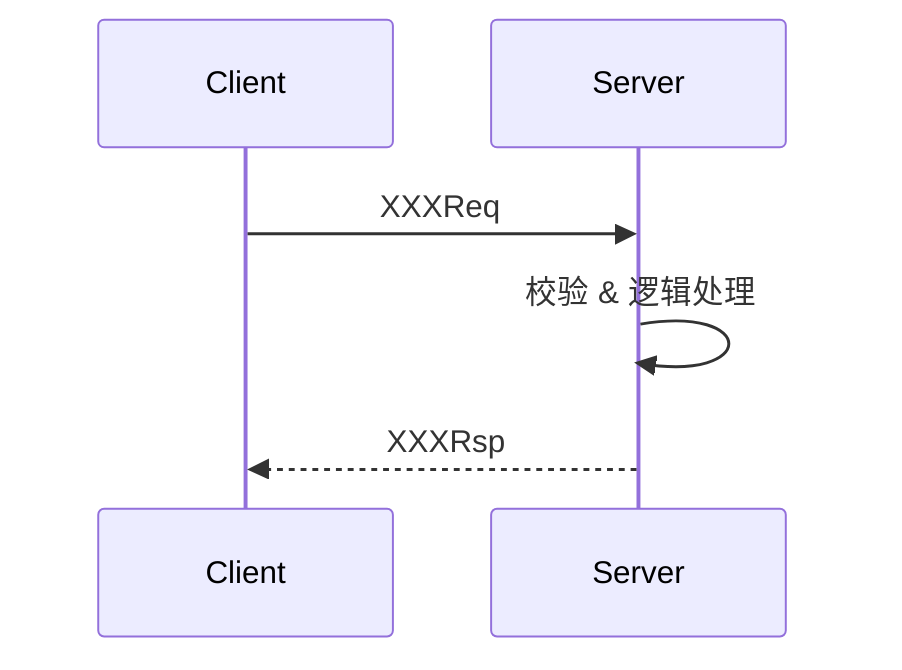
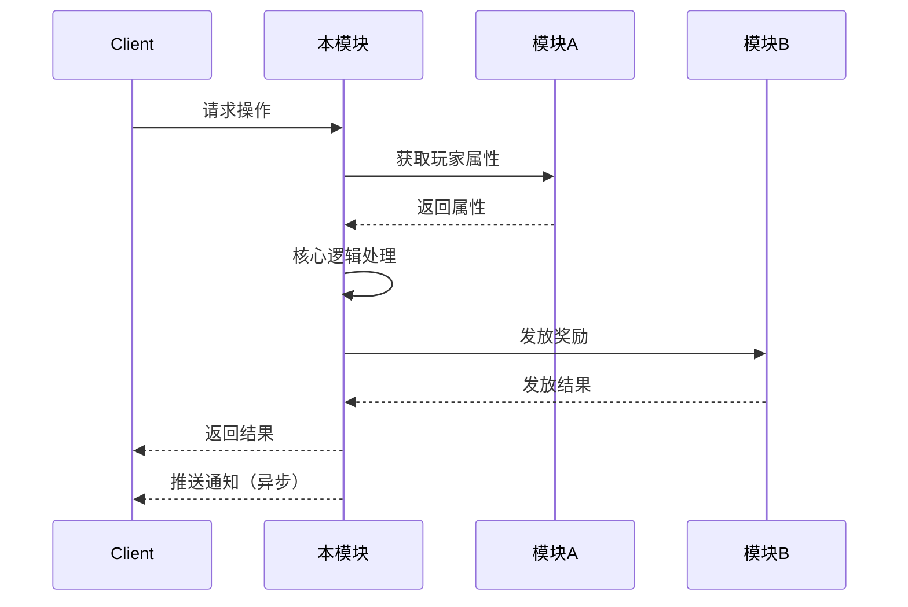
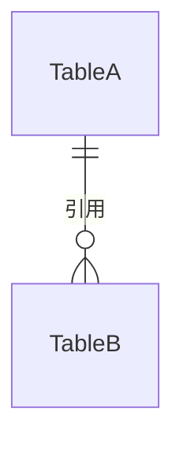

# G1-服务器-技术分析设计

## 概述

本技能在策划需求分析报告（逻辑审查）完成并通过后，基于 PRD 和需求分析报告，**从服务器技术开发视角**进行完整的技术分析与方案设计。

> **定位边界**：
> - ✅ 基于已通过审查的 PRD 和需求分析报告进行技术设计
> - ✅ 设计配置表结构、通讯协议、数据存储结构、组件接口
> - ✅ 分析关联模块的调用关系、数据流、时序交互
> - ✅ 识别实现中的坑点、维护策略和扩展预留
> - ❌ 不涉及架构层和框架层的设计（不修改 GoOne 框架 `lib/service/` 本身）
> - ❌ 不涉及具体代码实现（不写 Go 代码，只定义接口和数据结构）
> - ❌ 不审查 PRD 逻辑（那是"需求分析"技能的职责）

## 适用场景

- 需求分析报告通过审查后，进入技术方案设计阶段
- 策划提交新功能 PRD，开发需要输出技术方案供评审
- 多人协作开发前，需要统一技术方案和对齐接口约定
- 版本迭代中需要对已有模块进行改造，需要技术方案支撑

---

## 前置条件

本技能依赖需求分析报告已输出。开始前必须确认：

1. 知识库中 `{analysis_output_dir}/{需求名称}/需求分析报告.md` 已存在
2. 需求分析报告中的致命和严重问题已全部闭环（状态为"已解决"或"不予处理"）
3. 如果需求分析报告不存在，提示用户先使用"G1-服务器-需求分析"技能完成审查

---

## 工作流程

### 第一步：获取项目配置

调用 `G1-项目配置` 技能获取项目配置信息：

> - `vault_path` = Obsidian Vault 路径（用于 obsidian-cli 的 `vault=` 参数）
> - `prd_dir` = 策划需求文档目录（相对 vault 根目录）
> - `analysis_output_dir` = 技术输出目录（相对 vault 根目录）
>
> **输出目录**固定为 `{analysis_output_dir}/{需求名称}/`。

如果 `.GoOne/conf.json` 不存在，`G1-项目配置` 技能会自动引导创建。

---

### 第二步：拉取输入文档

按以下顺序通过 obsidian-cli 收集所有输入材料：

1. **PRD 文档**：通过 obsidian-cli 定位并读取需求对应的 PRD 文档：
   ```bash
   obsidian vault="{vault_path}" search query="{需求名称}"
   obsidian vault="{vault_path}" read path="{prd_dir}/{文档名称}"
   ```
2. **需求分析报告**：通过 obsidian-cli 读取：
   ```bash
   obsidian vault="{vault_path}" read path="{analysis_output_dir}/{需求名称}/需求分析报告.md"
   ```
3. **逻辑审查报告历史**：通过 obsidian-cli 搜索 `{analysis_output_dir}/{需求名称}/` 下所有逻辑审查报告：
   ```bash
   obsidian vault="{vault_path}" search query="逻辑审查报告"
   ```
4. **关联 PRD**：扫描 PRD 文档中的 `[[wiki-link]]` 引用，通过 obsidian-cli 递归读取被引用的关联需求文档（最多 2 层）：
   ```bash
   obsidian vault="{vault_path}" read file="{wiki-link名称}"
   ```
5. **已有技术方案**：通过 obsidian-cli 搜索是否已有同名或相关模块的技术方案，避免重复设计或冲突：
   ```bash
   obsidian vault="{vault_path}" search query="{需求名称} 技术分析方案"
   ```

---

### 第三步：需求分类与开发规范匹配

根据 PRD 内容和需求分析报告，识别需求所属的业务分类，并匹配合适的开发规范。

#### 需求分类体系

| 分类 | 典型特征 | 示例 |
|------|---------|------|
| **活动类** | 有明确起止时间、限时规则、奖励发放、参与条件 | 限时签到、节日活动、赛季通行证 |
| **养成类** | 涉及玩家属性成长、升级、突破、消耗材料 | 角色升级、装备强化、技能树 |
| **社交类** | 涉及玩家间交互、组队、公会、好友 | 公会系统、组队匹配、好友推荐 |
| **经济类** | 涉及货币/道具的产出与消耗、交易 | 商城、拍卖行、背包、充值 |
| **战斗类** | 涉及对战逻辑、匹配、结算、战斗数据 | PVP匹配、BOSS战、伤害统计 |
| **系统类** | 基础设施型功能，支撑其他系统运行 | 邮件、公告、GM指令、日志 |

#### 规范遵循（强制）

> 在进行配置表 Proto、通讯协议、数据库存储等数据结构的设计时，**先去 `.GoOne/spec/` 目录下自行寻找并读取相关规范文档**，严格遵循其中的规则和约定。技能不固化具体规范文件名，以目录下实际文档为准。

## 项目框架关键技术要素

在进行技术设计时，必须基于以下项目技术要素展开：

| 要素 | 说明 | 涉及路径/模块 |
|------|------|-------------|
| **配置表 proto** | xlsx → proto → `.conf` → `module/gamedata` 查询代码 | `common/game_conf/xls/`、`common/game_proto/config/`、`common/game_data/`、`module/gamedata/repository/` |
| **通讯协议 proto（core）** | 共享消息、枚举、CMD 号段 | `common/game_proto/core/` |
| **service proto（ssrpc IDL）** | 各服务 rpc 定义 + ssrpc option | `common/game_proto/service/` |
| **存储 proto** | KV 抽象（dbsvr） | `common/game_proto/storage/` |
| **数据持久化** | MySQL（xorm ORM）、Redis（缓存/计数/排行榜）、ssdb | `lib/db/`（`mysql/`、`xorm/`、`redis/`、`ssdb/`） |
| **服务通信与路由** | bus + 分片串行事务（TransMgr sharded serial key）+ `SvrRouterRule_*` 路由规则 | `lib/service/`（`runtime/`、`bussvc/`、`ssrpc/`、`router/`）、`module/misc/` |
| **服务模式** | `cmd/<svc>/main.go` → `src/<svc>svr/app.go` 的 `NewApp()` → Component 注册 → ssrpc handler | `src/<svc>svr/`（connsvr/mainsvr/infosvr/mysqlsvr/roomcentersvr/web_svr） |
| **生成代码（禁手改）** | ssrpc wrapper + `.pb.go` | `api/gen/`、`common/protocol/` |
| **配置加载** | `module/conf`（启动不可变快照 + Get/Unmarshal） | `module/conf/`、`module/gconf/` |

---

### 第四步：多维技术分析

按以下 **7 个维度** 逐项进行技术分析与方案设计。

---

#### 维度 1：配置表数据设计

**目标：定义需求所需的 Excel 配置表结构和运行时 JSON 格式。**

**分析要点：**

1. **新增配置表**：
   - 确定需要新增几张 Excel 配置表，每张表的用途
   - 定义每张表的字段名、字段类型（int32 / int64 / string / float / bool / []int32 等）
   - 确定主键字段，以及是否需要联合主键
   - 标注哪些字段是数组/列表类型（如奖励列表、条件列表）

2. **已有配置表扩展**：
   - 是否需要给已有配置表新增字段
   - 新字段的默认值是什么（保证老配置兼容）
   - 是否需要在已有的数组字段中新增元素类型

3. **配置表之间的引用关系**：
   - 哪张表的外键引用了另一张表的主键
   - 引用关系是否形成环（应避免）
   - 被引用的表是否已存在

4. **运行时加载策略**：
   - 全量加载还是按需加载
   - 是否有热更新需求
   - 是否需要服务启动时校验配置完整性

**设计输出格式：**

```markdown
### 配置表：{表名}

| 字段名 | 类型 | 说明 | 默认值 | 备注 |
|--------|------|------|--------|------|
| id | int32 | 唯一ID | - | 主键 |
| name | string | 名称 | "" | |
| ... | ... | ... | ... | ... |


**Proto 路径**：`common/game_proto/config/{文件名}.proto`
**运行时路径**：`common/game_data/{目录}/{文件名}.conf`
**加载方式**：全量加载 / 按需加载
```

---

#### 维度 2：通讯协议设计

**目标：定义客户端与服务器之间的 protobuf 消息结构。**

**分析要点：**

1. **协议分类**：
   - 请求消息（Req）：客户端 → 服务器
   - 响应消息（Rsp）：服务器 → 客户端
   - 推送消息（Push/Notify）：服务器主动推送给客户端
   - 是否需要定义通用的错误码枚举

2. **消息结构设计**：
   - 每个协议的字段名、字段类型、字段编号
   - 嵌套消息类型（如奖励列表、条件组）
   - 可选字段 vs 必选字段标注
   - 列表字段的长度上限（防止客户端恶意发包）

3. **协议路由设计**：
   - 该协议由哪个服务（Service）处理
   - Message ID 分配（需要确认项目中已有的消息 ID 范围）
   - 是否需要中间件处理（鉴权、限频、日志）

4. **协议交互时序**：
   - 单次请求-响应的流程
   - 涉及异步操作（匹配、等待确认）时的协议交互时序
   - 推送消息的触发条件和时机
   - 断线重连后的协议补偿策略

**设计输出格式：**

```markdown
### 协议列表

| 消息名 | 类型 | 方向 | 所属服务 | 说明 |
|--------|------|------|---------|------|
| XXXReq | Req | C→S | account | ... |
| XXXRsp | Rsp | S→C | account | ... |
| XXXNotify | Push | S→C | gate | ... |

### 协议详情：{消息名}

```protobuf
message XXXReq {
  int32 field1 = 1;  // 说明
  string field2 = 2; // 说明
}

message XXXRsp {
  int32 ret_code = 1; // 返回码
  repeated Reward rewards = 2; // 奖励列表
}
```

### 协议交互时序


```

---

#### 维度 3：数据存储结构设计

**目标：定义 MySQL 表结构和 Redis 数据结构。**

**分析要点：**

1. **MySQL 表设计（xorm ORM）**：
   - 确定需要新建的表（持久化权威数据通常落 MySQL，经 `mysqlsvr` 异步写库）
   - 定义表的字段结构（Go struct + xorm tag，对应 `lib/db/xorm/`）
   - 确定表的主键（通常是玩家 ID 或组合 ID）
   - 设计索引（单字段索引、复合索引、唯一索引）
   - 区分"玩家私有数据" vs "全局共享数据"
   - 对于玩家私有数据，考虑是独立表还是通过 KV 抽象（`common/game_proto/storage/` + dbsvr）存储

2. **Redis 数据结构设计**：
   - 确定使用的 Redis 数据类型（String / Hash / Set / Sorted Set / List）
   - Key 命名规范（如 `{模块}:{玩家ID}:{子项}`）
   - 过期时间（TTL）策略
   - 是否需要 Lua 脚本保证原子性

3. **数据生命周期**：
   - 数据创建时机（玩家注册时 / 首次使用功能时 / 服务启动时）
   - 数据更新频率（每次操作 / 定时批量 / 跨天重置）
   - 数据清理策略（永久保留 / 赛季结束后清理 / TTL 自动过期）
   - 数据归档需求（历史数据是否需要迁移到冷存储）

4. **数据一致性**：
   - MySQL 和 Redis 之间数据的一致性问题
   - 哪些数据以 MySQL 为准（持久化权威），哪些以 Redis 为准（实时权威）
   - 缓存更新策略（Cache-Aside / Write-Through / Write-Behind）

**设计输出格式：**

```markdown
### MySQL 表：{table_name}

| 字段名 | 类型 | 说明 | 索引 |
|----------|------|------|------|
| id | int64 | 玩家ID | 主键 |
| field1 | int32 | ... | |
| field2 | varchar | ... | |
| extra | blob | ... | |
| updated_at | int64 | 更新时间戳 | |

### Redis 结构

| Key 模板 | 类型 | 说明 | TTL |
|----------|------|------|-----|
| `module:{pid}:daily` | Hash | 每日数据 | 次日5:00 |
| `module:rank:global` | Sorted Set | 全局排行榜 | 永久 |
```

---

#### 维度 4：组件化模块设计（接口定义）

**目标：定义模块的对外接口和内部组件划分，不涉及具体实现代码。**

**分析要点：**

1. **模块定位**：
   - 本模块在整体架构中的位置（属于哪个 Service：connsvr/mainsvr/infosvr/mysqlsvr/roomcentersvr/web_svr）
   - 模块的核心职责（一个模块只做一件事）
   - 是否依赖已有的框架组件（`runtime.Component`、`bussvc.TransMgr`、`ssrpc.Registry`、`router`）

2. **对外接口定义**：
   - 组件初始化经 `app.MustRegister(...)` 装配到 `*runtime.App`（注册顺序即 Start 顺序）
   - ssrpc handler 通过 `Register<Service>ToRegistry(r, srv)` 注册，串行化优先复用 TransactionMgr sharded serial key
   - 公开方法签名（Go 风格）：方法名、参数类型、返回值类型、方法用途
   - 哪些方法是 key-local 串行的、哪些不是（Handlers must stay key-local，禁依赖全局单线程顺序）
   - 接口的幂等性要求（重复调用不产生副作用）

3. **内部组件划分**：
   - Logic 层：核心业务逻辑，纯函数，不依赖网络/IO
   - Route 层：协议路由处理，参数校验，调用 Logic
   - Data 层：数据读写封装，屏蔽底层存储细节
   - Event 层：事件发布/订阅（如果需要通知其他模块）

4. **错误处理约定**：
   - 定义本模块的错误码范围
   - 错误返回约定（Go error vs 业务错误码）
   - 哪些错误需要记录日志，哪些只需返回给客户端

5. **事件定义**：
   - 本模块会发布哪些事件（用于其他模块订阅）
   - 本模块需要订阅哪些外部事件
   - 事件的 Payload 结构

**设计输出格式：**

```markdown
### 模块：{模块名}

**所属服务**：`{svc}svr`（如 mainsvr）
**文件路径**：`src/{svc}svr/{模块名}/`

#### 对外接口

| 方法签名 | 用途 | 幂等 | 并发模型 |
|----------|------|------|---------|
| `NewXxxComponent(app)` | 注册 Component | - | 启动期装配 |
| `DoXxx(ctx, pid, ...) error` | 执行某操作 | 是 | TransMgr serial key 串行 |
| `GetXxx(ctx, pid) (*Data, error)` | 查询某数据 | 是 | key-local 串行 |

#### 发布事件

| 事件名 | Payload | 触发时机 |
|--------|---------|---------|
| `EventXxxCompleted` | `{pid, result}` | 操作完成时 |

#### 订阅事件

| 事件名 | 来源模块 | 响应行为 |
|--------|---------|---------|
| `EventPlayerLogin` | player | 检查并刷新每日数据 |
```

---

#### 维度 5：关联模块交互分析

**目标：梳理本模块与其他业务模块的调用关系、数据流和时序。**

**分析要点：**

1. **依赖关系图**：
   - 本模块直接依赖了哪些模块（调用其接口）
   - 哪些模块依赖了本模块（被调用关系）
   - 标注调用方向和数据流向

2. **典型业务流程的跨模块时序**：
   - 选 1-2 个核心业务场景，画出跨模块的时序图
   - 标注每个步骤调用了哪个模块的哪个接口
   - 标注同步调用 vs 异步事件

3. **数据共享与竞争**：
   - 哪些数据实体被多个模块同时读写
   - 是否存在并发写入同一数据的场景
   - 写入顺序是否有要求

4. **模块间协议约定**：
   - 调用其他模块时的前置条件（如"玩家必须在线"）
   - 调用其他模块时的后置保证（如"调用发奖接口后奖励必定到账"）
   - 调用失败时的降级策略

**设计输出格式：**

```markdown
### 模块依赖关系

```
[本模块]
    ├── 调用 → [模块A] : 获取玩家属性（同步）
    ├── 调用 → [模块B] : 发放奖励（同步）
    ├── 发布事件 → [模块C] : 通知任务进度更新
    └── 订阅事件 ← [模块D] : 监听玩家登录
```

### 核心流程时序：{场景名}


```

---

#### 维度 6：坑点与风险识别

**目标：预判开发过程中可能遇到的难点和线上可能爆发的风险。**

**分析要点：**

1. **性能风险**：
   - 是否存在高频调用场景（QPS 预估）
   - 是否存在大数据量查询（如全量排行榜、全服广播）
   - MySQL 查询是否需要覆盖索引、是否走 `mysqlsvr` 异步写
   - Redis 大 Key 风险（Sorted Set 元素过多、Hash 字段过多）
   - 是否需要做缓存预热

2. **并发风险**：
   - 哪些操作存在竞态条件（如限量抢购、同时领取）
   - 是否需要分布式锁（Redis SETNX / MySQL 行锁）
   - 是否需要乐观锁（版本号机制）
   - 并发下的数据一致性保证策略（优先复用 TransactionMgr sharded serial key）

3. **数据风险**：
   - 数值溢出风险（int32 上限约 21 亿）
   - 浮点数精度问题（货币/概率计算）
   - 数据膨胀风险（日志类数据无限增长）
   - 配置表数值填错的影响（是否有上下限校验）

4. **兼容风险**：
   - 老玩家存量数据的兼容处理
   - 客户端旧版本的协议兼容
   - 配置热更新时的中间状态

5. **安全风险**：
   - 是否有客户端可伪造的字段（如价格由客户端传入）
   - 是否有越权操作风险（玩家 A 操作玩家 B 的数据）
   - 是否有重放攻击风险（需做幂等保证的接口）
   - GM 指令的权限和审计

**设计输出格式：**

```markdown
### 风险清单

| # | 风险类别 | 风险描述 | 影响 | 应对策略 |
|---|---------|---------|------|---------|
| 1 | 并发 | 限量抢购存在超卖风险 | 高 | 使用 Redis 原子递减 + 异步回写 MySQL |
| 2 | 数据膨胀 | 操作日志无上限增长 | 中 | 设置 TTL 或按月分表归档 |
| 3 | 兼容 | 老玩家缺少新字段默认值 | 高 | 定义默认值策略，读时填充 |
```

---

#### 维度 7：维护与扩展预留

**目标：为后续迭代和运营需求预留可维护性和扩展空间。**

**分析要点：**

1. **配置驱动**：
   - 哪些逻辑参数应该做成配置项而非硬编码
   - 概率、上限、冷却时间等运营常调参数是否都已配置化
   - 是否有 A/B Test 或灰度发布的需求

2. **可扩展点**：
   - 当前设计方案下，未来可能扩展的方向有哪些
   - 哪些字段使用了 `repeated` / `map` 类型以适应未来扩展
   - 协议是否预留了扩展字段（reserved field numbers）

3. **运营工具需求**：
   - 是否需要配套的 GM 指令（数据查询、手动干预、补偿发放）
   - 是否需要运营后台的可视化管理界面
   - 是否需要数据统计埋点（BI 需求）

4. **测试策略**：
   - 单元测试如何覆盖核心逻辑（`go test -count=1 ./...`，不依赖外部中间件）
   - 集成测试的场景设计（`GOONE_INTEGRATION=1 go test ./...`，依赖真实 mysql/redis/zk/rabbitmq）
   - 压力测试的关注指标（QPS、延迟、内存）

5. **监控与告警**：
   - 需要监控的关键指标（调用量、成功率、延迟 P99）
   - 需要设置的告警规则（成功率低于阈值、延迟超过阈值）
   - 关键日志的格式和级别

**设计输出格式：**

```markdown
### 配置化清单

| 参数 | 当前建议值 | 配置路径 | 说明 |
|------|-----------|---------|------|
| 每日上限 | 10 | 配置表 daily_limit | 运营可调 |
| 概率权重 | 见配置表 | 配置表 prob_table | 支持热更 |

### GM 指令需求

| 指令 | 参数 | 用途 |
|------|------|------|
| `/gm_xxx_reset` | pid | 重置玩家数据 |
| `/gm_xxx_query` | pid | 查询玩家状态 |

### 扩展预留

| 预留点 | 当前状态 | 未来方向 |
|--------|---------|---------|
| 协议 reserved 字段 10-20 | 已预留 | 二期新增交互类型 |
```

---

### 第五步：输出技术分析方案

将以上所有维度的分析汇总，输出到知识库指定目录。

**输出命令**：
```bash
obsidian vault="{vault_path}" create name="{analysis_output_dir}/{需求名称}/技术分析方案" content="{方案内容}"
```

**方案结构：**

```markdown
# {需求名称} — 技术分析方案

> 方案版本：v1.0
> 创建日期：{date}
> 基于 PRD：[[{PRD路径}]]
> 基于需求分析报告：[[{analysis_output_dir}/{需求名称}/需求分析报告]]
> 方案状态：草稿 / 评审中 / 已确认

---

## 一、需求概述

### 1.1 功能简介

（用 3-5 句话概括需求的核心功能）

### 1.2 需求分类

分类：{活动类/养成类/社交类/经济类/战斗类/系统类}

### 1.3 涉及服务

| 服务 | 角色 |
|------|------|
| account | ... |
| gate | ... |

---

## 二、配置表设计

### 2.1 新增配置表

（按维度 1 的输出格式展开每张表）

### 2.2 已有配置表扩展

（列出需要在已有表中新增的字段）

### 2.3 配置表引用关系



---

## 三、通讯协议设计

### 3.1 协议总览

（协议列表汇总表）

### 3.2 协议详情

（按维度 2 的输出格式展开每个协议）

### 3.3 协议交互时序

（核心流程的序列图）

---

## 四、数据存储设计

### 4.1 MySQL 结构

（按维度 3 的输出格式展开每张表）

### 4.2 Redis 结构

（按维度 3 的输出格式展开每种 Key）

### 4.3 数据生命周期

| 数据 | 创建时机 | 更新频率 | 清理策略 |
|------|---------|---------|---------|
| ... | ... | ... | ... |

---

## 五、模块设计

### 5.1 模块架构

```
src/{svc}svr/{模块名}/              # 如 src/mainsvr/role/
├── app.go          # NewApp() 入口（装配 Component，整个服务共用一个 app.go）
├── globals/        # 服务级全局（TransMgr、RoleMgr 等管理器）
├── service/        # ssrpc handler 实现（经 Register<Service>ToRegistry 注册）
└── {子模块}/       # 业务子目录（role、room、info 等）
```

### 5.2 对外接口

（按维度 4 的输出格式展开）

### 5.3 事件定义

（按维度 4 的输出格式展开）

---

## 六、关联模块分析

### 6.1 模块依赖关系

（按维度 5 的输出格式展开）

### 6.2 核心流程时序

（按维度 5 的输出格式展开）

### 6.3 跨模块数据共享

| 数据实体 | 写入模块 | 读取模块 | 并发策略 |
|----------|---------|---------|---------|
| ... | ... | ... | ... |

---

## 七、风险与应对

（按维度 6 的输出格式展开风险清单）

---

## 八、维护与扩展

### 8.1 配置化清单

### 8.2 GM 指令需求

### 8.3 扩展预留

### 8.4 测试策略

### 8.5 监控指标

---

## 附录A：DB-KV Store 选择

（说明 Redis / MySQL(xorm) / ssdb / storage KV 抽象 在此模块中的选择依据）

## 附录B：需求分析报告中遗留问题的技术视角补充

（如果需求分析报告中有"技术侧可消化"的问题，在此说明技术方案如何兜底）
```

---

### 第六步：方案评审与迭代

1. **输出方案后**：通知相关开发者和策划进行方案评审
2. **收集反馈**：记录评审意见，更新方案内容
3. **版本管理**：每次重大修改后方案版本号 +0.1
4. **关联归档**：技术方案确认后，在需求分析报告的"附录A"中补充技术方案的 wiki-link 引用

```
需求分析报告通过 → 拉取PRD+分析报告 → 需求分类 → 7维技术分析
                                                    ↓
                                               输出技术方案
                                                    ↓
                                               团队评审
                                                    ↓
                                           通过? ─── 否 → 修改方案
                                            └── 是 → 方案确认 → 开发启动
```

---

## 设计原则

1. **配置驱动优先**：凡是运营可能调整的参数，必须走配置表，不能硬编码
2. **协议向前兼容**：新增字段使用 optional 或默认值，不删除已有字段编号
3. **数据读写分离**：区分高频读 vs 高频写的数据，选择合适的存储介质
4. **幂等设计**：所有涉及奖励发放、状态变更的接口必须考虑幂等性
5. **失败隔离**：一个模块的异常不应该影响不相关的其他模块
6. **先设计后编码**：方案确认前不写实现代码，避免返工

---

## 常见需求分类速查

| 分类 | 配置表特点 | 存储特点 | 协议特点 |
|------|-----------|---------|---------|
| 活动类 | 时间配置、奖励配置、条件配置 | 玩家参与记录 (MySQL)、计数/排名 (Redis) | 查询→参与→领奖 三步协议 |
| 养成类 | 等级表、消耗表、属性表 | 玩家养成数据落 MySQL 或 storage KV | 升级请求→校验消耗→返回结果 |
| 社交类 | 权限配置、上限配置 | 关系数据 (MySQL)、在线状态 (Redis) | 请求→确认/拒绝 异步协议 |
| 经济类 | 物品表、价格表 | 背包数据 (MySQL)、交易锁 (Redis) | 查询→扣费→发货 事务协议 |
| 战斗类 | 匹配规则、结算规则 | 战斗记录 (MySQL 归档)、实时状态 (Redis) | 匹配→确认→战斗→结算 |
| 系统类 | 较少，可能只有开关 | 轻量，多为 Redis | — |
