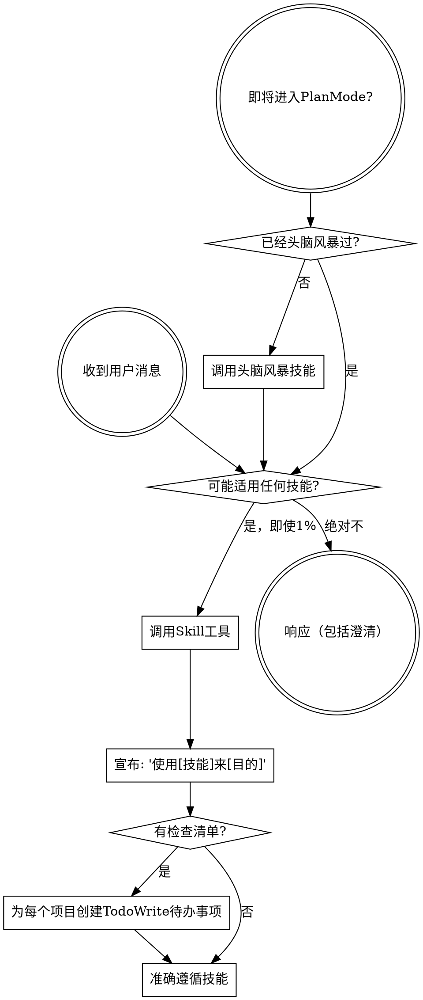

<SUBAGENT-STOP>
如果你作为子代理被调度来执行特定任务，请跳过此技能。
</SUBAGENT-STOP>

<EXTREMELY-IMPORTANT>
如果你认为技能有1%的可能性适用于你正在做的事情，你绝对必须调用该技能。

如果技能适用于你的任务，你没有选择。你必须使用它。

这不是可协商的。这不是可选的。你无法合理化逃避这一点。
</EXTREMELY-IMPORTANT>

## 指令优先级

超级能力技能覆盖默认系统提示行为，但**用户指令始终优先**：

1. **用户的明确指令**（CLAUDE.md、GEMINI.md、AGENTS.md、直接请求）——最高优先级
2. **超级能力技能**——在冲突时覆盖默认系统行为
3. **默认系统提示**——最低优先级

如果CLAUDE.md、GEMINI.md或AGENTS.md说"不要使用TDD"而技能说"始终使用TDD"，请遵循用户的指令。用户掌控一切。

## 如何访问技能

**在Claude Code中：** 使用`Skill`工具。当你调用技能时，其内容被加载并呈现给你——直接遵循它。永远不要使用Read工具读取技能文件。

**在Copilot CLI中：** 使用`skill`工具。技能从已安装的插件自动发现。`skill`工具的工作方式与Claude Code的`Skill`工具相同。

**在Gemini CLI中：** 通过`activate_skill`工具激活技能。Gemini在会话开始时加载技能元数据，并在需要时激活完整内容。

**在其他环境中：** 检查你的平台文档，了解如何加载技能。

## 平台适配

技能使用Claude Code工具名称。非CC平台：请参阅`references/copilot-tools.md`（Copilot CLI）、`references/codex-tools.md`（Codex）获取工具等效项。Gemini CLI用户通过GEMINI.md自动获取工具映射。

# 使用技能

## 规则

**在任何响应或操作之前调用相关或请求的技能。** 即使技能有1%的可能性适用，也意味着你应该调用技能来检查。如果调用的技能最终不适合该情况，你不必使用它。

## 危险信号

这些想法意味着停止——你在合理化：

| 想法 | 现实 |
|---------|---------|
| "这只是一个简单的问题" | 问题就是任务。检查技能。 |
| "我需要更多上下文先" | 技能检查在澄清问题之前。 |
| "让我先探索代码库" | 技能告诉你如何探索。先检查。 |
| "我可以快速检查git/文件" | 文件缺少对话上下文。检查技能。 |
| "让我先收集信息" | 技能告诉你如何收集信息。 |
| "这不需要正式技能" | 如果技能存在，使用它。 |
| "我记得这个技能" | 技能在发展。阅读当前版本。 |
| "这不算是任务" | 行动 = 任务。检查技能。 |
| "技能小题大做" | 简单的事情变得复杂。使用它。 |
| "我先做这件事" | 做任何事情之前检查。 |
| "这感觉很有成效" | 无纪律的行动浪费时间。技能防止这种情况。 |
| "我知道那是什么意思" | 知道概念 ≠ 使用技能。调用它。 |

## 技能优先级

当多个技能可能适用时，使用此顺序：

1. **流程技能优先**（头脑风暴、调试）- 这些决定如何处理任务
2. **实施技能其次**（前端设计、mcp-builder）- 这些指导执行

"让我们构建X" → 先头脑风暴，然后实施技能。
"修复这个bug" → 先调试，然后领域特定技能。

## 技能类型

**严格**（TDD、调试）：准确遵循。不要偏离纪律。

**灵活**（模式）：根据上下文调整原则。

技能本身会告诉你是哪一种。

## 用户指令

指令说什么，不是怎么做。"添加X"或"修复Y"不意味着跳过工作流。