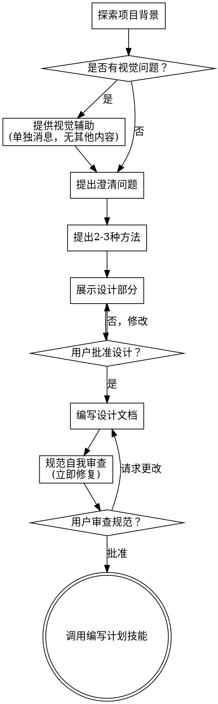

# 将想法转化为设计

通过自然协作对话，帮助将想法转化为完整的设计和规范。

首先了解当前项目背景，然后逐一提问以完善想法。一旦理解了要构建的内容，展示设计并获得用户批准。

<HARD-GATE>
在展示设计并获得用户批准之前，不得调用任何实现技能、编写任何代码、搭建任何项目或采取任何实现行动。无论项目看起来多么简单，这都适用于每个项目。
</HARD-GATE>

## 反模式："这太简单了，不需要设计"

每个项目都要经历这个过程。待办事项列表、单一功能的工具、配置更改——所有这些都是如此。"简单"的项目正是未经检验的假设导致最多浪费工作的地方。设计可以很短（对于真正简单的项目只需几句话），但您必须展示它并获得批准。

## 检查清单

您必须为以下每个项目创建任务，并按顺序完成：

1. **探索项目背景** — 检查文件、文档、最近的提交
2. **提供视觉辅助**（如果主题涉及视觉问题）——这是单独的消息，不与澄清问题合并。请参阅下面的视觉辅助部分。
3. **提出澄清问题** — 一次一个，了解目的/约束/成功标准
4. **提出2-3种方法** — 说明权衡和您的建议
5. **展示设计** — 根据复杂性分部分展示，每部分后获得用户批准
6. **编写设计文档** — 保存到 `docs/superpowers/specs/YYYY-MM-DD-<topic>-design.md` 并提交
7. **规范自我审查** — 快速检查占位符、矛盾、歧义、范围（见下文）
8. **用户审查编写的规范** — 在继续之前请用户审查规范文件
9. **过渡到实施** — 调用编写计划技能创建实施计划

## 流程

**终止状态是调用编写计划。** 不要调用前端设计、mcp-builder或任何其他实现技能。头脑风暴之后唯一调用的技能是编写计划。

## 流程说明

**理解想法：**

- 首先检查当前项目状态（文件、文档、最近的提交）
- 在提出详细问题之前，评估范围：如果请求描述了多个独立的子系统（例如，"构建一个包含聊天、文件存储、计费和分析的平台"），立即标记这一点。不要花时间细化需要先分解的项目的细节。
- 如果项目对于单个规范来说太大，请帮助用户将其分解为子项目：独立的部分是什么，它们如何关联，应该按什么顺序构建？然后通过正常的设计流程对第一个子项目进行头脑风暴。每个子项目都有自己的规范→计划→实施周期。
- 对于范围适当的项目，逐一提问以完善想法
- 尽可能使用选择题，但开放式问题也可以
- 每条消息只问一个问题——如果一个主题需要更多探索，将其分解为多个问题
- 专注于理解：目的、约束、成功标准

**探索方法：**

- 提出2-3种不同的方法及其权衡
- 以您的建议和理由对话式地呈现选项
- 以您推荐的选项开头并解释原因

**展示设计：**

- 一旦您认为理解了要构建的内容，展示设计
- 根据复杂性调整每个部分：如果简单则几句话，如果复杂则最多200-300字
- 每部分后询问是否看起来正确
- 涵盖：架构、组件、数据流、错误处理、测试
- 如果某些内容不合理，请随时回去澄清

**设计隔离和清晰性：**

- 将系统分解为更小的单元，每个单元都有一个明确的目的，通过定义良好的接口进行通信，并且可以独立理解和测试
- 对于每个单元，您应该能够回答：它做什么，如何使用它，以及它依赖什么？
- 有人能否在不阅读其内部的情况下理解单元的作用？您能否在不破坏使用者的情况下更改内部？如果不能，则边界需要改进。
- 更小、界限明确的单元也更易于您处理——您对可以立即掌握的代码推理更好，并且当文件专注时，您的编辑更可靠。当文件变大时，这通常表明它做得太多了。

**在现有代码库中工作：**

- 在提出更改之前探索当前结构。遵循现有模式。
- 如果现有代码存在影响工作的问题（例如，文件变得太大、边界不清晰、职责混乱），请作为设计的一部分包含有针对性的改进——就像优秀的开发人员改进他们正在工作的代码一样。
- 不要提出不相关的重构。专注于服务当前目标的内容。

## 设计之后

**文档：**

- 将经过验证的设计（规范）写入 `docs/superpowers/specs/YYYY-MM-DD-<topic>-design.md`
  - （用户对规范位置的偏好覆盖此默认值）
- 如果可用，使用 elements-of-style:writing-clearly-and-concisely 技能
- 将设计文档提交到 git

**规范自我审查：**
编写规范文档后，用全新的眼光看待它：

1. **占位符扫描：** 是否有任何"TBD"、"TODO"、不完整的部分或模糊的要求？修复它们。
2. **内部一致性：** 是否有任何部分相互矛盾？架构是否与功能描述匹配？
3. **范围检查：** 这是否足够集中用于单个实施计划，还是需要分解？
4. **歧义检查：** 是否有任何要求可以有两种不同的解释？如果是，请选择一个并明确说明。

立即修复任何问题。无需重新审查——修复后继续。

**用户审查门：**
规范审查循环通过后，请用户在继续之前审查编写的规范：

> "规范已编写并提交到 `<path>`。请在我们开始编写实施计划之前审查它并告诉我您是否要做任何更改。"

等待用户的响应。如果他们请求更改，请进行更改并重新运行规范审查循环。只有在用户批准后才能继续。

**实施：**

- 调用编写计划技能创建详细的实施计划
- 不要调用任何其他技能。编写计划是下一步。

## 关键原则

- **一次一个问题** - 不要用多个问题压倒用户
- **优先选择选择题** - 可能时比开放式问题更容易回答
- **严格遵循YAGNI** - 从所有设计中删除不必要的功能
- **探索替代方案** - 在确定之前始终提出2-3种方法
- **增量验证** - 展示设计，获得批准后再继续
- **保持灵活** - 当某些内容不合理时，回去澄清

## 视觉辅助

一个基于浏览器的辅助工具，用于在头脑风暴期间显示模型、图表和视觉选项。作为工具提供——不是模式。接受辅助工具意味着它可用于受益于视觉处理的问题；这并不意味着每个问题都通过浏览器进行。

**提供辅助工具：** 当您预计即将到来的问题将涉及视觉内容（模型、布局、图表）时，一次性提出以获得同意：
> "如果我可以在网络浏览器中向您展示某些内容，我们正在处理的某些内容可能更容易解释。我可以随时制作模型、图表、比较和其他视觉效果。此功能仍处于开发阶段，可能会消耗较多token。想尝试吗？（需要打开本地URL）"

**此提议必须是单独的消息。** 不要将其与澄清问题、上下文摘要或任何其他内容合并。消息应仅包含上述提议，别无其他。在继续之前等待用户的响应。如果他们拒绝，请继续使用纯文本头脑风暴。

**逐问题决策：** 即使用户接受，也要为每个问题决定使用浏览器还是终端。测试：**用户通过查看比阅读更好理解吗？**

- **使用浏览器** 用于视觉内容——模型、线框图、布局比较、架构图、并排视觉设计
- **使用终端** 用于文本内容——需求问题、概念选择、权衡列表、A/B/C/D文本选项、范围决策

关于UI主题的问题并不自动是视觉问题。"在这种背景下，个性意味着什么？"是一个概念性问题——使用终端。"哪个向导布局效果更好？"是视觉问题——使用浏览器。

如果他们同意使用辅助工具，请在继续之前阅读详细指南：
`skills/brainstorming/visual-companion.md`