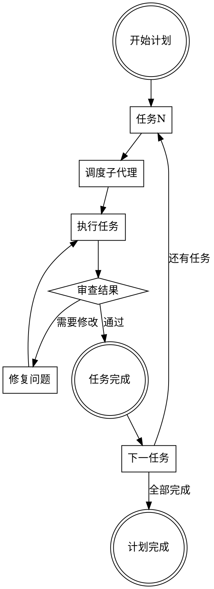

# 子代理驱动开发

## 概述

将复杂任务分解为独立的子任务，每个子任务由专门的子代理处理。这种方法提高了专注度、可审查性和执行质量。

**核心原则：** 每个任务一个子代理，审查作为检查点。

**开始时宣布：** "我正在使用子代理驱动开发技能来执行此计划。"

## 工作流程



## 两阶段审查

**第一阶段：规范合规**
- 任务是否按计划完成？
- 是否满足所有要求？
- 是否遵循TDD原则？

**第二阶段：代码质量**
- 代码是否符合风格指南？
- 是否有足够的测试覆盖率？
- 是否存在潜在的性能问题？

## 实施步骤

**步骤1：分解任务**

确保计划中的每个任务都是独立的、可测试的单元。

**步骤2：调度子代理**

为每个任务创建具有隔离上下文的子代理：

```python
# 示例：调度子代理执行单个任务
subagent = create_subagent(
    task="实现用户认证模块",
    context={"codebase": "current"},
    timeout=30
)
result = subagent.run()
```

**步骤3：执行任务**

子代理执行任务，遵循计划中的步骤。

**步骤4：审查结果**

```python
# 审查检查清单
review_checklist = [
    "任务完成了吗？",
    "测试通过了吗？",
    "代码符合标准吗？",
    "是否有回归？"
]
```

**步骤5：验证或修复**

根据审查结果，要么验证完成，要么要求子代理修复问题。

**步骤6：推进到下一任务**

## 子代理上下文隔离

每个子代理获得：
- 自己的工作目录
- 独立的代码库视图
- 相关的技能加载
- 任务特定的指令

## 审查标准

| 审查类型 | 标准 |
|-----------|-------|
| 规范合规 | 任务完成度、要求满足、TDD遵循 |
| 代码质量 | 风格、测试覆盖率、性能 |
| 架构 | 设计模式、依赖管理、可维护性 |

## 与执行计划技能的对比

| 特性 | 子代理驱动 | 内联执行 |
|-------|-------------|-----------|
| 上下文隔离 | 每个任务独立 | 共享上下文 |
| 审查检查点 | 每个任务 | 阶段性 |
| 并行执行 | 可能 | 顺序 |
| 专注度 | 高 | 中 |

## 何时选择子代理驱动

- 复杂的多阶段任务
- 需要严格审查的任务
- 团队协作场景
- 涉及多个技术栈的任务

## 何时选择内联执行

- 简单的单步任务
- 需要保持对话上下文
- 快速原型开发
- 探索性工作

## 工具参考

使用`create_subagent`工具创建子代理：

```bash
# 命令格式
create_subagent --task "任务描述" --context "context.json"
```

## 与其他技能的配合

- **编写计划**：提供任务定义
- **测试驱动开发**：指导子代理的执行
- **代码审查**：任务间的审查步骤
- **完成前验证**：最终验证

## 总结

子代理驱动开发通过隔离上下文和强制审查检查点提高了代码质量和可预测性。它特别适合需要多个独立步骤的复杂任务。