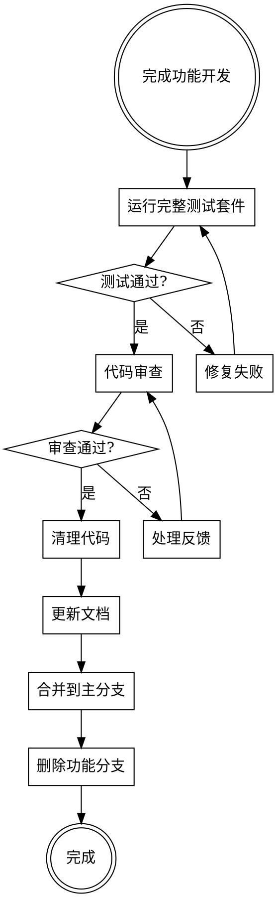

# 完成开发分支

## 概述

完成功能开发后，确保代码质量、运行最终验证、清理分支并安全合并到主分支。

**核心原则：** 完整验证后再合并。

## 工作流程



## 检查清单

**开发完成检查：**
- [ ] 所有功能已实现
- [ ] 单元测试覆盖
- [ ] 集成测试通过
- [ ] 代码审查完成

**合并前检查：**
- [ ] 运行完整测试套件
- [ ] 更新文档
- [ ] 清理调试代码
- [ ] 检查依赖更新
- [ ] 确保与主分支同步

**合并后检查：**
- [ ] 删除功能分支
- [ ] 更新变更日志
- [ ] 通知团队
- [ ] 部署到测试环境

## 实施步骤

**步骤1：运行完整测试套件**

```bash
# 运行所有测试
npm test

# 运行端到端测试
npm run test:e2e

# 检查代码覆盖率
npm run coverage
```

**步骤2：代码审查**

请求审查者进行最终审查。

**步骤3：处理审查反馈**

根据审查反馈进行必要的修改。

**步骤4：清理代码**

```bash
# 删除调试代码
grep -r "console.log" --include="*.js" .
grep -r "debugger" --include="*.js" .

# 运行代码检查
npm run lint
```

**步骤5：更新文档**

更新README、API文档等。

**步骤6：合并到主分支**

```bash
# 切换到主分支
git checkout main

# 拉取最新代码
git pull origin main

# 切换回功能分支
git checkout feature-branch

# 合并主分支
git merge main --no-ff

# 解决冲突（如果有）

# 推送分支
git push origin feature-branch

# 创建PR并合并
```

**步骤7：删除功能分支**

```bash
# 删除本地分支
git branch -d feature-branch

# 删除远程分支
git push origin --delete feature-branch
```

## 常见错误

| 错误 | 修复 |
|-------|---------|
| 跳过测试 | 始终运行完整测试套件 |
| 忽略代码审查 | 认真处理每个反馈 |
| 不清理调试代码 | 使用lint检查 |
| 直接合并 | 先同步主分支 |
| 忘记更新文档 | 检查清单确保完成 |

## 最佳实践

| 实践 | 说明 |
|-------|---------|
| 小批量合并 | 避免大型PR |
| 频繁同步 | 定期从主分支拉取 |
| 自动化测试 | CI/CD自动运行测试 |
| 代码审查 | 至少两人审查 |

## 工具参考

使用git命令管理分支：

```bash
# 查看分支状态
git status

# 查看分支历史
git log --oneline --graph

# 合并分支
git merge --no-ff
```

## 与其他技能的配合

- **请求代码审查**：发起最终审查
- **接受代码审查**：处理审查反馈
- **完成前验证**：最终验证
- **测试驱动开发**：确保测试覆盖

## 总结

完成开发分支是确保代码质量的最后一步。通过严格的检查清单和验证流程，可以安全地将功能合并到主分支。