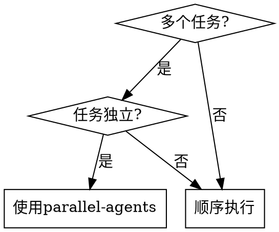
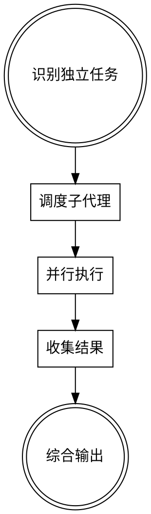

# 并行代理调度

## 概述

并行执行独立任务以加速工作流程。当多个任务可以独立完成时，同时调度多个子代理，然后综合结果。

**核心原则：** 独立任务 = 并行执行

**开始时宣布：** "我正在使用并行代理调度技能来并行执行多个独立任务。"

## 何时使用



**适用场景：**
- 搜索多个代码库
- 分析多个相关文件
- 并行运行测试套件的不同部分
- 同时收集不同数据源的信息

**不适用场景：**
- 任务有依赖关系
- 任务需要按特定顺序执行
- 需要共享状态的任务

## 工作流程



## 实施步骤

**步骤1：识别独立任务**

列出可以并行执行的任务。确保它们之间没有依赖关系。

**步骤2：调度子代理**

```python
# 示例：并行调度多个搜索任务
tasks = [
    {"task": "search_code", "query": "authentication"},
    {"task": "search_code", "query": "authorization"},
    {"task": "search_code", "query": "session management"}
]

# 并行调度所有任务
results = parallel_dispatch(tasks)
```

**步骤3：并行执行**

所有子代理同时工作，互不干扰。

**步骤4：收集结果**

等待所有任务完成，收集输出。

**步骤5：综合输出**

将各个结果整合成统一的报告。

## 最佳实践

| 实践 | 说明 |
|-------|---------|
| 任务隔离 | 每个子代理应有独立的上下文 |
| 超时控制 | 为每个任务设置合理的超时时间 |
| 错误处理 | 处理部分任务失败的情况 |
| 结果合并 | 智能合并相似结果，避免重复 |

## 常见错误

| 错误 | 修复 |
|-------|---------|
| 调度依赖任务 | 重新排序，确保独立任务并行 |
| 未设置超时 | 可能导致无限等待 |
| 忽略失败 | 应报告失败并继续其他任务 |
| 过度并行 | 太多并发任务可能降低性能 |

## 性能考虑

- 最佳并行度取决于可用资源
- 考虑API速率限制
- 监控任务执行时间
- 根据结果动态调整并行度

## 工具参考

使用`parallel_dispatch`工具调度并行任务：

```bash
# 命令格式
parallel_dispatch --tasks task1.json task2.json task3.json
```

## 与其他技能的配合

- **头脑风暴**：识别可以并行化的任务
- **执行计划**：在计划执行期间并行化独立步骤
- **系统调试**：并行收集不同来源的调试信息

## 总结

并行代理调度是加速多任务工作流程的强大技术。通过正确识别独立任务并并行执行，可以显著减少总执行时间。