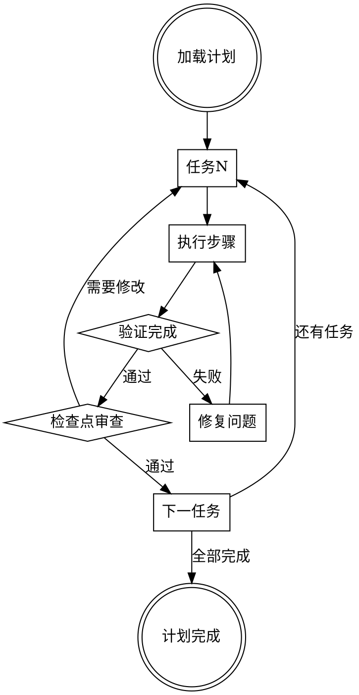

# 执行计划

## 概述

在当前会话中执行预先编写的实施计划。按顺序执行任务，在关键检查点进行审查，确保每个阶段都正确完成。

**核心原则：** 批量执行，阶段性审查。

**开始时宣布：** "我正在使用执行计划技能来执行此计划。"

## 工作流程



## 实施步骤

**步骤1：加载计划**

读取并理解计划文档中的任务列表。

**步骤2：逐个执行任务**

```python
# 示例：执行计划中的任务
for task in plan.tasks:
    print(f"执行任务: {task.name}")
    
    for step in task.steps:
        execute_step(step)
        
        # 验证每个步骤
        if not verify_step(step):
            fix_issue(step)
            break
    
    # 任务完成后验证
    verify_task(task)
```

**步骤3：验证完成**

运行测试确保任务完成正确。

**步骤4：检查点审查**

在每个主要阶段后进行审查：
- 验证任务完成度
- 检查代码质量
- 确保符合要求

**步骤5：推进到下一任务**

## 检查点频率

| 计划复杂度 | 检查点间隔 |
|-------------|-------------|
| 简单（<5任务） | 每2-3任务 |
| 中等（5-10任务） | 每任务 |
| 复杂（>10任务） | 关键任务后 |

## 验证清单

```python
# 任务验证检查清单
task_checklist = [
    "所有步骤已完成",
    "测试通过",
    "代码符合风格指南",
    "文档已更新",
    "没有引入回归"
]

# 计划验证检查清单
plan_checklist = [
    "所有任务完成",
    "端到端测试通过",
    "代码审查已完成",
    "文档完整",
    "部署就绪"
]
```

## 与子代理驱动开发的对比

| 特性 | 执行计划 | 子代理驱动 |
|-------|-----------|-------------|
| 上下文 | 共享会话 | 隔离 |
| 审查频率 | 阶段性 | 每个任务 |
| 并行执行 | 顺序 | 可能 |
| 适合场景 | 简单到中等任务 | 复杂任务 |

## 常见错误

| 错误 | 修复 |
|-------|---------|
| 跳过验证步骤 | 始终运行测试 |
| 忽略审查反馈 | 认真处理每个反馈 |
| 不更新文档 | 任务完成后更新文档 |
| 一次性完成所有任务 | 分阶段执行 |

## 工具参考

使用`execute_plan`工具执行计划：

```bash
# 命令格式
execute_plan --file "docs/plans/feature-plan.md" --checkpoint every
```

## 与其他技能的配合

- **编写计划**：提供计划文档
- **测试驱动开发**：指导每个任务的执行
- **完成前验证**：最终验证计划完成
- **子代理驱动开发**：复杂任务的替代方案

## 总结

执行计划技能提供了一种结构化的方式来执行预先定义的任务列表。通过批量执行和阶段性审查，确保工作质量和进度。