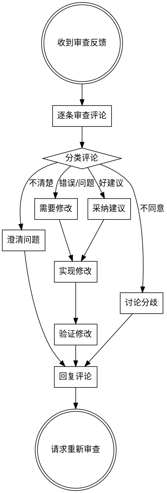

# 接受代码审查

## 概述

代码审查是协作开发的核心环节。以专业、尊重的态度处理审查反馈，确保高质量的代码交付。

**核心原则：** 审查是学习和改进的机会，不是批评。

## 工作流程



## 评论分类

| 类型 | 描述 | 处理方式 |
|-------|-------|-----------|
| **错误** | 代码有bug或逻辑错误 | 立即修复 |
| **改进** | 代码可以优化 | 考虑采纳 |
| **风格** | 不符合代码规范 | 按规范修改 |
| **问题** | 审查者有疑问 | 清晰解释 |
| **讨论** | 意见分歧 | 理性讨论 |

## 处理步骤

**步骤1：理解评论**

仔细阅读每条评论，确保理解审查者的意图。

**步骤2：分类评论**

根据类型对评论进行分类。

**步骤3：处理每一条**

```python
# 示例：处理评论的工作流程
for comment in review_comments:
    if comment.type == "error":
        fix_issue(comment)
    elif comment.type == "improvement":
        consider_improvement(comment)
    elif comment.type == "style":
        fix_style(comment)
    elif comment.type == "question":
        answer_question(comment)
    elif comment.type == "discussion":
        start_discussion(comment)
```

**步骤4：实现修改**

对于需要修改的评论，进行必要的代码更改。

**步骤5：验证修改**

运行测试确保修改没有引入回归。

**步骤6：回复评论**

对每条评论给出清晰的回复，说明做了什么修改。

**步骤7：请求重新审查**

完成所有修改后，请求审查者重新审查。

## 审查礼仪

**保持专业：**
- 感谢审查者的时间
- 保持冷静和尊重
- 关注代码而非个人

**有效沟通：**
- 清晰解释你的理由
- 对不同意的地方提出建设性讨论
- 提供足够的上下文

**积极态度：**
- 将审查视为学习机会
- 接受不同观点
- 专注于代码质量

## 常见错误

| 错误行为 | 正确做法 |
|-----------|-----------|
| 忽视评论 | 逐条处理所有评论 |
| 防御性回应 | 保持开放心态 |
| 一次提交多个修改 | 每次提交专注于一个问题 |
| 不运行测试 | 验证所有修改 |
| 不回复评论 | 清晰回复每条评论 |

## 工具参考

使用代码审查工具管理反馈：

```bash
# 查看审查评论
code_review list --pr 123

# 回复评论
code_review reply --comment-id 456 --message "已修复此问题"

# 请求重新审查
code_review request --pr 123
```

## 与其他技能的配合

- **请求代码审查**：发起审查流程
- **系统调试**：修复发现的bug
- **完成前验证**：验证修改

## 总结

代码审查是提高代码质量的重要环节。以专业、合作的态度处理审查反馈，将使整个团队受益。