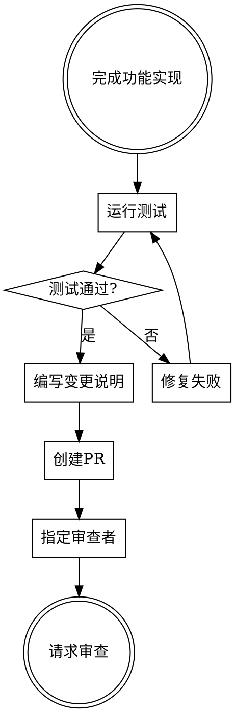

# 请求代码审查

## 概述

提交代码审查是确保代码质量的关键步骤。准备清晰、完整的审查请求，帮助审查者高效地理解和评估你的工作。

**核心原则：** 让审查者的工作尽可能轻松。

## 工作流程



## PR模板

使用结构化模板确保提供所有必要信息：

```markdown
## 变更类型

- [ ] 新功能
- [ ] Bug修复
- [ ] 代码重构
- [ ] 文档更新
- [ ] 测试添加

## 描述

简要描述此PR的目的和实现方式。

## 相关问题

关联的issue编号：#123

## 测试

- 运行了哪些测试？
- 测试结果如何？

## 检查清单

- [ ] 所有测试通过
- [ ] 代码符合风格指南
- [ ] 添加了适当的测试
- [ ] 更新了文档
- [ ] 没有引入回归

## 审查要点

特别关注的部分：
- 新增的认证模块
- 数据库查询优化
```

## 提交规范

**每个提交应该：**
- 是一个独立的逻辑单元
- 有清晰的提交信息
- 不包含无关更改

**提交信息格式：**
```
类型: 简短描述

详细描述（如果需要）

关联issue: #123
```

**类型：**
- `feat`：新功能
- `fix`：Bug修复
- `refactor`：代码重构
- `docs`：文档更新
- `test`：测试相关

## 准备步骤

**步骤1：确保测试通过**

```bash
# 运行所有测试
npm test

# 运行特定测试
npm test -- --grep "authentication"
```

**步骤2：检查代码风格**

```bash
# 运行代码检查
npm run lint
```

**步骤3：编写变更说明**

提供清晰的描述，帮助审查者理解变更。

**步骤4：创建PR**

使用项目的PR模板，填写所有必要信息。

**步骤5：指定审查者**

选择合适的审查者，考虑他们的专业领域。

**步骤6：请求审查**

发送审查请求，提供任何额外的上下文。

## 审查者选择

| 因素 | 考虑 |
|-------|-------|
| 专业知识 | 选择在相关领域有经验的审查者 |
| 可用性 | 考虑审查者当前的工作负载 |
| 多样性 | 选择不同背景的审查者 |
| 代码所有权 | 考虑代码模块的所有者 |

## 常见错误

| 错误 | 修复 |
|-------|-------|
| 测试未通过就提交 | 确保所有测试通过 |
| PR太大 | 拆分为更小的PR |
| 描述不清晰 | 提供详细的变更说明 |
| 缺少测试 | 添加适当的测试覆盖 |
| 代码风格问题 | 运行lint检查 |

## 工具参考

使用版本控制工具管理PR：

```bash
# 创建功能分支
git checkout -b feature/new-feature

# 提交更改
git commit -m "feat: add new feature"

# 推送分支
git push origin feature/new-feature

# 创建PR（在GitHub/GitLab中完成）
```

## 与其他技能的配合

- **测试驱动开发**：确保有良好的测试覆盖
- **接受代码审查**：处理审查反馈
- **完成开发分支**：完成后合并分支

## 总结

准备充分的代码审查请求是协作开发的良好实践。清晰的描述、完整的测试和良好的代码质量将使审查过程更加高效。