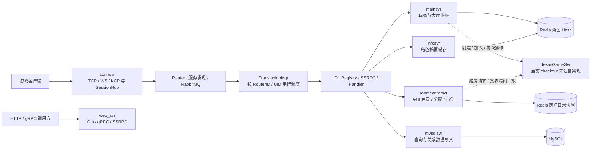
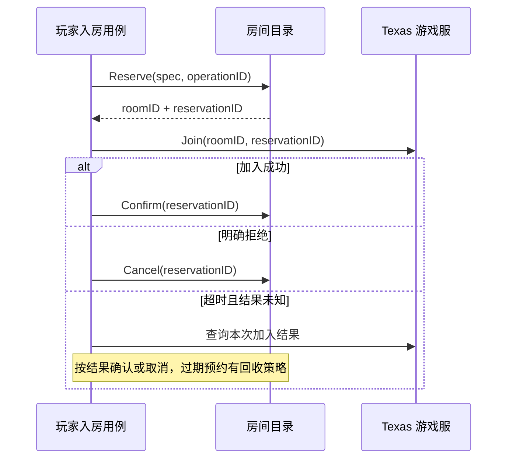

# GoOne 框架架构、组件与封装优化报告

审阅日期：2026-09-08。基线：`f2d78363bbd9ac4d696dcdb94203e6e3b4a2ffa1` 加当前工作区改动。

本报告依据当前源码、针对性测试、本地问题复现，以及主流框架官方资料编写。采用「karpathy-编码准则」：简单优先、说明假设、依据真实问题提出最小改进，不因追求形式上的优雅重写整个框架。本次交付为分析报告，未修改生产代码或现有测试，未执行部署。

## 1. 架构判断

**GoOne 已有较完整的服务运行与通信底座，当前主要短板是业务状态的所有权、跨组件失败语义和接口约束没有贯通。** 改进应优先让业务操作本身清晰、可靠，再考虑增加框架能力。

统一生命周期、IDL 生成 RPC、按键串行事务、背压、会话中心、Redis/MySQL 适配和观测能力都有实质实现。不能把当前项目评价为“没有框架”，也不适合再造一套启动器、RPC 框架或通用 Manager。

你所感受到的封装性和阅读性问题是有代码依据的，集中表现为：

- `app.go` 声明了组件，业务代码却继续从 `globals`、包级默认对象取得依赖，实例边界不完整。
- `Role.PbRole`、`TexasMap`、`RoomsMap` 等内部状态公开，调用者必须记住修改、加锁、标脏、同步、保存的顺序。
- `Get` 可能创建状态，`Save` 可能只标脏，`SaveToDB` 实际写 Redis；名字不能准确预告副作用。
- 存储失败、消息发送成功、业务执行成功等不同结果混在一起，调用者需要穿透多层实现才能判断。
- 大量历史修复注释和旧设计文档与现行代码并存，增加了理解成本。

**建议保留现有底座，以“角色退出”和“快速入房”作为两个重构试点。** 它们已经暴露真实缺陷，改造收益可以通过测试直接验证。

优先级定义：P0 为不可信客户端可访问时应阻止上线的安全问题；P1 为影响状态正确性、保存或关键流程的问题；P2 为维护成本、能力契约和工程验证问题。优先级不等于已经发生线上事故。

## 2. 审阅范围与证据边界

重点读取了六个服务的装配入口，网关接入、角色登录/退出/商城、房间目录/占位、资料缓存、MySQL 仓储，以及 `runtime`、`bussvc`、`ssrpc`、`transaction`、`router`、RabbitMQ driver、配置和 gamedata 的关键实现。检查了 CI、测试分布和现有架构文档。

本次基于当前 checkout：起始已有 9 个未提交修改文件，包括几个 `app.go`、房间恢复文件和 tester 配置，分析包含这些修改。没有把旧报告中记录的问题自动认定为当前仍存在。

| 证据等级 | 本报告的含义 |
|---|---|
| 已复现 | 在本地调用真实代码，以桩替代外部依赖，观察到了所述行为 |
| 源码确认 | 可以指出具体控制流或接口缺口；没有模拟所有运行条件 |
| 待验证风险 | 有触发条件和证据，但还需 race、故障注入或部署信息确认影响 |
| 能力边界 | 当前代码范围或产品定位的差异，本身不等于 BUG |

未进行线上访问测试、真实中间件故障演练、全项目漏洞扫描或容量压测；没有测量线上 P99、CCU、成本，因而不提供虚构的性能排名和容量结论。

### 2.1 可读性现状的量化参考

统计范围为 `src`、`lib`、`module`、`tools/tester` 下 `rg --files` 枚举出的 Go 文件；排除 `.pb.go`、`.gen.go`，并用前 8 行的生成声明进一步排除生成文件。此范围不包含 `common`、`api/gen` 和其他工具目录。

| 指标 | 当前结果 | 应怎样理解 |
|---|---:|---|
| 非生成、非测试 Go 文件 | 311 | 用于判断本次审阅规模，不代表逐行审计全部文件 |
| `_test.go` 文件 | 122 | 文件数量不是覆盖率，其中部分测试可能依赖集成条件 |
| 手写生产文件超过 500 行 | 5 | 有适当拆分空间，但不是普遍超大文件问题 |
| 手写生产文件超过 800 行 | 0 | 不宜把“全部拆小文件”作为首要方案 |
| `src` 非测试代码中匹配 `globals.` 的行 | 95 | 包含合法装配调用，不应全数视为坏依赖 |

较长文件包括 `role/sync_state.go`（661 行）、`role/item.go`（634 行）、`service/c2s_ssrpc.go`（585 行）、`ssrpc/trace.go`（531 行）、`router/router.go`（503 行）。**主要问题是理解一次操作需要跨越多少隐含约定，而非单纯行数。**

## 3. 当前架构与组件职责



图中的 Route、Dispatch、RPC 是逻辑层，不是额外三个部署进程。各 bus 服务拥有对应的路由和事务处理实例。`web_svr` 采用 HTTP/gRPC 路径。

| 层或组件 | 已有职责与优点 | 目前需要收紧的边界 |
|---|---|---|
| `runtime.App` | 状态机、组件启停、Quiesce/Drain/Stop、错误监督、admin | 组件必须真正回传错误、遵守取消，不能仅实现接口签名 |
| `bussvc` | 统一标准组件装配，显式选择 bus driver | 包级 router、业务 globals、配置读取仍使多实例隔离不完整 |
| `net_mgr` / SessionHub | 统一多传输会话索引与接入控制 | 会话绑定与可信身份认证需要分清 |
| `transaction` | 按键串行、响应按事务 ID 分发、队列上限和 deadline | 同键串行不保护队列外的定时器，也不自动保护共享指针 |
| `ssrpc` / Registry | IDL 驱动，注册校验、Seal、中间件与多协议适配 | handler 仍暴露通信上下文和全局依赖；声明鉴权不等于完成认证链 |
| `router` / `svrinstmgr` / bus | 路由、发现、发布、就绪检查 | 发送完成与业务完成语义、运行错误向组件的传播需要明确 |
| `module/conf` | 统一入口、启动校验、配置快照 | 运行配置与 gamedata 热更新要在文档中严格区分 |
| `gamedata` | 生成查询接口、单表快照原子发布 | 跨表版本一致性、对外指针只读约定仍需设计 |
| `RoleMgr` / `Role` | 集中加载、增量同步、按模块持久化 | 内部字段公开，业务、存储、通知、时间逻辑耦合 |
| roomcenter | 目录查询、占位、补房、目录快照 | 不应被误认为权威对局执行框架；预约必须有准确语义 |
| `mysqlsvr/repository` | 已有注入式 DBProvider、参数化查询、事务和旧数据检查 | 可作为现有项目内部正例；不要再平行建设另一套仓储框架 |

入口证据：[标准装配](../lib/service/runtime/bussvc/stdcomp.go)，[运行生命周期](../lib/service/runtime/run.go)，[事务串行键](../lib/service/transaction/transaction_mgr_impl.go) L210–244，[MySQL 仓储](../src/mysqlsvr/repository/repository.go) L16–51、139–178。

### 3.1 必须厘清的“房间”概念

当前 `roomcentersvr` 的 5 秒 Tick 用于目录巡检、过期清理和补房；10 秒 Tick 用于目录快照。这不代表战斗帧率。`TexasRoom` 实际封装的是一个场次中的房间集合，名称容易让人误认为单个对局对象。

创建、加入和对局操作转发到 `misc.ServerType_TexasGameSvr`，当前 `src` 只有六个服务目录，未包含该游戏服实现。因此本报告不能评价它的帧同步、AOI、结算、回放或实际对局恢复，也不能断言生产环境没有另外部署它。

证据：[创建对局](../src/mainsvr/room/create.go) L52，[加入对局](../src/mainsvr/room/join.go) L22、77，[目录 Tick](../src/roomcentersvr/room_mgr/base.go) L57–100，[巡检逻辑](../src/roomcentersvr/room_mgr/texas_room/base.go) L68–76、320–381。

## 4. 与代表性游戏服务框架的比较

这里选择不同定位的代表框架，而非宣称行业市场份额排名。官方资料访问日期均为 2026-09-08，滚动文档不等于固定版本保证。Orleans 是通用 Virtual Actor 框架，列入是为了比较状态所有权。

| 框架 | 关键机制 | GoOne 应借鉴什么 | 不应作出的推断 |
|---|---|---|---|
| Skynet（Lua/C） | Actor 服务、消息通信；协程等待期间可处理其他请求，跨等待点的临界区可使用 `skynet.queue` | 状态归属于明确服务；文档写清消息处理是否允许交错 | 不能把单服务执行理解为每个请求从头到尾天然不被插入。[官方介绍](https://github.com/cloudwu/skynet/wiki)、[临界区](https://github.com/cloudwu/skynet/wiki/CriticalSection) |
| Pitaya（Go） | Acceptor、前后端服务、Session、handler、RPC 分工；handler 有可配置并发 | 网关会话与后端业务状态分离，路由和 handler 契约清晰 | 它不是按 UID 天然串行的 Actor 系统；Session 也不是持久玩家状态。[通信流程](https://pitaya.readthedocs.io/en/stable/communication.html)、[框架能力](https://pitaya.readthedocs.io/en/stable/features.html) |
| Nakama | 通用游戏后端功能；权威 Match 具有明确的初始化、加入、离开、循环、结束等回调 | 将可复用的对局生命周期与玩法逻辑分离 | Match 状态驻单实例，跨节点能力存在 Enterprise 边界；不能认定有自动无损内存迁移。[多人引擎](https://heroiclabs.com/docs/nakama/concepts/multiplayer/)、[权威对局](https://heroiclabs.com/docs/nakama/concepts/multiplayer/authoritative/) |
| Orleans（.NET） | Grain 的身份、激活、放置和执行约束；默认非重入；持久状态显式写入 | 按玩家/房间 ID 获得唯一状态入口，显式定义保存时机 | Actor 不代表自动落库或跨 Actor 自动原子事务，也不是完整游戏后端。[概览](https://learn.microsoft.com/en-us/dotnet/orleans/overview)、[请求调度](https://learn.microsoft.com/en-us/dotnet/orleans/grains/request-scheduling)、[持久化](https://learn.microsoft.com/en-us/dotnet/orleans/grains/grain-persistence/) |

对照后的差距主要有以下几类；这些是针对当前代码的设计判断：

| 维度 | GoOne 当前情况 | 优化目标 |
|---|---|---|
| 开发者入口 | `globals`、`IContext`、生成 client、领域对象交错使用 | handler 能以一到两个明确用例方法完成业务表达 |
| 状态所有权 | UID 队列、对象锁、定时器、导出字段并存 | 每类可变状态明确唯一执行入口；跨边界使用稳定快照 |
| 会话与身份 | 当前接入链把客户端 UID 当作绑定依据 | 验证身份后绑定 Session，普通包不能自行改变身份 |
| 房间抽象 | 目录和占位有实现；权威游戏服不在本仓库 | 先准确命名目录/预约；需要复用对局框架时再设计 Match 生命周期 |
| 保存与重试 | Redis 分字段写、异步消息与业务结果容易混淆 | 原子快照、错误回传、关键操作的幂等和结果查询 |
| 运行治理 | 已有大量指标、Trace、生命周期与测试 | 补齐业务正确性和故障契约验证，而非再搭一套监控 |

对于当前项目，不建议因这张表直接迁移到任何一个框架。语言、运维体系、游戏类型和既有协议不同，整体替换成本没有充分证据支撑。优先借鉴机制，并复用 GoOne 已经成熟的部分。

## 5. 需要优先处理的缺陷

### F01 · P0（有外部可达条件）· 可信身份未与客户端连接绑定

**源码确认，身份链已经交叉复核；未进行公网攻击测试。**

网关读取包头 UID 后直接建立或替换会话。登录请求实际上含 `account/token`，但 mainsvr 的 `Login` 忽略请求，只按 `ctx.Uid()` 加载角色并返回角色数据。鉴权中间件对 `AuthRequired=false` 直接放行；当前 MainC2S 的装配和 IDL 没有补齐认证链。

证据：[网关](../src/connsvr/pack_proc.go) L43–70；[TCP 绑定](../lib/net/net_mgr/tcp_impl.go) L200–210；[会话中心](../lib/net/net_mgr/session_hub.go) L131–164；[登录请求](../common/game_proto/core/client.proto) L207–212；[Login](../src/mainsvr/service/c2s_ssrpc.go) L25–50；[方法声明](../common/game_proto/service/mainsvrc2s.proto) L13–32；[鉴权中间件](../lib/service/ssrpc/auth.go) L21–33；[装配](../src/mainsvr/app.go) L78。

触发条件：不可信客户端能够访问 connsvr，且仓库之外没有可信的身份验证层。此时自报他人 UID 可能冒用角色、抢占连接。[现有账号认证函数](../src/connsvr/login/login.go) L35 只有定义，不能因函数存在就认定已启用认证。

建议闭环：仅登录握手允许匿名；校验凭证后由服务端确定 UID，再绑定连接；普通请求从已认证 Session 取身份，拒绝不匹配 UID；重连重新证明身份。后端默认要求可信身份，公共方法显式放行。修改鉴权声明时必须同步提供正确的 Authenticator，单加 `auth: true` 不是完整修复。

验收：伪造 UID、未登录直接发业务包、跨 UID 重绑、过期凭证均被拒绝；合法登录与重连可用；保留可测试的本地认证桩。

### F02 · P1 · 快速建房传反场次与货币类型

**已本地复现。** [工厂声明](../src/roomcentersvr/room_mgr/texas_room/base.go) L15 的签名是 `(gameId, stage, coinType)`，而 `QuickStart` L167 传入 `(gameId, CoinType, Stage)`。[实际工厂](../src/roomcentersvr/room_ai/ai_create.go) L29–33 据此查表。

当无可用房间进入创建分支，且两个数值不同时，会查询错误配置或创建错误场次/币种的房间。桩复现结果：

```text
request stage=2 coinType=1
factory received stage=1 coinType=2
quick start code=ERR_OK returned stage=1 coinType=2
```

最小修复是纠正参数顺序，并补充不同数值的断言。进一步用带字段名的 `RoomSpec` 表达创建条件，避免同为 `int32` 的位置参数错误。[现有测试](../src/roomcentersvr/room_mgr/texas_room/base_test.go) L96–114 验证建房次数和占位，没有验证场次/币种，因此能通过。

### F03 · P1 · 占位回滚不具备请求幂等性

**已本地复现。** [QuickStartRollback](../src/roomcentersvr/room_mgr/texas_room/base.go) L209–227 每收到一次请求就减一，仅保证不小于零。同一请求重复调用得到 `3 → 2 → 1`；后一次可能释放其他玩家的占位。

“计数不会变负”是下限保护，不是幂等。当前注释提到周期上报最终修正，这属于允许暂时不准确的取舍，不能代替预约正确性；本次没有证明真实网络已经发生重复投递。

建议让分配返回唯一 `reservationID`，确认/取消按该票据最多执行一次；同玩家的不同尝试必须可区分，增加有效期处理。目录真实人数与待确认预约数分开表达。先改此流程，不必先建设通用分布式事务框架。

验收：相同取消调用两次只释放一次；A/B 交错预约时取消 A 不影响 B；加入结果未知时先查询/对账，不能把 RPC 超时直接当成对局加入未发生。

### F04 · P1 · 角色保存失败后仍删除内存对象

**源码确认。** [Logout](../src/mainsvr/service/c2s_ssrpc.go) L65–67 调用 `SaveToDB` 后不检查错误，立即 `DeleteRole`；[SaveToDB](../src/mainsvr/role/role.go) L156–168 会返回 Redis 保存错误。

保存失败条件下会失去当前内存状态及重试机会；可能导致进度丢失或重新加载到旧状态，不是所有失败都必然丢档。

建议把“保存并退出”收敛到一个用例方法：先停止接受该会话的新操作，保存成功后移除；失败则保留待保存状态、返回明确错误并实施有界重试。设置保存重试容量、超时与告警，避免故障时无界保留玩家对象。成功保存前不能回复业务意义上的退出完成。

验收：注入保存失败，角色仍有可恢复/重试状态；重试成功后仅删除一次；重复退出不会导致新会话被旧退出删除。

### F05 · P1 · 跨角色模块保存不是一个原子状态提交

**源码确认提交方式，崩溃后果需故障测试。** [saveRoleHash](../src/mainsvr/role/persist_hash.go) L75–105 对每个模块分别执行 HSET。一次操作同时修改余额、背包、购买计数时，前几个字段写成功、后续失败或进程退出，会留下新旧模块混合的角色状态。

保存失败时 dirty mask 仍保留，有助于存活进程重试，但不能使已经写入的部分状态回滚。[loadRoleHash](../src/mainsvr/role/persist_hash.go) L120–148 也没有校验跨模块提交版本。

建议先完整序列化本次变更，再将同一个角色 Hash 的多个字段通过**一条多字段 HSET**提交；需要防止不同持有者覆盖时，再加入版本比较与 Lua/CAS。单命令原子性不代表断电持久性或跨 Redis/MySQL 原子性，相关保障分别定义。只在需要可追溯发奖、订单结算时引入业务操作 ID 和恢复记录。

验收：在模块边界注入错误/重启，恢复结果只能是旧提交或新提交；余额、物品和购买计数满足业务不变量。

### F06 · P1 · 心跳过期检查仍在角色串行执行范围之外

**源码确认缺少共同同步，未执行 race 动态复现。** [RoleMgr](../src/mainsvr/role/role_mgr.go) L149–164 在 scheduler 协程读取 `PbRole.LoginInfo.LastHartBeatTime` 等字段；[角色心跳](../src/mainsvr/role/role.go) L235–268 由业务处理更新这些字段。`sync.Map` 保护容器，不保护其中 `*Role` 的字段。

当前已经将最终 Logout 投递回 UID 队列，这是正确改进；但过期判定仍可能与心跳并发，且排队后状态可能已更新。仅把删除操作排队不能证明整个过期流程正确。

建议定时器只投递 UID 和检查时间，过期判定、当前会话代数检查、保存及删除在同一 UID 执行域内完成。另一种可接受方式是统一对象锁和快照契约，但所有读写都必须遵守同一机制。

验收：并发心跳与过期扫描无 race；排队期间发生合法重连后，旧过期任务不能踢掉新会话。

### F07 · P1 · 房间保存失败传播和停止预算不完整

**源码确认。** [roomFlushComponent](../src/roomcentersvr/app.go) L166–170 记录失败数量后仍返回 `nil`。[周期保存](../src/roomcentersvr/room_mgr/texas_room/data_proc.go) L21–42 也未把单次失败汇总成返回错误。上层生命周期/Task 无法准确区分成功和失败。

此外，两个服务的 Flush 都丢弃传入的 `ctx`，底层 Redis 使用 `context.Background()`：[角色保存](../src/mainsvr/role/persist_hash.go) L90、101；[房间保存](../src/roomcentersvr/room_mgr/texas_room/data_proc.go) L71、97。runtime 在 [run.go](../lib/service/runtime/run.go) L295、317–324 同步调用各 Drainer，取消是协作式的，内部不遵守取消会拖延停机。

准确区分：**mainsvr 的 Drain 已对失败数量返回错误**，见 [app.go](../src/mainsvr/app.go) L137–139；它的剩余问题是取消预算，不应被归为吞掉失败。

建议全链路传递 `ctx`，返回聚合错误；慢存储时遵守总排空预算，保留失败清单/指标。按当前架构无需改写 runtime 状态机。

验收：Redis 失败时房间 Drain 返回错误；取消后调用在规定预算内结束；成功路径在事务排空后才取最终快照。

### F08 · P1/P2 · 部分初始化成功后失败，没有清理全部资源

**源码确认路径，尚未故障注入统计连接泄漏。** [webRuntimeComponent.Start](../src/web_svr/app.go) L75–101 在 Redis 启动成功后，配置解码或 HTTP 启动失败会直接返回；这些分支没有关闭已经启动的 Redis。

[Component 契约](../lib/service/runtime/component.go) L12–15 明确要求失败组件自行清理；[startComponents](../lib/service/runtime/run.go) L158–172 仅把成功启动的组件加入回滚列表。因此不能依赖 App 自动替失败的 `web_runtime` 调用 Stop。

建议让 Redis 成为独立、先启动的资源组件，或在该 Start 中用一个成功标志和明确的 defer 完成失败清理。类似审查应覆盖 mainsvr/roomcenter 的 `business_deps`：Redis 成功后远端 gamedata 初始化仍可能失败。

验收：逐个在第二、第三个初始化步骤注入失败；连接数与后台工作回到启动前；重试启动不会复用半初始化对象。

### F09 · P1/P2 · 资料缓存把存储失败转换为成功的缺失数据

**源码确认。** [InfoMgr.GetInfo](../src/infosvr/info/info_mgr.go) L49 忽略 `loadBriefFromDB` 的错误码，L58 返回成功；解码路径 L84 忽略 protobuf 错误。上层 [GetBriefInfo](../src/infosvr/service/info_ssrpc.go) L14–24 因而可返回成功的空列表或部分列表。

这会混淆“玩家不存在”“缓存未命中”和“Redis 故障/数据损坏”。`SetInfo` L61–63 先改缓存再保存，保存失败时缓存与 Redis 也存在不同状态。

建议返回明确 `error`，确实需要部分结果时显式表达未取到的 UID 和失败原因；决定并测试写缓存与持久化的顺序。对外返回快照，避免缓存中的 protobuf 指针被调用方修改。

验收：存储不可用不再伪装成不存在；损坏数据不能以成功结果发布；失败重试行为可预测。

## 6. 框架能力与可靠性契约的不足

### 6.1 RabbitMQ 是当前通信传输，不是天然的可靠业务任务队列

[RabbitMQ driver](../lib/service/bus/driver/rabbitmq/rabbitmq.go) L156 使用非持久队列，L164 使用自动 ACK；L324–333 的 Publish 不要求 mandatory 路由成功，未使用 publisher confirm，消息仅设置 Body。

因此当前成功返回不能证明目标业务已处理，更不能证明角色已经保存。消费者处理前退出、目标队列不存在等情况下可能丢消息。这可以是实时通信的有意取舍，不应为了“可靠”把每个心跳、广播都改成持久任务。

建议为两类场景写清契约：普通实时消息允许丢弃/超时并有指标；奖励、购买、结算等重要操作以业务响应、唯一操作 ID、可查询结果和恢复机制闭环。需要 broker 级保证时，再单独启用确认与相应队列策略。重试必须以幂等为前提。

### 6.2 “存在错误上报接口”与“组件已接入监督”不一致

driver 在 [rabbitmq.go](../lib/service/bus/driver/rabbitmq/rabbitmq.go) L208、358–361 提供 RuntimeErrors；但 [RouterComponent](../lib/service/runtime/bussvc/bussvc.go) L204–253 没有实现/转发该接口，App 只检查自己注册的组件，[run.go](../lib/service/runtime/run.go) L187–204。

当前不能根据 driver 注释宣称“MQ 断连自动使整个 App 进入 Failed”。已有 `router.ReadyCheck` 会通过 bus 健康值使就绪探针失败，并且 driver 有重连，二者应保留。需要明确：哪些错误只摘流并恢复，哪些错误超过恢复预算后必须结束进程，再把后一类接入组件监督。

另外 `RouterComponent.Start` 忽略上下文，router 自建 Background 超时，driver `setup(ctx)` 内部 `amqp.Dial` 未使用 ctx；连接中取消的实际响应时长还需故障注入，不能仅据此断言永久死锁。

### 6.3 单表原子发布不等于全部游戏配置同版本

[gamedata.applyKVs](../module/gamedata/gamedata.go) L150–175 顺序调用每张表的解析器，每张表独立 Store。[生成 Item 查询](../module/gamedata/repository/item/gdata_item_item.go) L67–86 展示了单表快照发布；L94–109 返回的元素仍是内部 protobuf 指针。

已具备单表解析失败保留旧数据的基础，但不能声称跨表切换原子，也不能因为使用 atomic 就认定所有返回数据不可修改。例如一次商城购买若跨热更分别读商品表和道具表，可能取得不同版本。

建议先在需要跨表一致性的业务中引入 `CatalogSnapshot`/发布版本，让一次操作固定使用同一版本；有实际跨表发布需求时，再构建整批候选、验证引用关系后一次发布。查询对象应遵循不可变读取契约，边界处返回值或独立快照。生成行为修改应落到 [cfgtool 模板](../tools/cfgtool/internal/templ/code_tpl.go)，再重新生成，不手改产物。

### 6.4 在线状态的路由归属不等于分布式唯一持有权

本地 UID 队列、服务发现和一致性路由解决了各自一部分问题，但并不能仅据此证明扩缩容、网络分区、旧实例排空时同一角色永远只有一个写入者。当前角色 Redis Hash 保存路径也没有显式 owner epoch/version 比较。

这是**待验证的分布式状态风险**。先演练实例摘流、UID 迁移和旧请求迟到，观察是否出现双持有；确有需求再加入拥有者代数与条件写。不要在没有场景和测量前直接引入完整 Virtual Actor 平台。

## 7. 如何改善封装与阅读性

### 7.1 把依赖声明在构造处，把组装保留在 app.go

`src/mainsvr/globals/globals.go` 中的 `RoleMgr`、`TransMgr`，以及 `router.defaultRouter`，使看似实例化的 App 仍依赖进程级对象。`MainC2SServiceImpl{}` 本身不声明依赖，读者要进入方法才能发现它要访问哪些全局资源。

建议逐步让服务持有实际需要的依赖：先给 handler 注入一个玩家用例对象，给玩家用例注入角色管理和存储。只对外部 I/O 或需要替换测试的边界定义小接口；纯内存规则使用具体类型即可。

配置仍遵循现有启动模型：在 LoadConfig 后由组件 Start 解码必要配置，避免在 NewApp 构造期提前读取尚未加载的配置。不要引入自动反射 DI 容器。

迁移顺序是一个业务入口一条链：新入口使用实例依赖，旧入口暂由兼容包装转发；后续删除不再使用的全局访问。验收是测试可以在同进程构造两个互不污染的用例实例，不用重置全局变量。

### 7.2 数据、业务规则和状态提交应由一个明确入口负责

当前 [Role](../src/mainsvr/role/role.go) L19–48 暴露 Mutex 和 `PbRole`；[ItemGetCountRef](../src/mainsvr/role/item.go) L22–40 返回内部金额/数量字段指针。外部可以绕过物品规则、标脏和同步机制。

应把状态字段收为私有，提供 `Purchase`、`Rename`、`Logout` 等业务方法；状态变更计算生成新的结果/变更集合，在明确的 UID 执行域中提交。跨 goroutine、handler 返回、持久化任务接收的数据采用独立且不再修改的快照。复制范围限于涉及的模块，避免每次读操作复制完整角色。

角色快照、客户端协议和 Redis 保存格式可以暂时共用 protobuf 类型，但**不能共用可被外部修改的同一对象**。先落实所有权，不必第一步就建立大量相似 DTO。

房间目录也有具体例子：[RoomListPage](../src/roomcentersvr/room_mgr/texas_room/base.go) L260–281 收集共享对象指针，L306 的三索引切片只限制容量，不复制对象；QuickStart L161、198 同样返回内部房间指针。跨键更新与回包序列化可能因此共享可变字段，属于需要 race 验证的风险。对外查询应在状态保护范围内生成稳定视图，不能把“复制了切片”当作“复制了数据”。

### 7.3 用具名参数消除已经发生的歧义

以下为目标形态示意，尚未修改现有接口：

```go
type RoomSpec struct {
    GameID   pb.GameTypeId
    Stage    pb.RoomStage
    CoinType pb.CoinType
}

spec := RoomSpec{
    GameID:   req.GetGameId(),
    Stage:    req.GetStage(),
    CoinType: req.GetCoinType(),
}
base, err := createRoom(ctx, spec)
```

这项封装直接对应 F02；字段名和不同枚举类型共同减少误传。类似 `SendMsgByConn(uid, uid, zone, cmd, 0, body, ip, port)` 的长参数列表可只在项目边界改为具名 envelope，热路径内部保持现有布局，改动前后用 benchmark 检查分配。

### 7.4 让 handler 表达用例，不负责拼接生命周期

现在的退出操作相当于：

```go
myRole.SaveToDB(ctx)
globals.RoleMgr.DeleteRole(ctx.Uid())
```

建议的外部调用形态：

```go
if err := s.players.Logout(ctx, ctx.Uid()); err != nil {
    return nil, toRPCError(err)
}
return logoutResponse(), nil
```

这是接口示意，`players.Logout`、`toRPCError`、`logoutResponse` 为建议方法。关键是 Logout 内部拥有“停止新操作、保存、失败保留、成功移除”的契约，handler 只做协议转换。只把原来两行搬进函数而继续忽略错误，不算完成封装。

同理，商城 handler 应表达一次 `Purchase`：固定配置版本、校验数量/限购/余额、生成扣款与奖励变更、原子提交需要保存的字段、返回结果。保留当前 dirty/patch 增量机制，将调用顺序集中在一个位置。

### 7.5 给房间目录一个准确且小的 API

当前结构更接近 `RoomDirectory → 分区目录 → 场次目录`。可先修正文档和类型注释，再逐步将 `TexasRoom` 等容易误导的名字改成目录含义；不必为了命名一次性重命名整个仓库。

推荐让调用者看到四个具体操作：查询可用房间、申请预约、确认预约、取消预约。创建条件用 `RoomSpec`，预约结果包含房间 ID、reservation ID 和有效期。

业务流程成为：



跨服务协议增加 reservation 字段时应修改 `common/game_proto` 并再生成，保留旧字段兼容，不手改 `api/gen`。当前 checkout 不含游戏服，涉及 Join 端幂等的改造必须与该服务实现配套，不能只改 roomcenter 就宣称完整闭环。

### 7.6 将持锁范围与远程保存分开，但不要引入新的漏存窗口

[SaveRoomDataToDB](../src/roomcentersvr/room_mgr/texas_room/data_proc.go) L27–37 持目录读锁执行序列化和 Redis I/O。Redis 变慢时，该分区需要写锁的更新会等待。影响程度需要压测，不能直接称为死锁。

建议在锁内复制本次 dirty 数据并记录版本，锁外写快照；成功后仅在版本仍等于快照版本时清 dirty。若保存期间新版本已产生，必须保留 dirty。这比简单“把 SetBytes 移到锁外再 MarkSaved”多一个必要的版本检查，否则会漏掉期间发生的新修改。

还必须保证同一存储键的快照写入串行，或由 Redis 版本条件写拒绝旧版本覆盖新版本；周期保存和 Drain 共用这项约束。内存版本比较与清 dirty 应在同一状态锁内原子完成。否则 v2 先写成功并清 dirty、v1 后写覆盖时，仅比较内存版本不能防止存储倒退。

只在状态所有权已经明确后做此性能改造。优先用单元测试覆盖“快照 v1 保存中产生 v2”和“v2 先完成、v1 后到达”，再测锁等待和 Redis 延迟。

### 7.7 统一名称、返回值和错误归属

| 当前样式 | 读者容易误解的地方 | 建议 |
|---|---|---|
| `GetOrLoadOrCreateRole` 返回 `*Role` 或 nil | nil 无法表达存储失败还是不存在 | `LoadOrCreate(ctx, uid) (*Role, error)`，错误保留原因 |
| `loadRole(...) (error, *Role)` | 与 Go 常见返回顺序相反 | 结果在前、error 在后 |
| `MallGetItem` | 名为获取，实际创建 map 和元素 | 区分只读查询与 `Ensure`/业务写方法 |
| `TexasRoom.Save()` | 实际仅设置 dirty | `MarkDirty()`，真实 I/O 使用 `SaveSnapshot(ctx, ...)` |
| `SaveToDB` | 读者要查实现才知道写 Redis 还是 MySQL | 存储边界命名清晰，业务入口不关心 key/SDK |
| `*[]*PbItem` | 增加指针层级，通常无必要 | 返回 `[]Item`/`[]*Item`，明确是否为快照 |
| 大型 `cmd_handler.IContext` | 身份、日志、解码、回包、RPC 混在一起 | handler 留协议上下文；领域规则只收标准 context、ID 与业务参数 |
| 同时用 error、Ret.Code、int | 容易“日志报错但返回成功” | 层内用 error；在协议边界统一映射业务错误码 |

证据：[RoleMgr](../src/mainsvr/role/role_mgr.go) L27–32、79、103；[MallGetItem](../src/mainsvr/role/mall.go) L8–18；[TexasRoom](../src/roomcentersvr/room_mgr/texas_room/texas/base.go) L44–60；[上下文接口](../lib/api/cmd_handler/cmd_handler_i.go) L14–37。

### 7.8 按用例拆文件，保持层数克制

建议先在现有包内整理，不新增一整套 `controller/service/domain/repository/manager/facade` 平行目录：

```text
src/mainsvr/
  app.go                         只装配组件与依赖
  service/
    c2s_login.go                 登录、退出、心跳协议适配
    c2s_inventory.go             背包协议适配
    c2s_mall.go                  商城协议适配
    c2s_room.go                  入房协议适配
  role/
    role.go                     状态与不变量
    session.go                  登录、过期、退出用例
    purchase.go                 购买规则与状态变更
    persistence.go              角色保存边界
    sync_state.go               增量同步

src/roomcentersvr/room_mgr/
  directory.go                  目录职责
  reservation.go                预约与确认/取消
  snapshot.go                   快照、版本和保存
```

此为建议结构，不是已新增文件。只有职责已经明确时才拆文件；同一包拆分只改善定位，不会自动获得状态隔离。实际目录名可保持项目约定，优先保证一个功能的规则和验证能在邻近文件读完。

注释应解释“约束与原因”，例如“保存 v1 后若内存已是 v2 不清 dirty”。把“Phase 2”“旧实现曾如何”“修复历史缺陷”等迁移历史集中到现有架构文档，避免每个入口都像变更日志。

## 8. 建议的实施顺序与验收

工作量是拆分尺度建议，不是经过排期的承诺；涉及外部游戏服或身份系统时应以联调条件为准。每一步完成后独立验证和提交，避免大范围同时变动。

| 阶段 | 范围 | 可审核产物与验收 |
|---|---|---|
| 第一阶段：修正关键行为 | F01 身份绑定；F02 参数错误；F04 保存失败删除；F07 错误返回 | 针对性失败用例先出现，再以最小修改修复；新旧正常路径结果一致 |
| 第二阶段：两个封装试点 | Logout 用例；RoomSpec 和预约协议 | handler 不再拼接保存/删除或裸人数回滚；测试无需重置全局对象 |
| 第三阶段：状态一致性 | UID 内过期检查、多字段原子保存、稳定快照 | 并发/重启/中途失败时满足状态不变量；同一 UID 操作保持顺序 |
| 第四阶段：组件与文档收敛 | 资源启动回滚、ctx 传播、bus 错误监督、依赖注入 | 启动每个阶段失败均能回收；取消有时限；文档契约与装配一致 |
| 后续按需求实施 | 跨表配置版本、状态迁移 fencing、可复用 Match API | 先证明业务需求和故障场景；不得只以“主流框架有”作为开发理由 |

每个阶段的检查应围绕业务结果：

- 正确性：保存失败不丢弃唯一待保存状态，重复取消不释放其他预约，失败不伪装成功。
- 并发：把 `src/mainsvr/role`、房间目录等有真实状态的包加入 race 验证。
- 覆盖：核心新用例至少满足项目规定的 80% 覆盖率，同时覆盖错误与边界分支；存量覆盖率逐步纳入门禁，不能靠浅断言凑数字。
- 兼容：不随意改 CMD、路由键或 protobuf 字段号；协议改动通过生成一致性检查。
- 性能：同机同 Go 版本记录基线，比较业务 P95/P99、同键等待、锁等待、保存耗时与分配；本次没有证据支持替换 RabbitMQ 或事务 goroutine 模型。
- 可读性：评审者能从一个入口明确指出身份来源、状态拥有者、失败结果、保存时机；不要求穿透多个全局 Manager 才理解一项操作。

## 9. 测试、CI 与文档方面的具体差距

当前 [.github/workflows/ci.yml](../.github/workflows/ci.yml) 已包含构建、vet、单元测试、race、真实中间件集成、生成一致性、安全扫描、lint 和文档检查，工程基础应保留。

但 CI 的 race 列表主要覆盖 `lib` 和 gamedata，未纳入角色、房间业务包；现有工作流未看到实际执行覆盖率阈值检查。集成用例非零检查使用 `=== RUN` 总数，不能证明每种依赖都有非 Skip 的真实测试，混合纯单元测试尤其容易造成误判。建议按约定集成用例或测试 JSON 结果逐依赖核实成功/失败/跳过。

文档也存在可核验漂移：

- [STYLE](STYLE.md) L162–170 仍描述 `appconfig.Store` 和配置白名单热重载，而当前运行配置入口为 `module/conf`，运行配置不支持 Watch；不能拿旧设计说明现行能力。
- [支持矩阵](integration_support_matrix.md) L20、30 将 Nacos 配置、etcd 注册标记为已进真实 CI；现行 integration job 启动的是 MySQL、Redis、ZooKeeper、RabbitMQ，测试列表没有 Nacos/etcd。至少“当前 CI 已验证”这一表述缺少对应工作流证据。
- [AGENTS](../AGENTS.md) 对注册路径仍提及 `RegisterToDispatcher`，当前生产装配已使用 RegistryComponent/`RegisterToRegistry`，CI 也禁止生产服务新增旧调用。
- [持久化注释](../src/mainsvr/role/persist_hash.go) L113–116 提到旧 string 回退和三返回值，但现行函数为两返回值，空 Hash 直接返回不存在。迁移能力需按代码重新核对。

这些不是单纯文风问题：读者会据此选择不存在的 API、误解可靠性、或把计划当成已实现能力。建议以本报告和后续实际变更更新现有规范；不要并存多份都声称“最新”的架构真相。

## 10. 本次验证结果

环境：Windows/amd64，实际 `go version` 为 Go 1.26.1，`CGO_ENABLED=0`。仓库 toolchain/CI 基线是 Go 1.25.12。本地结果不能替代 CI 基线或 Linux 性能证据。

| 检查 | 结果 |
|---|---|
| Git-Bash `./main.sh doctor` | 通过；缺少 ansible-playbook，未进行部署 |
| 下列选定包 `go test -count=1 -timeout 180s -cover` | 多个包通过；mainsvr/roomcenter 部分包在覆盖率插桩时因 BOM 报错，整体命令退出 1 |
| `go test -count=1 -timeout 180s ./src/mainsvr/... ./src/roomcentersvr/...` | 通过；部分包无测试文件 |
| 原有快速开始/回滚两个测试 | 通过，但没有阻止本报告两项复现行为 |
| 临时桩程序调用真实 QuickStart/QuickStartRollback | 复现参数互换、重复回滚连续减数；未初始化 Redis，未连接外部业务服务 |
| `go run ./tools/cmd/checkdocs ./docs` | 报告编写前、完成后均通过 |
| race、线上 E2E、真实中间件故障矩阵、容量 | 本次未执行，不作通过声明 |

覆盖率命令：

```powershell
go test -count=1 -timeout 180s -cover ./lib/service/runtime/... ./lib/service/transaction/... ./lib/service/ssrpc/... ./lib/net/net_mgr/... ./module/conf/... ./src/...
```

该命令中成功返回的部分包覆盖率如下。它们是本次包级结果，不能加权推算全项目覆盖率，也不能证明所有关键行为已覆盖：

| 包 | 覆盖率 |
|---|---:|
| `lib/service/runtime` | 80.3% |
| `lib/service/runtime/bussvc` | 50.4% |
| `lib/service/transaction` | 42.9% |
| `lib/service/ssrpc` | 62.6% |
| `lib/net/net_mgr` | 61.5% |
| `module/conf` | 59.9% |
| `src/connsvr` | 15.7% |
| `src/mainsvr/role` | 17.3% |
| `src/mysqlsvr/repository` | 32.6% |
| `src/mysqlsvr/service` | 21.1% |
| `src/web_svr` | 36.1% |
| `src/web_svr/service` | 40.9% |

BOM 范围必须准确：`src/mainsvr/room/create.go` 与 `src/roomcentersvr/room_ai/ai_create.go` 文件起点包含 UTF-8 BOM；本机 Go 1.26.1 加 `-cover` 时报告 `invalid BOM in the middle of the file`，不加覆盖率时上述服务普通测试通过。因此应处理文件编码/工具兼容问题，**不能宣称这两个服务普通编译失败**。

### 本地复现的最小逻辑

以下片段用于说明已有动态证据，可放入临时 `package main` 中从仓库根目录 `go run`；`tr` 指 `src/roomcentersvr/room_mgr/texas_room`，`pb` 指 `g1_common/protocol`。未将该复现改入现有测试。

```go
m := tr.NewTexasRoomCenterMgr(1)
m.SetCreateRoomFn(func(game pb.GameTypeId, stage, coin int32) (*pb.RoomBaseInfo, error) {
    fmt.Printf("factory: stage=%d coin=%d\n", stage, coin)
    return &pb.RoomBaseInfo{
        RoomId: 100, GameId: game,
        Stage: pb.RoomStage(stage), CoinType: pb.CoinType(coin), MaxPlayer: 9,
    }, nil
})
m.QuickStart(&pb.QuickStartReq{GameId: 1, Stage: pb.RoomStage(2), CoinType: pb.CoinType(1)})

m.UpdateRoomInfo(&pb.RoomShowInfo{Base: &pb.RoomBaseInfo{
    RoomId: 200, Stage: pb.RoomStage(2), CurPlayerNum: 3, MaxPlayer: 9,
}})
cancel := &pb.QuickStartRollbackReq{RoomId: 200, Stage: pb.RoomStage(2)}
m.QuickStartRollback(cancel)
m.QuickStartRollback(cancel)
// 同一预约取消两次后，当前实现将人数由 3 减到 1。
```

## 11. 推荐决策

优先修复已明确的身份绑定、参数互换、保存失败删除和失败传播问题。随后以两个用例建立简单、可测试的接口：玩家退出拥有保存与移除的完整语义，房间分配拥有创建条件和预约生命周期。

保留 runtime、IDL/Registry、按键事务、显式 driver 和现有观测体系。将状态、依赖、错误、取消与保存契约贯通之后，再根据游戏类型和实测需求决定是否增加权威 Match 框架、跨实例状态迁移或可靠业务任务能力。
