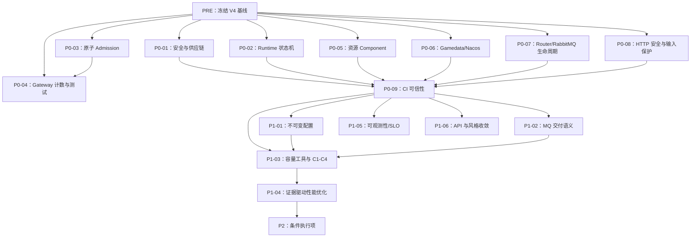

# GoOne V4 生产闭环现代化实施计划

> **对于智能体工作者：**实施本计划时必须使用 `superpowers-子代理驱动开发`（推荐）或
> `superpowers-执行计划`，严格按任务依赖与阶段门禁推进。所有任务使用复选框跟踪；
> 未取得验收证据不得标记完成。

**目标：**在保留 V3 已落地架构能力的前提下，修复并发正确性、资源所有权、安全门禁、
过载保护与容量证明缺口，使 GoOne 从“生产候选框架”收敛为可验证、可灰度、可回滚的
生产框架。

**架构：**继续采用显式 `runtime.App + Component` 装配，不增加通用 DI、插件容器或事件
总线。所有长期资源由唯一具体 Component 持有，状态迁移串行化，准入采用原子
Acquire/Release，配置在完整校验后以不可变值发布。RabbitMQ 是当前唯一生产消息驱动，
VM/Ansible 是当前生产部署方式，Agones 仅保留适配边界。

**技术栈：**Go 1.25.12、gRPC、RabbitMQ、Redis、XORM/MySQL、Nacos、gnet、Prometheus、
OpenTelemetry、GitHub Actions、Go race detector、govulncheck v1.6.0、gitleaks v8.30.1、
golangci-lint v2.12.2、benchstat、pprof。

---

## 1. 文档定位与执行原则

### 1.1 输入基线

本计划基于以下事实来源制定：

- 当前代码基线：`dev@4b595f4`。
- V3 计划：`docs/modernization_execution_plan_2026-07-v3.md`。
- V3 审计：`docs/architecture_review_2026-07-v3.md`。
- 代码规范：`docs/STYLE.md`。
- V4 前置复核：2026-07-31 对全仓源码、CI、依赖、测试和微基准的复核结果。

### 1.2 V3 已完成能力

以下能力作为 V4 基线保留，不重新设计：

| 能力 | 当前结论 | V4 处理 |
|---|---|---|
| 六服务统一 `NewApp().Run(ctx)` | 已完成 | 仅补并发与终态缺陷 |
| `RegistryComponent` SSRPC 注册 | 已完成 | 保持单路径 |
| 显式 `DriverRegistry` | 已完成 | RabbitMQ 继续为生产主驱动 |
| Web 不链接 MQ SDK | 已完成 | CI 保持依赖图门禁 |
| connsvr 不链接未选择 MQ SDK | 已完成 | CI 保持依赖图门禁 |
| HTTP/gRPC Listen-first 和 RuntimeErrors | 已完成 | 补输入上限与依赖回滚 |
| gRPC health Drain 摘流 | 已完成 | 补超时与故障测试 |
| SessionHub 生产共享路径 | 已完成 | 补构造器安全和计数一致性 |
| Packet `To` 热路径零分配 | 已完成 | 不重复优化 |
| 默认集成测试门控 | 已完成 | 补真实中间件 CI |
| HTTP server 超时和 Header 上限 | 已完成 | 补 Body 上限 |

### 1.3 默认决策

- 兼容策略：公开 API 保留一个稳定版本的 Deprecated 过渡期。
- 配置策略：启动配置不可变；只有 gamedata 支持热更新。
- 过载策略：开发默认 `off`；生产必须显式配置，先 `shadow` 后 `enforce`。
- 消息驱动：RabbitMQ。
- 容量目标：单 connsvr 10,000 长连接。
- 性能环境：固定 Linux 机器，固定 CPU 配额、Go 版本和 GOMAXPROCS。
- 部署方式：VM/Ansible；Agones 为条件执行项。
- 风格策略：只格式化本任务触及文件，不执行全仓机械重写。
- 架构约束：优先消除双路径与泄漏，不引入通用资源容器。

### 1.4 优先级定义

| 等级 | 定义 | 发布约束 |
|---|---|---|
| P0 | 安全、并发正确性、数据丢失、资源泄漏、CI 可信性 | 全部完成才能发布下一稳定版本 |
| P1 | 容量闭环、配置收敛、交付语义、可观测性、简洁性 | 全部完成才能声明生产容量闭环 |
| P2 | 依赖代际、gnet v2、PGO、Agones、破坏性清理 | 只有满足量化门槛或部署需求才执行 |

### 1.5 明确不做

- 不重建已删除的 `application/bootstrap/busapp` 生命周期。
- 不增加 `runtime.Main`、通用 DI、反射式资源容器或动态插件系统。
- 不把运行配置扩展为通用热更新平台。
- 不同时支持多种生产 MQ 语义。
- 不为低频登录分配引入对象池。
- 不在没有 profile、benchmark 或容量数据时声称性能提升。
- 不手工修改 `api/gen/**`、`common/protocol/*.pb.go` 或 gamedata 生成文件。

---

## 2. 总体依赖与里程碑



| 里程碑 | 组成 | 完成结果 |
|---|---|---|
| M0 | PRE | 基线、风险和执行环境可复现 |
| M1 | 全部 P0 | 无已知发布阻断问题 |
| M2 | 全部 P1 | 10,000 连接容量与运行闭环有证据 |
| M3 | 满足条件的 P2 | 依赖或部署代际升级获得量化收益 |

### 2.1 建议责任角色

| 角色 | 负责范围 | 不可兼任的最终验收 |
|---|---|---|
| 框架负责人 | Runtime、Component、配置与代码规范 | 自己实现的 Runtime 并发用例终审 |
| 网关负责人 | SessionHub、Admission、TCP/WS/KCP | C4 容量报告终审 |
| 基础设施负责人 | RabbitMQ、Registry、Redis、Nacos、CI | 安全扫描例外审批 |
| 数据负责人 | XORM/MySQL Worker、持久化幂等、Gamedata | 数据迁移与重复投递终审 |
| 安全负责人 | 凭据轮换、TLS、依赖漏洞 | 不直接实现业务兼容绕行 |
| QA/性能负责人 | 故障注入、race、C1～C4、灰度证据 | 不修改被测热路径来“适配”测试 |

---

## 3. PRE：冻结 V4 基线

### PRE-01 建立审计证据目录

**文件：**

- 创建：`docs/benchmarks/v4/README.md`
- 创建：`docs/benchmarks/v4/.gitkeep`
- 修改：`.gitignore`

**步骤：**

- [ ] 在 `docs/benchmarks/v4/README.md` 记录基线 commit、分支、Go 版本、GOOS、
  GOARCH、CGO_ENABLED、GOMAXPROCS、CPU 型号、内存和内核版本。
- [ ] 在 `.gitignore` 增加 `.artifacts/v4/`，原始测试、profile 和容量 JSON 放入该
  忽略目录；仓库只提交摘要、benchstat 与容量矩阵。
- [ ] 记录 Windows 结果仅用于开发回归，Linux 结果才可用于性能门禁。

**基线命令：**

```bash
git rev-parse HEAD
git status --short
go version
go env GOOS GOARCH CGO_ENABLED GOMAXPROCS
go build ./...
go vet -composites=false ./...
go test -count=1 -timeout 600s ./...
```

**预期：**

- commit 与文档一致。
- 工作树在开始实现前干净。
- build、vet、默认测试通过或真实标明失败项。

### PRE-02 冻结微基准与依赖图

**文件：**

- 创建：`docs/benchmarks/v4/micro-baseline.md`
- 创建：`docs/benchmarks/v4/dependency-baseline.md`

**步骤：**

- [ ] 在固定 Linux 环境关闭 Info 日志后，各运行 10 次微基准。
- [ ] 使用 benchstat 生成摘要，保存 Go 版本和 GOMAXPROCS。
- [ ] 保存 websvr、connsvr 的最终依赖图结论。

```bash
go test -run '^$' -bench . -benchmem -count=10 \
  ./lib/api/sharedstruct/... \
  ./lib/service/transaction/... \
  ./lib/service/ssrpc/... \
  ./lib/net/...

go list -deps ./cmd/web_svr > .artifacts/v4/websvr-deps.txt
go list -deps ./cmd/connsvr > .artifacts/v4/connsvr-deps.txt
go mod graph > .artifacts/v4/go-mod-graph.txt
```

**验收标准：**

- 基准原始输出可追溯到 commit 和执行环境。
- websvr 不包含 MQ SDK。
- connsvr 只包含 RabbitMQ/amqp091 相关 MQ SDK。

---

## 4. P0：发布阻断项

### P0-01 安全凭据、TLS 与供应链门禁

#### 当前风险

- `lib/api/logger/plug/notify.go` 含已提交的机器人访问凭据。
- `module/gconf/server_conf.yaml` 与 `etc/env/env_docker.yaml` 含静态密码。
- `lib/api/httpclient`、`lib/web/http_client` 默认关闭 TLS 证书校验。
- `go.mod` 的 Go 基线低于当前安全补丁。
- CI 未运行 govulncheck，golangci-lint 使用浮动 `latest`。

#### 目标契约

- 仓库不保存真实凭据。
- TLS 默认严格校验，跳过校验只能由测试专用构造器显式启用。
- CI 使用 Go 1.25.12、govulncheck v1.6.0、gitleaks v8.30.1、
  golangci-lint v2.12.2。
- 可达漏洞为 0；安全扫描失败必须阻断合并。

#### 文件

- 修改：`go.mod`
- 修改：`.github/workflows/ci.yml`
- 修改：`lib/api/logger/plug/notify.go`
- 修改：`module/gconf/server_conf.yaml`
- 修改：`etc/env/env_docker.yaml`
- 修改：`lib/api/httpclient/http_api.go`
- 修改：`lib/web/http_client/http_api.go`
- 创建：`.env.example`
- 创建：`.gitleaks.toml`
- 创建：`lib/api/httpclient/http_api_test.go`
- 创建：`lib/api/logger/plug/notify_test.go`

#### 执行步骤

- [ ] 先在凭据提供方轮换已暴露的机器人 Token、数据库密码和中间件密码；轮换完成后
  才修改仓库，避免把“删掉字符串”误当成凭据失效。
- [ ] 将通知地址改为构造参数或环境变量；未配置时通知插件不启动，不回退到硬编码值。
- [ ] 将示例配置改为 `$MYSQL_ROOT_PASSWORD`、`$REDIS_PASSWORD` 等外部注入；
  `.env.example` 只包含无权限示例值。
- [ ] HTTP Transport 默认使用系统证书池，删除生产默认的 `InsecureSkipVerify: true`。
- [ ] 如集成测试需要自签名证书，测试显式传入 `*tls.Config`，且测试构造器不从生产配置
  路径暴露。
- [ ] 在 `go.mod` 保留语言版本并增加 `toolchain go1.25.12`。
- [ ] CI 的 setup-go 固定为 `1.25.12`，避免从 `go.mod` 的旧 patch 解析出不安全工具链。
- [ ] 新增 security job：

```bash
go install golang.org/x/vuln/cmd/govulncheck@v1.6.0
govulncheck ./...
```

- [ ] 将 golangci-lint 从 `version: latest` 固定为 `v2.12.2`。
- [ ] 使用 gitleaks v8.30.1 增加凭据扫描，禁止 Token、完整 DSN、Authorization、私钥
  进入 Git diff。

#### 必须先写的失败测试

- [ ] `TestDefaultTransportVerifiesTLSCertificate`：访问自签名 TLS server，默认 Client
  必须失败。
- [ ] `TestNotifyDisabledWithoutEndpoint`：未配置通知地址时不得发起网络请求。
- [ ] `TestConfigAndLogsDoNotContainSecrets`：捕获日志并断言密码、Token、完整 DSN 不存在。

#### 验收

```bash
go test -count=1 ./lib/api/http_client/... ./lib/api/logger/plug/...
go test -race -count=20 ./lib/api/http_client/... ./lib/api/logger/plug/...
govulncheck ./...
git grep -nE '(access_token=|BEGIN (RSA |EC |OPENSSH )?PRIVATE KEY|password:[[:space:]]+[^$])'
git diff --check
```

**通过标准：**

- govulncheck 可达漏洞为 0。
- 默认 TLS 不接受不受信证书。
- 仓库和日志没有真实凭据或完整 DSN。
- CI 工具版本固定且能在日志中显示实际版本。

**回滚：**

- 代码可回滚，已经轮换的凭据不得恢复旧值。
- TLS 不允许通过重新启用全局跳过校验回滚；只能部署受信 CA 或测试专用 Client。

---

### P0-02 Runtime 状态迁移、启动信号与失败终态

#### 当前风险

- `StateStore.transition` 在 observer 执行期间释放状态锁，Ready/Allocated 可在并发 Drain
  后提交旧决策，造成状态回退。
- 启动期信号由单独 goroutine 消费；不遵守 context 的 Start 返回成功后，可能继续进入
  Ready。
- 只有 RuntimeError 导致 Failed；Drain/Stop error 仍可能留下 Stopped 终态。

#### 目标契约

- 所有状态迁移串行执行。
- observer 可读取状态，但不得递归发起迁移。
- 任一启动终止信号只产生一次关停原因，且不因阶段交接丢失。
- Start、Ready observer、RuntimeError、Drain、Stop 任一失败都形成可定位错误链。
- Drain 或 Stop 失败的最终状态必须是 Failed。

#### 文件

- 修改：`lib/service/runtime/state.go`
- 修改：`lib/service/runtime/run.go`
- 修改：`lib/service/runtime/signal.go`
- 修改：`lib/service/runtime/doc.go`
- 修改：`lib/service/runtime/state_test.go`
- 修改：`lib/service/runtime/startup_signal_test.go`
- 修改：`lib/service/runtime/lifecycle_test.go`
- 创建：`lib/service/runtime/transition_concurrency_test.go`

#### 执行步骤

- [ ] 写 `TestAllocateObserverBlockedThenDrainNeverRegresses`：Allocated observer 阻塞时触发
  Drain，释放 observer 后最终状态只能是 Draining/Stopping/Stopped/Failed。
- [ ] 写 `TestStartupSignalWithContextIgnoringStart`：组件收到取消但延迟返回 nil，App 仍不得
  进入 Ready。
- [ ] 写 `TestDrainErrorMarksFailed` 和 `TestStopErrorMarksFailed`。
- [ ] 在 `StateStore` 增加独立 `transitionMu`，覆盖“校验 → observer → 提交”完整迁移；
  observer 执行时不持有 `s.mu`，因此仍可安全调用 `Current`/`Snapshot`。
- [ ] 文档明确 observer 禁止调用 Allocate、Drain 或其他状态迁移方法，避免重入
  `transitionMu`。
- [ ] 用单一 cancel-cause context 贯穿 LoadConfig、Start、Ready wait 和 Drain reason，
  删除启动期与 Ready 期对 `termCh` 的竞争消费。
- [ ] 只有全部 Start 成功且启动 cause 仍为空时才允许 `enterReady(signalCtx)`。
- [ ] 计算最终错误后再提交终态：`runtimeErr || drainErr || stopErr` 任一非 nil 都
  `markFailed(errors.Join(...))`，否则 `markStopped()`。
- [ ] `errors.Join` 中每项必须包含组件名和阶段名，并保持 `%w`/Unwrap。

#### 验收

```bash
go test -count=100 ./lib/service/runtime/...
go test -race -count=50 ./lib/service/runtime/...
```

**通过标准：**

- 无状态从 Draining/Stopping/Failed 回退到 Ready/Allocated。
- SIGTERM 到达任意启动阶段都不进入 Ready。
- 每个已启动组件只 Stop 一次，顺序严格逆序。
- Drain/Stop error 对应 Failed 终态。
- Run 返回后无 signal/runtime watcher 遗留。

**注意：**

- 不把状态机改造成事件总线。
- 不在持有 `s.mu` 时调用 observer。
- 不通过缩短 timeout 掩盖无法取消的 Start。

---

### P0-03 原子 Admission 与按方法在途计数

#### 当前风险

- 连接和 inflight 都是“检查后增加”，并发下可超过配置上限。
- `max_inflight_per_method` 使用全局 inflight 比较，语义不正确。
- 拒绝日志逐请求 Warning，过载时会放大 I/O。

#### 目标接口

`ssrpc.InflightLimiter` 收敛为原子租约：

```go
type InflightLimiter interface {
    TryAcquireInflight(method string, globalLimit, methodLimit int) bool
    ReleaseInflight(method string)
}
```

连接准入收敛为：

```go
func (a *AdmissionController) TryAcquireConnection() bool
func (a *AdmissionController) ReleaseConnection()
func (a *AdmissionController) TryAcquireLogin(ip string) bool
```

#### 文件

- 修改：`lib/net/net_mgr/admission.go`
- 修改：`lib/net/net_mgr/admission_metrics.go`
- 修改：`lib/net/net_mgr/admission_test.go`
- 修改：`lib/service/ssrpc/admission_mw.go`
- 修改：`lib/service/ssrpc/admission_mw_test.go`
- 修改：`module/gconf/config.go`
- 修改：`module/gconf/config_test.go`
- 创建：`lib/net/net_mgr/admission_concurrency_test.go`

#### 执行步骤

- [ ] 先写 1,000 goroutine 同时获取 10 个连接名额的测试，enforce 模式成功数必须恰好
  为 10。
- [ ] 先写两个方法各自上限为 2 的测试，方法 A 满载不得阻断尚有名额的方法 B。
- [ ] `AdmissionController` 内部维护原子 reserved connection、global inflight 和有界
  method inflight。
- [ ] Acquire 使用 CAS 循环完成检查与占位；Release 只释放已获得的租约。
- [ ] method counter 只为配置中出现的方法创建，不允许按任意客户端输入无限增长 map。
- [ ] `shadow` 模式执行相同决策计算和指标记录，但不拒绝；计数仍必须正确 Acquire/Release。
- [ ] 登录增加全局和 IP 两级令牌桶；IP limiter 使用有最大容量和空闲淘汰时间的缓存。
- [ ] 配置校验增加：
  - 所有 per-method limit 必须大于等于 0。
  - `max_unauthenticated_connections <= max_connections`，总上限为 0 时除外。
  - 生产 enforce 模式不得同时把全部限制配置为 0。
- [ ] 逐请求 Warning 改为 counter 指标；日志按 reason 做限频采样。

#### 验收

```bash
go test -count=100 ./lib/net/net_mgr/... ./lib/service/ssrpc/...
go test -race -count=30 ./lib/net/net_mgr/... ./lib/service/ssrpc/...
```

**通过标准：**

- 并发峰值永不超过 enforce 上限。
- Release 后所有计数回到 0，不出现负数。
- 方法 A 达上限不错误占用方法 B 配额。
- shadow/enforce 的判定数量可以通过指标对账。
- 过载 60 秒时日志量保持有界。

---

### P0-04 Gateway 连接计数、构造器与测试资源回收

#### 当前风险

- 被 Admission 拒绝的连接没有增加计数，但 OnClose 可能无条件减少计数。
- `NewTcpSvr/NewWsTcpSvr/NewKcpSvr` 构造出的 hub 为 nil，兼容调用方可能触发空指针。
- KCP 端到端测试使用窄随机端口且没有 Stop，`-count=100` 会出现端口占用。

#### 文件

- 修改：`lib/net/net_mgr/net_i.go`
- 修改：`lib/net/net_mgr/tcp_impl.go`
- 修改：`lib/net/net_mgr/ws_impl.go`
- 修改：`lib/net/net_mgr/kcp_impl.go`
- 修改：`lib/net/net_mgr/kcp_gateway_test.go`
- 修改：`lib/net/net_mgr/session_hub_test.go`
- 创建：`lib/net/net_mgr/gateway_contract_test.go`

#### 执行步骤

- [ ] 三个旧构造器默认创建 `NewSessionHub(nil)`，保证 hub 永不为 nil。
- [ ] 新增显式构造器 `NewTcpSvrWithHub`、`NewWsTcpSvrWithHub`、
  `NewKcpSvrWithHub`；nil hub 返回 error。
- [ ] `SetHub` 继续 Deprecated，只允许 Start 前调用；Start 后调用返回 error 或被测试阻止。
- [ ] 传输层仅在 `TryAcquireConnection` 成功后记录 admitted；OnClose 仅为 admitted 连接
  Release。
- [ ] 将 TCP/WS/KCP 的重复计数逻辑收敛为私有小型 connection lease，不增加通用抽象。
- [ ] KCP 测试使用操作系统分配端口或可靠 listener 注入；`t.Cleanup` 中 Stop gateway、
  关闭 client、等待 Serve goroutine。
- [ ] 建立三传输共享契约测试：accept、reject、bind、replace、kick、quiesce、stop。

#### 验收

```bash
go test -count=100 ./lib/net/net_mgr/...
go test -race -count=30 ./lib/net/net_mgr/...
```

**通过标准：**

- 所有连接测试结束后 active connections/sessions 为 0。
- 无端口冲突、listener 泄漏或 goroutine 线性增长。
- Quiesce 后新连接和新绑定均被拒绝，已有会话仍可完成。
- 三传输具有相同错误与 Drain 语义。

---

### P0-05 Redis、XORM、MySQL Worker 资源 Component 化

#### 当前风险

- 多个服务通过只有 OnStart 的 FuncComponent 初始化 Redis，Stop 不关闭。
- Web 的一个 Component 同时持有 Redis、HTTP、gRPC 等资源，部分失败回滚不完整。
- MySQL worker 在 ORM 初始化失败时可能继续运行。
- `Async` 队列无上限，Push 在停止后静默丢弃，Stop 不接受 context。

#### 目标组件

目标组件为 `redis.RedisComponent`、`xorm.ORMComponent` 与
`async.WorkerComponent`。三者只拥有各自包内资源，不相互引用，也不读取服务全局变量。

每个组件实现 `Start(context.Context) error`、`Stop(context.Context) error`；worker 额外实现
`Quiesce(context.Context) error` 与 `Drain(context.Context) error`。

#### 文件

- 修改：`lib/db/redis/redis_mgr.go`
- 创建：`lib/db/redis/component.go`
- 创建：`lib/db/redis/component_test.go`
- 修改：`lib/db/xorm/orm_mgr.go`
- 创建：`lib/db/xorm/component.go`
- 创建：`lib/db/xorm/component_test.go`
- 修改：`lib/service/async/async.go`
- 修改：`lib/service/async/queue.go`
- 创建：`lib/service/async/component.go`
- 创建：`lib/service/async/component_test.go`
- 修改：`src/infosvr/app.go`
- 修改：`src/mainsvr/app.go`
- 修改：`src/mysqlsvr/app.go`
- 修改：`src/roomcentersvr/app.go`
- 修改：`src/web_svr/app.go`

#### 执行步骤

- [ ] Redis `Close(context.Context) error` 聚合所有 client Close error，不再静默忽略。
- [ ] Redis 初始化记录成功实例；任一后续实例失败时逆序关闭已成功实例。
- [ ] ORM Ping、SyncTables 或表注册失败时立即关闭 Engine。
- [ ] `Async.Push` 改为返回 error，至少区分 stopped、quiescing、queue full。
- [ ] worker queue 增加显式容量；新任务不得无限增长。
- [ ] worker Start 创建 goroutine；Quiesce 停止接收；Drain 等待队列归零；Stop 使用 context
  取消并 join。
- [ ] 任务执行失败进入可观测错误回调，持久化失败必须使 Drain 返回 error。
- [ ] 五个使用 Redis 的服务注册具体 RedisComponent，不用无 Stop 的 FuncComponent 持有连接。
- [ ] mysqlsvr 的注册顺序为 Registry → Redis/ORM/Worker → Transaction → Router；
  Stop 严格逆序。
- [ ] Web 将依赖初始化与 Web listener 拆为两个具体组件，HTTP/gRPC 启动失败不得泄漏
  Redis。

#### 必须测试

- [ ] 第二个 Redis 实例失败，第一个已经 Close。
- [ ] ORM Ping/SyncTables 失败，Engine 已 Close。
- [ ] Worker queue full 返回明确错误。
- [ ] Quiesce 后 Push 被拒绝；Drain 成功后 queue depth 为 0。
- [ ] Drain timeout 后 Stop 可以在 stop timeout 内退出。
- [ ] Start 只完成一半时 Stop 幂等。

#### 验收

```bash
go test -count=50 ./lib/db/redis/... ./lib/db/xorm/... ./lib/service/async/...
go test -race -count=20 ./lib/db/redis/... ./lib/db/xorm/... ./lib/service/async/...
go test -count=20 ./src/infosvr/... ./src/mainsvr/... ./src/mysqlsvr/... ./src/roomcentersvr/... ./src/web_svr/...
```

**通过标准：**

- 启停 100 次后连接、goroutine、FD 不线性增长。
- 所有 Stop error 返回 Runtime，不只记录日志。
- mysqlsvr Drain 后队列为 0；失败任务使 Drain 返回 error。

---

### P0-06 Gamedata 不可变版本快照与 Nacos 监听回收

#### 当前风险

- `module/gamedata.InitNet` 不保存 ListenConfig 句柄，无法 Cancel。
- 多表逐个解析、逐个 Store，跨表热更可能读取到混合版本。
- 监听或后续表加载失败时，之前注册的监听没有回滚。

#### 目标模型

```go
type Snapshot struct {
    Version string
    LoadedAt time.Time
    tables map[string]any
}

type subscription struct {
    dataID string
    group string
}

type Component struct {
    client config_client.IConfigClient
    group string
    subscriptions []subscription
    current atomic.Pointer[Snapshot]
    callbacks sync.WaitGroup
    cancel context.CancelFunc
}
```

`tables` 仅由生成的类型安全 accessor 读取，不向业务暴露可变 map。生成表不得自行发布
新版本；生成解析器负责构建候选表，Component 在全量校验后一次发布 Snapshot。

#### 文件

- 修改：`module/gamedata/gamedata.go`
- 修改：`tools/cfgtool/internal/templ/code_tpl.go`
- 修改：`tools/cfgtool/service/code_gen.go`
- 修改：`tools/cfgtool/test/tool_test.go`
- 不修改：`module/gamedata/repository/**/*.gen.go`
- 创建：`module/gamedata/snapshot.go`
- 创建：`module/gamedata/component.go`
- 创建：`module/gamedata/component_test.go`
- 修改：`lib/contrib/config/nacos/nacos.go`
- 修改：`lib/contrib/config/nacos/watcher.go`
- 修改：`src/mainsvr/app.go`
- 修改：`src/roomcentersvr/app.go`
- 修改：`src/web_svr/app.go`

#### 执行步骤

- [ ] 将 `NewNacosConfigClient` 的生产入口统一为 `(config_client.IConfigClient, error)`；
  构造失败不得只记日志后返回 nil。
- [ ] Component 保存每个 DataID、Group；Start 中途失败时逆序 Cancel 已注册监听。
- [ ] 初次加载流程固定为“拉取全部 → 解析全部 → 引用完整性校验 → 构建 Snapshot → 原子发布
  → 注册监听”。
- [ ] 热更事件以配置版本为单位聚合；只有完整候选版本通过校验才替换当前指针。
- [ ] 解析或校验失败保留旧 Snapshot，并增加失败计数；普通日志不得输出完整配置内容。
- [ ] Stop 取消所有 ListenConfig，关闭 client，并等待回调退出。
- [ ] 生成器改为生成纯解析函数；重新生成后执行 `go/format`。

#### 验收

```bash
go test -count=50 ./module/gamedata/... ./lib/contrib/config/nacos/...
go test -race -count=30 ./module/gamedata/... ./lib/contrib/config/nacos/...
./main.sh check-genproto --full
```

**通过标准：**

- 100 次启停后监听 goroutine 不增长。
- 多表读取只能看到旧版本或新版本，不出现混合版本。
- 热更失败后旧数据仍完整可用。
- 同一输入连续生成两次无 diff。

---

### P0-07 Router、服务发现与 RabbitMQ 生命周期

#### 当前风险

- Router 先注册服务发现，再创建 RabbitMQ Bus。
- RabbitMQ constructor 启动后台重连后立即返回，服务可能被发现但 Bus 不可用。
- registry watcher 的 cancel/watcher 字段与 Close 存在并发访问，且没有 join。
- RabbitMQ Close 只关闭 stop channel，没有等待 run goroutine。
- Publish 失败可能只记录日志，调用 Send 的业务侧此前已经得到成功。

#### 目标契约

- `Start` 成功表示 RabbitMQ 已连接、消费队列已声明且 consumer 已启动。
- Bus 就绪后才注册服务发现。
- Bus 或 registry watcher 运行期失败进入 RuntimeErrors。
- Close/Stop 接受 context、取消并 join 全部 goroutine。
- Send 的成功定义必须清晰：至少表示消息已被当前连接成功 publish；不能只表示进入本地队列。

#### 文件

- 修改：`lib/service/bus/bus_i.go`
- 修改：`lib/service/bus/driver/rabbitmq/rabbitmq.go`
- 修改：`lib/service/bus/driver/rabbitmq/rabbitmq_test.go`
- 修改：`lib/service/router/router.go`
- 修改：`lib/service/router/router_test.go`
- 修改：`lib/service/svrinstmgr/svr_inst_mgr.go`
- 修改：`lib/service/svrinstmgr/svr_inst_mgr_test.go`
- 创建：`lib/service/router/lifecycle_test.go`

#### 执行步骤

- [ ] 为 Bus 增加显式启动/就绪契约，优先采用具体 RabbitMQ Component，不扩大所有兼容
  Driver 的接口变更。
- [ ] RabbitMQ Start 同步等待首次连接、queue declare、consumer 创建；受调用方 context
  控制。
- [ ] 调整 Router 顺序：设置 receiver → 启动并确认 Bus → 注册 self → 启动 discovery
  watch。
- [ ] 任一步失败时逆序回滚 Bus、注册项、watcher 和 client。
- [ ] `ServerInstanceMgr` 保存 cancel、WaitGroup 和 watcher；赋值与 Close 在同一锁规则下。
- [ ] 把 `time.Sleep` 重试改为可被 context 取消的 timer。
- [ ] RabbitMQ run、consumer 和 publisher goroutine 全部由 WaitGroup join。
- [ ] Publish error 返回等待中的 Send 调用；关闭时所有排队 Send 收到 `ErrBusClosed`。
- [ ] 所有地址日志使用脱敏结构，不打印包含用户名密码的 URI。
- [ ] runtime error 包含 `router.registry`、`router.rabbitmq.consumer` 或
  `router.rabbitmq.publisher` 来源。

#### 故障测试

- [ ] RabbitMQ 不可达：Start 超时返回，服务发现中无当前实例。
- [ ] Registry 不可达：RabbitMQ 已启动但随后回滚关闭。
- [ ] Start 后 RabbitMQ 断线：readyz 失败并触发标准 Drain/Failed。
- [ ] Publish 时连接断开：Send 返回 error，不产生虚假成功。
- [ ] Close 与 watcher 创建并发：无 race、无迟到 watcher。

#### 验收

```bash
go test -count=50 ./lib/service/router/... ./lib/service/svrinstmgr/... ./lib/service/bus/driver/rabbitmq/...
go test -race -count=30 ./lib/service/router/... ./lib/service/svrinstmgr/... ./lib/service/bus/driver/rabbitmq/...
GOONE_INTEGRATION=1 go test -count=10 ./lib/service/bus/... ./lib/service/router/...
```

**通过标准：**

- Bus 未就绪时绝不注册服务实例。
- 任一失败后 registry、connection、channel、watcher 和 goroutine 全部释放。
- Run 返回的错误能定位具体组件和阶段。

---

### P0-08 HTTP Client 合并、安全与输入保护

#### 当前风险

- `lib/api/httpclient` 与 `lib/web/http_client` 是重复实现。
- 部分 NewRequest error 检查发生在 Header 访问之后。
- 响应使用无上限 `io.ReadAll`，部分调用没有统一 timeout。
- Web server 只有 Header 上限，没有 Body 上限。

#### 文件

- 重构：`lib/api/httpclient/http_api.go`
- 创建：`lib/api/httpclient/client.go`
- 创建：`lib/api/httpclient/client_test.go`
- 修改：`lib/web/http_client/http_api.go`
- 修改：`lib/web/web_gin/config.go`
- 修改：`lib/web/web_gin/http.go`
- 修改：`module/gconf/config.go`
- 修改：`module/gconf/server_conf.yaml`
- 创建：`lib/web/web_gin/http_limits_test.go`

#### 执行步骤

- [ ] 先为 NewRequest 失败、超时、自签名证书、超大响应和 context cancel 写失败测试。
- [ ] 建立单一 `httpclient.Client`，构造时注入 `*http.Client`、最大响应字节数和允许的
  redirect 策略。
- [ ] 所有请求使用 `NewRequestWithContext`；先检查 error，再写 Header。
- [ ] 使用 `io.LimitReader(max+1)`；超过上限返回 `ErrResponseTooLarge`。
- [ ] 旧包只做代理并标记 Deprecated，一个稳定版本后删除；不得复制 Transport。
- [ ] Web 配置增加 `max_body_bytes`；使用中间件或 `http.MaxBytesReader` 在业务绑定前
  拒绝超大 Body。
- [ ] URL、Header、Body 日志使用字段白名单，不记录 Authorization、Token、签名和完整
  请求体。

#### 验收

```bash
go test -count=50 ./lib/api/http_client/... ./lib/web/http_client/... ./lib/web/web_gin/...
go test -race -count=20 ./lib/api/http_client/... ./lib/web/http_client/... ./lib/web/web_gin/...
```

**通过标准：**

- 不受信 TLS 默认失败。
- 所有请求可由 context 取消。
- 超大请求和响应快速失败且内存不随输入无限增长。
- 旧入口与新 Client 的正常响应行为兼容。

---

### P0-09 测试分层与 CI 可信性

#### 文件

- 修改：`.github/workflows/ci.yml`
- 创建：`tools/cmd/checkdocs/main.go`
- 创建：`tools/cmd/checkdocs/main_test.go`
- 修改：`lib/internal/itest/itest.go`
- 修改：`etc/env/env_docker.yaml`
- 创建：`etc/env/.env.example`

#### 执行步骤

- [ ] 将 CI 拆为 build-unit、race、integration、generated、security、lint、docs 七个 job。
- [ ] build-unit 运行完整 `go test -count=1 ./...`，不再维护容易遗漏的手工 package 清单。
- [ ] integration job 启动 `mysql`、`redis`、`zookeeper`、`rabbitmq`，使用 CI Secret 或
  job 临时随机密码，不提交真实密码。
- [ ] `GOONE_INTEGRATION=1` 时依赖不可达必须失败，不能继续 `t.Skip`；只有未开启
  integration 时允许 Skip。
- [ ] integration job 输出实际执行用例数量；数量为 0 时 job 失败。
- [ ] docs checker 递归扫描 `docs/**/*.md` 的相对链接，忽略外部 HTTP 链接，发现不存在
  文件时返回非 0。
- [ ] generated job 连续生成两次，第二次工作树必须无 diff。
- [ ] race job覆盖 runtime、net_mgr、router、svrinstmgr、bus、ssrpc、transaction、
  appconfig、scheduler、async 和 gamedata。
- [ ] CI 注释删除阶段编号与历史“方案 B”说明，只描述当前门禁不变量。

#### 验收

```bash
go test -count=1 -timeout 600s ./...
go test -race -count=1 -timeout 600s \
  ./lib/net/... ./lib/service/runtime/... ./lib/service/router/... \
  ./lib/service/svrinstmgr/... ./lib/service/bus/... ./lib/service/ssrpc/... \
  ./lib/service/transaction/... ./lib/service/async/... ./module/gamedata/...
go run ./tools/cmd/checkdocs ./docs
./main.sh check-genproto --full
```

**通过标准：**

- 无中间件环境默认测试快速 Pass/Skip，不发生外部超时。
- integration 环境真实用例数大于 0，依赖故障时明确 Fail。
- docs 全目录无内部断链。
- CI 每个 job 的失败含义可以区分。

---

## 5. P1：生产容量、配置与简洁性

### P1-01 启动配置不可变与全局变量收敛

#### 当前风险

- loader 直接反序列化进包级全局配置，校验失败可能留下部分修改。
- NewApp 闭包运行期继续读取可变全局。
- `docs/STYLE.md` 仍把通用 appconfig 热更新描述为主路径。

#### 目标接口

```go
func ReadConnConfig(path string) (ConnConfig, error)
func ReadInfoConfig(path string) (InfoConfig, error)
func ReadMainConfig(path string) (MainSvrConfig, error)
func ReadMySQLConfig(path string) (MySqlSvrConfig, error)
func ReadRoomCenterConfig(path string) (RoomCenterConfig, error)
func ReadWebConfig(path string) (WebSvrConfig, error)
```

#### 文件

- 修改：`module/gconf/config.go`
- 修改：`module/gconf/config_test.go`
- 修改：`src/connsvr/app.go`
- 修改：`src/infosvr/app.go`
- 修改：`src/mainsvr/app.go`
- 修改：`src/mysqlsvr/app.go`
- 修改：`src/roomcentersvr/app.go`
- 修改：`src/web_svr/app.go`
- 修改：`cmd/connsvr/main.go`
- 修改：`cmd/infosvr/main.go`
- 修改：`cmd/mainsvr/main.go`
- 修改：`cmd/mysqlsvr/main.go`
- 修改：`cmd/roomcentersvr/main.go`
- 修改：`cmd/web_svr/main.go`
- 修改：`lib/service/appconfig/store.go`
- 修改：`docs/STYLE.md`

#### 执行步骤

- [ ] loader 只向局部值解码，完成 Normalize/Validate 后返回值。
- [ ] `NewApp` 显式接收配置值或 config loader；组件闭包捕获服务局部不可变值。
- [ ] 不把 map/slice 指针直接暴露给运行期修改；构造时复制需要长期持有的集合。
- [ ] 旧 `LoadXConfig` 保留一个版本，内部调用 Read 后发布兼容快照并标记 Deprecated。
- [ ] 除 gamedata 外，不支持端口、MQ、DB、身份和容量参数热改。
- [ ] 日志重载仅保留独立窄接口，不恢复通用 Store 主路径。

#### 验收

```bash
go test -count=50 ./module/gconf/... ./lib/service/appconfig/... ./src/...
go test -race -count=20 ./module/gconf/... ./lib/service/appconfig/... ./src/...
```

**通过标准：**

- 无效配置不修改任何已发布值。
- Start 后配置不会被原地修改。
- 六服务不新增 `gconf.*Cfg` 直接读取点。
- 配置错误只记录字段路径，不记录敏感值。

---

### P1-02 RabbitMQ 交付语义与持久化幂等

#### 决策

先区分消息类别，再改变 Ack：

| 类别 | 示例 | 目标语义 |
|---|---|---|
| 短生命周期查询/RPC | 查询在线状态、房间列表 | at-most-once，失败由调用方超时/重试 |
| 状态变更命令 | 登录绑定、房间状态变更 | at-least-once + 业务幂等 |
| 持久化命令 | mysqlsvr 写入 | at-least-once + 幂等键 + 手工 Ack |

#### 文件

- 修改：`lib/service/bus/bus_i.go`
- 修改：`lib/service/bus/driver/rabbitmq/rabbitmq.go`
- 修改：`lib/service/bus/driver/rabbitmq/rabbitmq_test.go`
- 修改：`lib/service/ssrpc/context.go`
- 修改：`src/mysqlsvr/service/mysql_ssrpc.go`
- 修改：`src/mysqlsvr/service/mysql_ssrpc_test.go`
- 创建：`src/mysqlsvr/service/idempotency_test.go`
- 创建：`docs/rabbitmq_delivery_contract.md`

#### 执行步骤

- [ ] 文档定义每类消息的成功点、Ack 点、重试责任、最大重试次数和死信处理。
- [ ] 复用现有 SSPacketHeader 的 `SrcBusID + SrcTransID + Cmd + CmdSeq` 生成稳定 delivery
  key；mysqlsvr 在写入前做幂等检查，不为此新增一套客户端协议 ID。
- [ ] consumer 对持久化命令使用手工 Ack：业务成功后 Ack，可重试失败 Nack，永久错误
  Ack 后记录拒绝原因或进入死信。
- [ ] publisher 对需要可靠投递的命令启用 Confirm；Confirm timeout 返回调用方。
- [ ] 查询类继续轻量路径，不强制所有消息承担持久化成本。
- [ ] 重复投递、乱序和断线重连进入集成测试。

#### 验收标准

- 同一 request ID 投递 10 次，只产生一次数据库状态变化。
- consumer 在 handler 成功前退出，消息可再次投递。
- publisher 未收到 Confirm 时调用方不得得到成功。
- 可靠性增强后 C4 P99 回退不超过约定门禁；否则拆分专用持久化通道。

---

### P1-03 容量工具单路径与 C1～C4 认证

#### 当前风险

`tools/tester/cmd/capacity` 把 Write 成功误认为登录/心跳成功，不能作为容量证据；
`tools/tester/cmd/stress` 已具有真实 Session、登录响应关联、统计和 pprof，应该成为唯一
容量主路径。

#### 文件

- 删除或 Deprecated：`tools/tester/cmd/capacity/main.go`
- 修改：`tools/tester/cmd/stress/main.go`
- 修改：`tools/tester/internal/session/login.go`
- 修改：`tools/tester/internal/stats/stats.go`
- 修改：`tools/tester/internal/report/report.go`
- 修改：`tools/tester/stress.toml`
- 创建：`tools/tester/internal/report/capacity_matrix.go`
- 创建：`tools/tester/internal/report/capacity_matrix_test.go`
- 创建：`docs/benchmarks/capacity-matrix.md`

#### 执行步骤

- [ ] stress 每个请求以序列号关联真实响应；登录成功必须校验业务响应码。
- [ ] 心跳成功必须收到合法响应或服务端确认，不能只检查 socket Write。
- [ ] 支持 connect、login、ramp-up、steady、drain、reconnect/recovery 六阶段。
- [ ] JSON 原始报告记录客户端 CPU、RSS、goroutine、网络吞吐，识别压测端瓶颈。
- [ ] 服务端采集 CPU、RSS、GC pause、goroutine、FD、Session、inflight、queue depth、
  rejected、MQ backlog、Redis/MySQL pool、P50/P95/P99/P999。
- [ ] 支持 `shard_index/shard_count`，多压测机 UID 范围不冲突。
- [ ] 自动把 JSON 汇总为容量矩阵 Markdown。
- [ ] Drain 阶段记录 readiness 关闭时间、已接受请求完成数、强制 Stop 数和资源恢复时间。

#### 容量阶梯

| 阶段 | 长连接 | 登录速率 | 稳态消息 | 稳态时间 |
|---|---:|---:|---:|---:|
| C1 | 1,000 | 100/s | 500/s | 30 分钟 |
| C2 | 3,000 | 200/s | 1,500/s | 30 分钟 |
| C3 | 5,000 | 300/s | 2,500/s | 30 分钟 |
| C4 | 10,000 | 500/s | 5,000/s | 30 分钟 |

每档必须通过后才能进入下一档；失败先保存 profile 和原始 JSON，不直接修改代码。

#### C4 验收标准

- 连接成功率不低于 99.9%。
- 登录与业务请求成功率不低于 99.9%。
- 框架链路 P99 不高于 50ms。
- CPU 不高于分配核心的 70%。
- 最后 15 分钟 RSS 增长小于 5%。
- GC pause P99 不高于 20ms。
- goroutine、FD 无持续增长。
- readiness 在 1 秒内关闭。
- 已接受请求不丢失。
- 30 秒 drain timeout 内完成排空。
- Drain 后 goroutine、FD 回到基线 ±2%。

---

### P1-04 证据驱动的性能优化

#### 不再优先优化

- SSPacketHeader/CSPacketHeader 的 `To`/From 零分配路径。
- SessionHub Lookup。
- Sealed Dispatcher 查找。

这些路径只有在新 profile 中重新成为显著热点时才允许修改。

#### 优先候选

1. Admission CAS 竞争和 method counter。
2. TransactionMgr 排队、channel、closure 分配。
3. RabbitMQ frame 构建、publish 等待和 backlog。
4. Gamedata 快照构建。
5. HTTP Client 连接复用。
6. Sonic 在 Go 1.26 下回退 `encoding/json` 的兼容问题。

#### 文件

- 候选修改：`lib/net/net_mgr/admission.go`
- 候选修改：`lib/service/transaction/transaction_mgr_impl.go`
- 候选修改：`lib/service/transaction/transaction_impl.go`
- 候选修改：`lib/service/bus/driver/rabbitmq/rabbitmq.go`
- 候选修改：`module/gamedata/snapshot.go`
- 候选修改：`lib/api/httpclient/client.go`
- 更新：`docs/benchmarks/v4/micro-baseline.md`
- 创建：`docs/benchmarks/v4/profile-findings.md`

每个性能提交最多选择一个候选路径；profile 未显示为热点的候选文件不得修改。

#### 合并门禁

```bash
go test -run '^$' -bench . -benchmem -count=10 \
  ./lib/net/net_mgr ./lib/service/transaction \
  ./lib/service/router ./lib/service/bus/driver/rabbitmq > before.txt
# 实施最小修改
go test -run '^$' -bench . -benchmem -count=10 \
  ./lib/net/net_mgr ./lib/service/transaction \
  ./lib/service/router ./lib/service/bus/driver/rabbitmq > after.txt
benchstat before.txt after.txt
```

**通过标准：**

- 同机器、同 Go、同 GOMAXPROCS、同日志级别。
- 中位数回退不超过 5%。
- 原 0-allocation 路径不得新增分配。
- 优化必须在微基准或 C1～C4 至少一项取得可重复收益。
- TransactionMgr 不破坏 UID/房间串行、同 key 顺序、panic 隔离、cancel 和 Drain。

---

### P1-05 可观测性与运行 SLO

#### 文件

- 修改：`lib/service/runtime/metrics.go`
- 修改：`lib/net/net_mgr/metrics.go`
- 修改：`lib/net/net_mgr/admission_metrics.go`
- 修改：`lib/service/router/metrics.go`
- 修改：`lib/db/redis/metrics.go`
- 修改：`lib/db/xorm/metrics.go`
- 创建：`docs/observability_slo.md`

#### 执行步骤

- [ ] 指标名符合 Prometheus 命名规范，单位进入名称，例如 `_seconds`、`_bytes`。
- [ ] 标签只允许 service、component、method、transport、reason、decision 等有界值。
- [ ] 禁止 UID、IP、request ID、错误全文成为标签。
- [ ] 定义 Ready 耗时、RuntimeError、Drain 耗时、强制 Stop、overload rejection、MQ
  reconnect、pool saturation 告警。
- [ ] 结构化日志统一 service、component、phase、reason；预期流控不记 Error。
- [ ] tracing 不记录 Header、Token、完整 Body 或配置正文。

#### 验收标准

- 10,000 连接过程中 Prometheus time series 数量不随 UID/连接数线性增长。
- 过载、MQ 断线、Drain timeout 均能由指标定位。
- 日志采样后仍保留首个错误、周期摘要和恢复事件。

---

### P1-06 API、代码风格与文档事实源收敛

#### 文件

- 修改：`docs/STYLE.md`
- 修改：`docs/architecture_review_2026-07-v3.md`
- 修改：`docs/modernization_execution_plan_2026-07-v3.md`
- 修改：`docs/optimization_roadmap.md`
- 修改：仅限 P0-01～P1-05 已触及的非生成 Go 文件，不新增独立“全仓风格化”范围
- 修改：`tools/protoc-gen-goone/generate.go`
- 修改：`tools/protoc-gen-goone/generate_test.go`
- 修改：`tools/cfgtool/internal/templ/code_tpl.go`
- 修改：`tools/cfgtool/test/tool_test.go`

#### 执行步骤

- [ ] STYLE 删除 `bootstrap/busapp` 主路径，改为当前 `runtime.App + Component`。
- [ ] STYLE 将启动配置定义为不可变值，只保留 gamedata 热更。
- [ ] V3 文档按“已完成、部分完成、未验证、Deferred”重新核销，不再保留与代码冲突的
  待执行描述。
- [ ] 删除生产代码中的 P0/P1/P2/V3/方案 B/roadmap 阶段性注释；保留不变量与原因。
- [ ] 本轮触及的导出符号使用中文 GoDoc，缩写统一 UID、IP、ID、HTTP、URL。
- [ ] `STATUS_RUN` 等新代码改为 Go 常量命名；既有公开 `Uid/Ip` 在一个版本中提供兼容
  访问，下一主版本再删除。
- [ ] 删除注释掉的历史代码，历史信息由 Git 与文档承担。
- [ ] 替换触及路径中的 `ioutil`，不为此执行无关全仓重构。
- [ ] 生成器在输出前执行 `go/format`。

#### 验收

```bash
git diff --name-only -- '*.go' | xargs -r gofmt -l
git diff --check
rg -n 'P0-|P1-|P2-|方案 B|V3-|roadmap' \
  cmd src lib common module tools \
  --glob '*.go' \
  --glob '!api/gen/**' \
  --glob '!common/protocol/**' \
  --glob '!module/gamedata/repository/**'
go run ./tools/cmd/checkdocs ./docs
```

**通过标准：**

- gofmt 无输出。
- 非生成生产代码不再包含阶段编号注释。
- STYLE、代码、CI、V3/V4 状态一致。
- 不出现行尾导致的全文件无语义 diff。

---

### P1-07 可选适配器失败语义与支持等级

#### 当前风险

- Consul watcher 后台运行失败时直接 panic。
- Kubernetes registry 查询失败时直接 panic。
- Apollo 同时存在 panic 构造入口与 error 构造入口，命名不能清晰区分。
- 可选适配器没有统一的“正式支持/实验性/仅编译”分级。

#### 文件

- 修改：`lib/contrib/config/consul/watcher.go`
- 创建或修改：`lib/contrib/config/consul/watcher_test.go`
- 修改：`lib/contrib/registry/kubernetes/registry.go`
- 创建或修改：`lib/contrib/registry/kubernetes/registry_test.go`
- 修改：`lib/contrib/config/apollo/apollo.go`
- 修改：`lib/contrib/config/apollo/apollo_test.go`
- 创建：`docs/integration_support_matrix.md`

#### 执行步骤

- [ ] 后台 watcher 错误通过 `Next() error`、内部错误 channel 或 RuntimeErrorSource 上报，
  禁止从库 goroutine panic。
- [ ] Kubernetes 初始查询失败返回 Watch/Next 调用方；watch 循环按有界退避重试并可由
  context 取消。
- [ ] Apollo 保留 error-returning `NewSourceE`；现有 panic 入口改名或文档定义为
  `MustNewSource`，旧入口保留一个版本 Deprecated。
- [ ] 支持矩阵只允许三个等级：
  - Production：进入 build、race、真实 integration、故障恢复矩阵。
  - Experimental：可编译且有基础单测，但不承诺生产恢复语义。
  - Compile-only：只保证根模块可构建，下一主版本迁出或删除。
- [ ] 当前未进入 CI 真实集成矩阵的适配器不得标记 Production。

#### 验收

```bash
go test -count=50 \
  ./lib/contrib/config/consul/... \
  ./lib/contrib/config/apollo/... \
  ./lib/contrib/registry/kubernetes/...
go test -race -count=20 \
  ./lib/contrib/config/consul/... \
  ./lib/contrib/config/apollo/... \
  ./lib/contrib/registry/kubernetes/...
```

**通过标准：**

- 外部服务断开不会杀死进程。
- watcher 可取消并 join。
- 每个适配器的支持等级与测试矩阵一致。
- Experimental/Compile-only 不出现在生产推荐配置中。

---

## 6. P2：条件执行项

### P2-01 基础依赖代际

每项独立分支、独立提交、独立回滚：

1. Sonic 升级到支持目标 Go 版本的版本，或从非必要热路径移除。
2. `github.com/golang/protobuf` 迁移到 `google.golang.org/protobuf`。
3. Nacos v1/v2 统一为 v2。
4. XORM 新版本或替代方案评估。
5. Redis 客户端 context、连接池和维护状态评估。
6. 非 RabbitMQ 驱动迁出根 module。

**每项必须提供：**

- API/协议兼容矩阵。
- build、unit、integration、race。
- 断线恢复或数据一致性测试。
- benchmark/容量前后对比。
- 单独回滚提交。

未满足证据要求时标记 Deferred。

### P2-02 gnet v2 Linux A/B

只在独立 Linux 分支实施。

**迁移门槛：**

- 吞吐提升至少 10%；或 CPU/RSS 降低至少 15%。
- C4、race、断线恢复、Quiesce/Drain/Stop 全部通过。
- 行为兼容 TCP/WS/KCP 统一 SessionHub 契约。

未达到门槛则保留 gnet v1，不以“版本更新”为理由强制迁移。

### P2-03 PGO

- 只使用代表性 C3/C4 或生产 CPU profile。
- 构建在无 profile 时能够回退。
- profile 不含敏感业务数据。
- 容量矩阵稳定提升至少 5%，且 P99/P999 不恶化。

### P2-04 Agones Adapter

确认生产进入 Kubernetes/Agones 后再实现：

- Ready、Health、Reserve、Allocate、Shutdown。
- WatchGameServer 确认异步状态结果。
- SIGTERM 与 Sidecar Shutdown 进入同一个 Drain cause。
- Pod 驱逐、滚动发布、分配中断、Sidecar 重启、远端状态延迟和 Drain timeout 测试。

当前 VM/Ansible 部署不引入 Agones SDK。

### P2-05 下一主版本破坏性清理

删除：

- `SetHub` 和 hub 可选分支。
- 旧 `LoadXConfig` 全局发布接口。
- 无生产用途的 appconfig 通用 Reload Store。
- 包级 Driver Registry 和 driver `init()` 兼容路径。
- 非 RabbitMQ 驱动根模块依赖。
- 无错误返回的 BusID/IP 解析接口。
- `Client.Uid/Ip` 旧拼写。
- `lib/web/http_client` 代理包。
- 失真的 `tools/tester/cmd/capacity`。
- 无生产调用方且忽略递归错误的 `lib/util/file.MatchRemoveAll`。

必须提供迁移文档和至少一个稳定版本的 Deprecated 提示。

---

## 7. 全局验收矩阵

| 维度 | 命令/场景 | P0 门禁 | P1 门禁 |
|---|---|---|---|
| Build | `go build ./...` | 全绿 | 全绿 |
| Vet | `go vet -composites=false ./...` | 全绿 | 全绿 |
| Unit | `go test -count=1 ./...` | 全绿/明确 Skip | 全绿/明确 Skip |
| Runtime stress | `go test -count=100 ./lib/service/runtime/...` | 全绿 | 全绿 |
| Gateway stress | `go test -count=100 ./lib/net/net_mgr/...` | 全绿 | 全绿 |
| Race | 核心并发包 `-race` | 无 race | 无 race |
| Integration | `GOONE_INTEGRATION=1` | 真实用例 > 0 | 故障注入通过 |
| Security | `govulncheck ./...` | 可达漏洞 0 | 可达漏洞 0 |
| Secrets | gitleaks/自定义扫描 | 无有效凭据 | 无有效凭据 |
| Generated | `check-genproto --full` | 无漂移 | 无漂移 |
| Docs | `go run ./tools/cmd/checkdocs ./docs` | 无断链 | 状态一致 |
| Microbench | benchstat ×10 | 无非预期回退 | 优化有证据 |
| Capacity | C1～C4 | 不要求 | C4 全部 SLO 通过 |

---

## 8. 分批提交与执行纪律

### 8.1 每个任务的固定循环

1. 写能稳定复现问题的失败测试。
2. 运行单测确认因目标问题失败。
3. 实施最小修改。
4. 运行局部 unit/race/count 测试。
5. 运行全量 build、vet、test。
6. 更新对应文档和验收证据。
7. 独立提交。

### 8.2 推荐提交边界

```text
security: rotate leaked configuration and enforce TLS verification
ci: pin toolchain and add vulnerability and secret gates
runtime: serialize lifecycle transitions and preserve signal cause
net: make admission reservations atomic
net: fix gateway connection leases and cleanup tests
db: own redis and orm resources with components
gamedata: publish validated immutable snapshots
router: require bus readiness before service registration
http: consolidate clients and enforce body limits
ci: run real middleware integration jobs
config: load immutable service configuration values
bus: define reliable persistence delivery semantics
tester: unify capacity runs on the real protocol client
docs: align style and modernization status with production code
```

### 8.3 禁止事项

- 一个提交同时做依赖升级、生命周期重构和全仓格式化。
- 手工修改生成代码。
- 新增无上限 goroutine、channel、queue、cache 或标签维度。
- Component 内调用 Fatal、panic 或 os.Exit。
- 忽略 Start、Serve、Drain、Stop、Close、Publish error。
- 用日志代替错误传播。
- 通过降低测试次数或缩短 timeout 掩盖泄漏。
- 未运行真实协议就把 socket Write 计为业务成功。

---

## 9. 灰度发布与回滚

### 9.1 发布顺序

1. infosvr
2. mysqlsvr
3. mainsvr
4. roomcentersvr
5. connsvr
6. web_svr

每个服务依次执行：

1. 开发环境启动/停止 100 次。
2. 中间件集成回归。
3. RabbitMQ/Redis/MySQL/Registry 故障注入。
4. 10% 实例灰度。
5. 50% 实例灰度。
6. 全量。

### 9.2 灰度观察指标

- 启动成功率与 Ready 耗时。
- RuntimeError 次数和组件来源。
- Drain 耗时、Drain timeout、强制 Stop 次数。
- goroutine、FD、RSS、GC pause。
- 请求成功率、P95、P99、P999。
- active/unauthenticated connections。
- inflight、queue depth、overload rejected。
- RabbitMQ reconnect、publish confirm timeout、consumer backlog。
- Redis/MySQL pool saturation。

### 9.3 回滚条件

任一条件满足即停止扩容并回滚：

- 错误率比基线上升超过 0.5%。
- P99 比基线上升超过 20% 且持续 5 分钟。
- RSS 或 goroutine 持续增长。
- Drain 超过配置时间。
- Session、FD 或中间件连接无法释放。
- RuntimeError 无法定位组件。
- RabbitMQ publish 出现虚假成功或持久化重复写。
- 新版本无法在 stop timeout 内退出。

Admission 可以从 `enforce` 配置回退到 `shadow/off`；该配置回退不替代存在计数错误或资源
泄漏时的二进制回滚。

---

## 10. 阶段完成门禁

### P0 完成

- [ ] 已暴露凭据全部轮换。
- [ ] TLS 默认严格校验。
- [ ] Go 1.25.12、govulncheck v1.6.0、gitleaks v8.30.1、
  golangci-lint v2.12.2 在 CI 固定。
- [ ] govulncheck 可达漏洞为 0。
- [ ] Runtime 并发迁移、启动信号、失败终态测试全部通过。
- [ ] Admission Acquire/Release 原子且计数不为负。
- [ ] Redis、ORM、Worker、Nacos、Router、RabbitMQ 都有唯一资源所有者。
- [ ] Bus 未就绪时不注册服务发现。
- [ ] HTTP 默认安全并有请求/响应大小上限。
- [ ] 默认测试、race、真实 integration、generated、docs、security CI 全绿。

### P1 完成

- [ ] 配置以不可变值传入六服务。
- [ ] RabbitMQ 交付语义有文档、幂等与故障测试。
- [ ] capacity 只使用真实协议 Session。
- [ ] C1～C4 容量矩阵完整。
- [ ] C4 达到单 connsvr 10,000 连接 SLO。
- [ ] 性能修改均有 benchstat/profile/capacity 证据。
- [ ] 指标标签有界，告警能定位过载与生命周期故障。
- [ ] STYLE、V3/V4 文档和生产代码描述一致。
- [ ] 可选适配器无后台 panic，支持等级与测试矩阵一致。

### P2 完成

- [ ] 只实施达到量化门槛的升级。
- [ ] 未满足条件的项目明确标记 Deferred。
- [ ] 下一主版本删除项有迁移说明与弃用周期。

---

## 11. 任务跟踪表

| 任务 | 优先级 | 责任角色 | 依赖 | 初始状态 | 主要产物 |
|---|---|---|---|---|---|
| PRE-01/02 | PRE | QA/性能 | 无 | 待执行 | V4 基线证据 |
| P0-01 | P0 | 安全、基础设施 | PRE | 待执行 | 安全工具链、凭据和 TLS 门禁 |
| P0-02 | P0 | 框架 | PRE | 待执行 | 串行状态迁移与可靠信号 |
| P0-03 | P0 | 网关、框架 | PRE | 待执行 | 原子 Admission |
| P0-04 | P0 | 网关 | P0-03 | 待执行 | Gateway lease 与稳定测试 |
| P0-05 | P0 | 基础设施、数据 | PRE | 待执行 | Redis/ORM/Worker Component |
| P0-06 | P0 | 数据 | PRE | 待执行 | Gamedata 版本快照 |
| P0-07 | P0 | 基础设施、框架 | PRE | 待执行 | Bus-ready-before-register |
| P0-08 | P0 | 框架、安全 | P0-01 | 待执行 | 单一安全 HTTP Client |
| P0-09 | P0 | 基础设施、QA | P0-01～08 | 待执行 | 可信 CI |
| P1-01 | P1 | 框架 | P0 | 待执行 | 不可变配置 |
| P1-02 | P1 | 基础设施、数据 | P0-07 | 待执行 | RabbitMQ 交付契约 |
| P1-03 | P1 | 网关、QA/性能 | P0、P1-01/02 | 待执行 | C1～C4 容量矩阵 |
| P1-04 | P1 | 框架、QA/性能 | P1-03 | 待执行 | 性能证据与最小优化 |
| P1-05 | P1 | 基础设施 | P0 | 待执行 | SLO 与可观测性 |
| P1-06 | P1 | 框架 | P0/P1 | 待执行 | 代码与文档事实源 |
| P1-07 | P1 | 基础设施 | P0-09 | 待执行 | 可选适配器支持矩阵 |
| P2-01～05 | P2 | 各领域负责人 | P1 | Deferred | 条件升级或主版本清理 |

任务状态只允许：

- 待执行
- 执行中
- 已完成
- 阻塞
- Deferred

标记“已完成”时必须在任务旁记录 commit、执行环境、验收命令和证据文档路径。

---

## 12. 外部设计依据

- [Kratos Transport 生命周期契约](https://go-kratos.dev/docs/component/transport/overview/)
- [Pitaya Session/Drain 能力](https://pitaya.readthedocs.io/en/latest/features.html)
- [due 按需组件与模块化](https://github.com/dobyte/due)
- [gRPC Health Checking](https://grpc.io/docs/guides/health-checking/)
- [gRPC Graceful Shutdown](https://grpc.io/docs/guides/server-graceful-stop/)
- [Agones Client SDK 状态模型](https://agones.dev/site/docs/guides/client-sdks/)
- [Go 安全补丁记录](https://go.dev/doc/devel/release)
- [govulncheck](https://pkg.go.dev/golang.org/x/vuln/cmd/govulncheck)
- [gitleaks](https://github.com/gitleaks/gitleaks/releases/tag/v8.30.1)
- [Prometheus 指标命名](https://prometheus.io/docs/practices/naming/)
